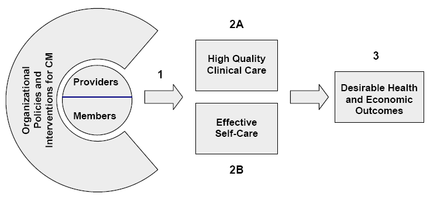
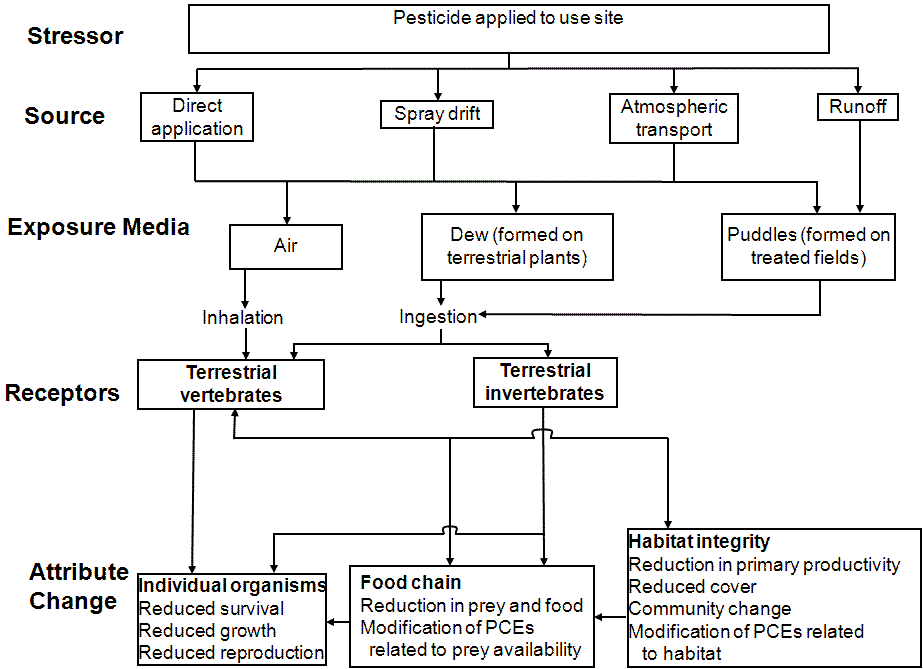

# 6th Week Homework

 ID : 20175045

> TextBook, pp 242, Exercises 1.  Answer in English within 200 words.
>
> > Discuss the underlying conceptual model for the following activities: using an ATM; buying a plane ticket on the Web; using a public information kiosk; setting a VCR to record a programme.
>
> 

Conceptual modeling is about describing the semantics of software applications at a high level of abstraction. Specifically, conceptual modelers (1) describe structure models in terms of entities, relationships, and constraints; (2) describe behavior or functional models in terms of states, transitions among states, and actions performed in states and transitions; and (3) describe interactions and user interfaces in terms of messages sent and received and information exchanged. In their typical usage, conceptual-model diagrams are high-level abstractions that enable clients and analysts to understand one another, enable analysts to communicate successfully with application programmers, and in some cases automatically generate (parts of) the software application.

#### Activity 1 : using an ATM

#### Activity 2 : buying a plane ticket on the Web

#### Activity 3 : using a public information kiosk

#### Activity 4 : setting a VCR to record a programme

