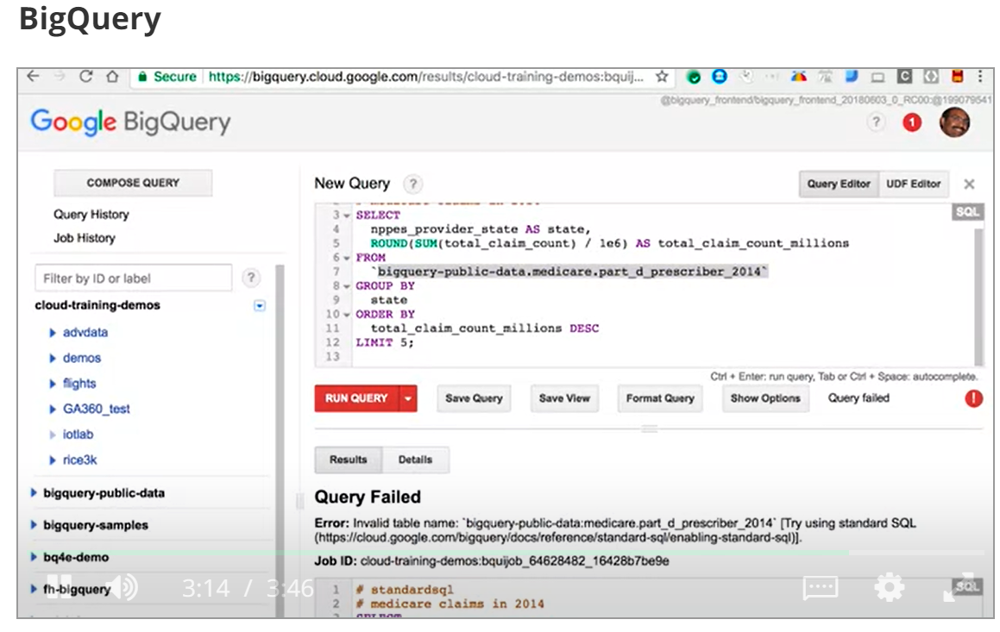
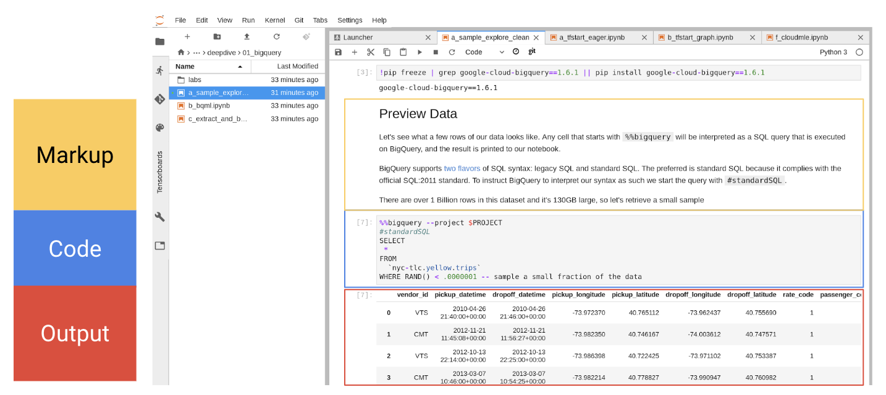
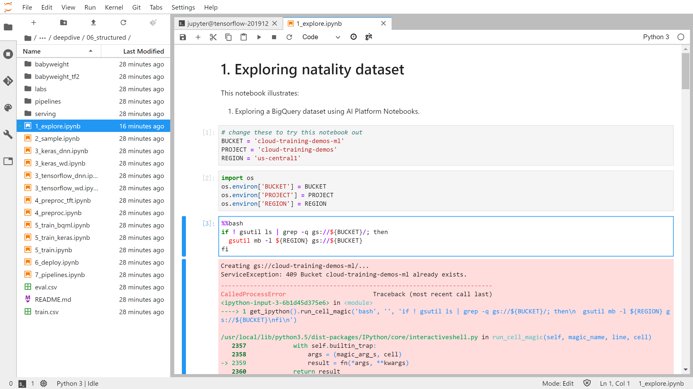
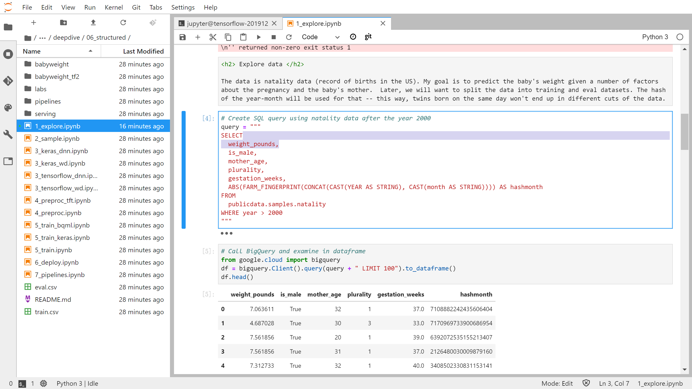
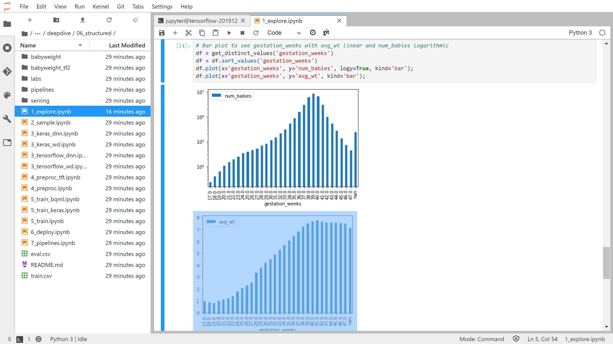

# [End-to-End Machine Learning with TensorFlow on GCP](https://www.coursera.org/learn/end-to-end-ml-tensorflow-gcp/home/welcome)

## [第 1 周](https://www.coursera.org/learn/end-to-end-ml-tensorflow-gcp/home/week/1)

### 1. Fully managed ML

> Let's do a fast review of the steps involved when doing machine learning on GCP. These are the steps involved in any machine learning project, but we'll focus on doing them with Google Cloud Platform Tools. Like most software libraries, TensorFlow contains multiple abstraction levels, tf layers, tf losses et cetera. These are high level representations of useful neural network components. These modules provide components that are useful when building custom neural network models. You often don't need a custom ML model, the estimator API is a high level API. It knows how to do distributed training, it knows how to evaluate, how to create a checkpoint, how to save a model, how to set it up for TensorFlow Serving. It comes with everything done in a sensible way that fits most ML models in production. In this course, we will work with TensorFlow at the tf estimator level of abstraction. Cloud ML Engine is orthogonal to this hierarchy. Regardless of which abstraction level you're writing your code at, CMLE gives you a managed service for training and deploying TensorFlow models. 
>
> 

让我们快速回顾一下在 GCP 上进行机器学习所涉及的步骤。这些是任何机器学习项目都会涉及到的步骤，但我们将重点介绍如何使用 Google 云平台工具来完成这些步骤。像大多数软件库一样，TensorFlow 包含多个抽象级别，tf 层，tf 丢失等等。这些都是有用的神经网络组件的高级表示。这些模块提供的组件在构建定制神经网络模型时非常有用。你通常不需要一个定制的机器学习模型，估计器 API 是一个高级的 API。它知道如何进行分布式培训，它知道如何评估，如何创建检查点，如何保存模型，如何为 TensorFlow Serving 设置模型。它以一种适合大多数机器学习生产模式的合理方式完成了所有的事情。在本课程中，我们将在抽象的 tf 估计级别上使用 TensorFlow。云机器学习引擎与这个层次结构是正交的。无论您在哪个抽象层编写代码，CMLE 都为您提供了一个用于培训和部署 TensorFlow 模型的托管服务。

> 
>
> If you have data that fits in memory, pretty much any machine learning framework will work. Once your data sets get larger, your data will not fit into memory and you need a more sophisticated performant ML framework. This is where TensorFlow comes in. You can use TensorFlow estimators not just for deep learning but also for things like Boosted Regression Trees. But as we discussed in the first specialization, there are ways to architect deep neural networks so that they get the benefits of bagging and boosting, and so we will simply focus on one technology, Neural Networks. In real-world problems, there's often very little benefit to a different machine learning algorithm. You should spend any time and resources you have on getting better data. But as we said, many machine learning frameworks can handle toy problems. But what are some of the important things to think about when it comes to building effective machine learning models? The first and most important thing is that you need to figure out a way to train the model on as much data as you can. Don't sample the data, don't aggregate the data, use as much data as you can. As your data size increases, batching and distribution become extremely important. You will need to take your data and split it into batches, and then you need to train, but then you need to also distribute your training over many machines. This is not as simple as MapReduce, where things are embarrassingly parallel. Things like gradient descent optimizations are not embarrassingly parallel. You will need parameter servers that form a shared memory that's updated during each epoch. Sometimes people think they can take a shortcut in order to keep the training simple by getting a bigger and bigger machine with lots of GPUs. They often regret that decision because at some point, you will hit the limit of whatever single machine you're using. Scaling out is the answer, not scaling up. 

如果你有适合内存的数据，几乎任何机器学习框架都可以工作。一旦你的数据集变得更大，你的数据将无法放入内存，你需要一个更复杂的性能更高的机器学习框架。这就是 TensorFlow 的用武之地。你不仅可以使用 TensorFlow 估计器来进行深度学习，还可以使用诸如升级回归树之类的东西。但是正如我们在第一个专题中所讨论的，有一些方法可以构建深层神经网络，这样它们就可以得到装袋和增强的好处，所以我们将简单地关注一种技术，神经网络。在真实世界的问题中，不同的机器学习算法通常没有什么好处。你应该花费你所有的时间和资源来获得更好的数据。但正如我们所说的，许多机器学习框架可以处理玩具问题。但是，在建立有效的机器学习模型时，需要考虑哪些重要因素呢？首先，也是最重要的一点是，您需要找到一种方法，以尽可能多的数据来训练模型。不要采样数据，不要聚合数据，尽可能多地使用数据。随着数据大小的增加，批处理和分发变得极其重要。您需要将数据分成批，然后需要进行培训，但是还需要将培训分布到许多机器上。这可不像 MapReduce 那么简单，因为它们的并行性令人尴尬。类似于梯度下降法优化的事情并不是令人尴尬的并行的。您将需要形成共享内存的参数服务器，该内存在每个历元期间更新。有时候人们认为他们可以走捷径，以保持训练的简单，得到一个越来越大的机器与大量的 gpu。他们经常后悔这个决定，因为在某个时刻，你将会达到你所使用的任何一台机器的极限。扩大规模是答案，而不是扩大规模。

> Another common shortcut that people take is to sample their data, so that it's small enough to do machine learning on the hardware they happened to have. They're leaving substantial performance gains on the table if they do that. Using all the available data and devising a plan to collect even more data is often the difference between ML that doesn't work and machine learning that appears magical. It's rare that you can build an effective machine learning model from just the raw data. Instead, you have to do feature engineering to get great machine learning models. So, the second thing you need to build effective machine learning is that you need feature engineering. Many of the major improvements to machine learning happen when human insights come into the problem. In machine learning, you bring human insights, what your experts know about the problem in the form of new features. You will need to pre-process the data, you will need to scale the data, encode it et cetera, and you need to create new features, and you need to do these two things on the large dataset, and it needs to be distributed, and it needs to be done on the cloud. The third thing that you need for effective machine learning is to use an appropriate model architecture. Different types of problems are better addressed with different types of models. For example, if you have a text classification problem, you want to be able to use CNNs and RNNs, things that we will look at in this specialization. This is where TensorFlow comes in. TensorFlow is the number one machine learning software repository. We, Google that is, we open-sourced TensorFlow because it can enable so many other companies to build great machine learning models. TensorFlow is highly performant. You can train models on CPUs, GPUs, TPUs, et cetera. Another advantage, you're also not locked in when you work with Cloud ML on GCP because the code that you write, TensorFlow, is based on open-source. So, why use TensorFlow? Because it can work with big data, it can capture many types of feature transformations, and it has implementations of many kinds of model architectures.

人们采取的另一个常见的快捷方式是对数据进行采样，这样它就足够小，可以在他们碰巧拥有的硬件上进行机器学习。如果他们这样做的话，他们就会留下巨大的业绩收益。利用所有可用的数据，并设计一个计划来收集更多的数据，这往往是机器学习和机器学习之间的区别，机器学习似乎是神奇的。仅仅从原始数据就能建立一个有效的机器学习模型是非常罕见的。相反，你必须做功能工程，以获得伟大的机器学习模型。所以，构建有效的机器学习的第二件事是你需要特性工程。许多机器学习的重大改进都发生在人类洞察力出现问题的时候。在机器学习中，你带来了人类的洞察力，你的专家以新特性的形式知道问题的所在。你需要对数据进行预处理，你需要对数据进行扩展，编码等等，你需要创建新的特性，你需要在大数据集上做这两件事，它需要被分布，它需要在云上完成。有效的机器学习需要的第三件事是使用合适的模型架构。不同类型的问题最好用不同类型的模型来解决。例如，如果您有一个文本分类问题，您希望能够使用 cnn 和 rnn，我们将在这个专门化中看到的东西。这就是 TensorFlow 的用武之地。是排名第一的机器学习软件资源库。我们，也就是谷歌，我们开源了 TensorFlow，因为它可以让许多其他公司建立伟大的机器学习模型。Tensorflow 是高性能的。您可以在 cpu、 gpu、 TPUs 等上训练模型。另一个优点是，在 GCP 上使用 Cloud ML 时，您也不会被锁定，因为您编写的代码 TensorFlow 是基于开放源码的。那么，为什么要使用 TensorFlow 呢？因为它可以处理大数据，它可以捕获许多类型的特性转换，并且它有许多种模型架构的实现。

### 2.  Exploring the dataset

> The first lab is about exploring the data. Why are we exploring the data? Why don't we just take all the columns in the dataset and feed them into the machine learning model? Shouldn't the machine learning model be able to figure out that some of the columns aren't needed? Maybe give them zero weight? Isn't the point of the machine learning model to learn how to combine the columns so as to get the label that we want? Well, real life doesn't work that way. Many times that data, as recorded, isn't what you expect. Show me a dataset that no one is actively visualizing, whether in the form of dashboards or charts or something, and I'm quite confident that much of the data will be missing or even wrong. In the real world, there are surprisingly many intricacies hidden in the data, and if we use the data without developing an understanding of it, we will end up using the data in a way that will make productionization very hard. The thing to remember about productionization is that during production, you're going to have to deal with the data as it comes in. So, it'll make productionization very hard and we'll see a few examples of this. You are probably doing this specialization because you saw images, sequences, recommendation models, all listed in the set of courses. However, all five courses in the first specialization were all on structured data.

第一个实验室是关于探索数据的。我们为什么要探索这些数据？为什么我们不把数据集中的所有列输入到机器学习模型中呢？难道机器学习模型不应该能够指出一些列是不需要的吗？也许给他们零weight？难道机器学习模型的重点不是学习如何组合列以获得我们想要的标签吗？现实生活不是这样的。很多时候，这些数据，根据记录，并不是你所期望的。给我看一个没有人积极可视化的数据集，不管是仪表盘还是图表或其他什么，我相信很多数据将会丢失，甚至是错误的。在现实世界中，隐藏在数据中的错综复杂令人惊讶，如果我们使用这些数据而不去理解它们，我们最终会以一种使生产变得非常困难的方式来使用这些数据。关于生产化，需要记住的是，在生产过程中，你必须在数据到来的时候处理它。所以，这会使生产变得非常困难，我们会看到这方面的一些例子。您之所以这样做，可能是因为您看到了图像、序列、推荐模型，它们都列在课程集中。然而，第一个专业化的所有五门课程都是关于结构化数据的。

> Why? Even though image models and text models get all the press, even at Google, most of our machine learning models operate on structured data. That's what this table shows. MLP is multilayer perceptron, your traditional feedforward fully connected neural network with four or five layers, and that's what you tend to use for structured data. Nearly two thirds of our models are MLPs. LSTM, long short-term memory models, are what you tend to use on text and time series models. That's 29% of all of our models. CNNs, convolutional neural networks, these are the models you tend to use primarily for image models. Although you can also successfully use them for tasks like text classification. CNNs are just five percent of models. This explains why we have focused so much on structured data models. These are, quite simply, the most common types of models that you will encounter in practice. Our goal is to predict the weight of newborns so that all newborns can get the care that they need. This scenario is this, a mother calls a clinic and says that she's on her way. At that point, the nurse uses our application to predict what the weight of the newborn baby is going to be, and if the weight is below some number, the nurse arranges for special facilities like incubators, maybe different types of doctors et cetera, and this is so that we can get babies the care that they need. So, this is the application that we will build. Essentially, the nurse puts in the mother's age, the gestation weeks assuming that the baby is born today, how many babies - single, twins et cetera, and the baby's gender if it is known. The nurse hits "Predict", the ML model runs, and the nurse gets back a prediction of 7.19 pounds or 4.36 pounds, depending on the inputs, and then the nurse arranges for special facilities for the babies on the right, and that's the way it works. So, this is what we will build. For machine learning, we need training data. In our case, the US government has been collecting statistics on births for many years. That data is available as a sample dataset in BigQuery. It's reasonably sized, it has about 140 million rows, 22 gigs of data. We can use this dataset to build a machine learning model. In reality, of course, you don't want to use data this old, 1969 to 2008, but let's ignore the fact that the sample dataset stops in 2008 because this is a learning opportunity.

为什么？即使图像模型和文本模型得到了所有的媒体，即使在谷歌，我们的大多数机器学习模型操作的结构化数据。这就是这个表格所显示的。多层前向神经网络是一种多层感知机神经网络，传统的前向完全连接的神经网络，有4到5层，这就是结构化数据使用的方式。我们的车型中近三分之二是 mlp。Lstm，长期短期记忆模型，是你倾向于在文本和时间序列模型中使用的。这是我们所有模型的29% 。Cnns，卷积神经网络，这些是你倾向于主要用于图像模型的模型。尽管您也可以成功地将它们用于文本分类等任务。Cnn 只是模型的百分之五。这就解释了为什么我们如此关注结构化数据模型。这些都是您在实践中将遇到的最常见的模型类型。我们的目标是预测新生儿的体重，这样所有的新生儿都能得到他们所需要的护理。这个场景是这样的，一位母亲打电话给诊所，说她在路上了。这时，护士使用我们的应用程序来预测新生儿的体重，如果体重低于某个数字，护士就会安排一些特殊的设施，比如恒温箱，也许还有不同类型的医生等等，这样我们就可以给婴儿提供他们所需要的护理。这就是我们将要构建的应用程序。基本上，护士把母亲的年龄，怀孕周假设今天婴儿出生，有多少婴儿-单身，双胞胎等等，和婴儿的性别，如果它知道。护士点击“预测” ，机器学习模型运行，护士得到预测7.19磅或4.36磅，根据投入，然后护士安排特殊设施的婴儿在右边，这是它的工作方式。所以，这就是我们要建造的。对于机器学习，我们需要训练数据。在我们的案例中，美国政府多年来一直在收集出生率的统计数据。该数据可作为 BigQuery 中的示例数据集使用。它的大小合理，它有大约1.4亿行，22g 的数据。我们可以使用这个数据集来建立一个机器学习模型。实际上，当然，你不想使用这么老的数据，1969年到2008年，但是让我们忽略这样一个事实，样本数据集在2008年停止，因为这是一个学习的机会。

> The dataset includes a variety of details about the baby and about the pregnancy. We'll ignore the birthday, of course, but columns like the US State, the mother's age, gestation weeks et cetera, those might be useful features. The baby's birth weight in pounds, that is the label, it is what we're training our model to predict. Our first step will be to explore this dataset, primarily by visualizing various things. But before that, a quick word on how to access the lab environment.
>
> 这个数据集包括了关于婴儿和怀孕的各种细节。当然，我们会忽略生日，但是像美国这样的专栏，母亲的年龄，怀孕周等等，这些可能是有用的功能。婴儿的出生体重，以磅为单位，这是标签，这是我们训练模型来预测的。我们的第一步将是探索这个数据集，主要是通过可视化各种事物。但在此之前，我们先简单介绍一下如何进入实验室环境。

BigQuery

> The dataset of births is in BigQuery, the data warehouse on Google Cloud Platform. Let's do a quick review of what BigQuery is and how you can use it for data exploration. BigQuery is a serverless data warehouse that operates at massive scale. It's serverless. To use BigQuery, you don't have to store your data in a cluster. To query the data, you don't need a massive machine either. All you need is an API call. You invoke BigQuery from just a web browser. You can analyze terabytes to petabytes of data, and it won't take you hours. Your query will often finished in a few seconds to a couple of minutes. The queries that you write are in a familiar SQL 2011 query language. There are many ways to ingest, transform, load, export data to and from BigQuery. You can ingest CSV, JSON, Avro, Google Sheets, et cetera, and you can also export to those formats. Usually, tables in BigQuery are in denormalized form. In other words, they're flat, but BigQuery also supports nested and repeated fields, and this is why it can support, for example, JSON because Jason is a hierarchical format. In BigQuery, storage and compute are separate. So you'll pay a low cost for storage and pay for what you use. A flat rate pricing is also available, but most people go for the on-demand pricing model. To run a BigQuery query, simply visit the BigQuery web page, bigquery.cloud.google.com, and type in your SQL query and hit Run Query. Before running a query, you can click on the Validate button to see how much data would get processed. Queries are charged based on the amount of data processed. Everything that you can do with a web console can also be done with a Python client. So, options include the destination BigQuery table where they are to cash, et cetera. You will get to look at this in the lab, but if you want to copy and paste and try out a query, try out a query on the query that's on the next slide. So, here's a quick demo. So, here I'm going to go to console or bigquery.cloud.google.com. I'm inside BigQuery. So let me just move the window a little bit so you can see it. So there you are. You're in BigQuery. I'll go ahead and say composed query, and I'll pick the query from here.

出生的数据集在 BigQuery 中，这是 Google 云平台上的数据仓库。让我们快速回顾一下什么是 BigQuery，以及如何使用它进行数据探索。Big query 是一个无服务器的数据仓库，可以大规模运行。它是无服务器的。要使用 BigQuery，您不必将数据存储在集群中。要查询数据，你也不需要大型机器。您所需要的只是一个 API 调用。

您只需从一个 web 浏览器调用 BigQuery。你可以分析太字节到千兆字节的数据，这不会花费你几个小时。您的查询通常会在几秒钟到几分钟内完成。您编写的查询使用熟悉的 SQL 2011查询语言。有许多方法可以向 BigQuery 摄取、转换、加载和导出数据。你可以摄取 CSV，JSON，Avro，Google Sheets，等等，你也可以导出到这些格式。通常，BigQuery 中的表是非规范化的。换句话说，它们是扁平的，但是 BigQuery 也支持嵌套和重复字段，这就是为什么它能够支持 JSON，例如，因为 Jason 是一种层次结构格式。在 BigQuery 中，存储和计算是分开的。因此，你将支付一个低成本的存储和支付你使用。固定价格也是可行的，但大多数人选择按需定价模式。要运行一个 BigQuery 查询，只需访问 BigQuery 网页， BigQuery.cloud.google.com  ，然后输入你的 SQL 查询并点击 Run Query。在运行查询之前，可以单击 Validate 按钮查看将处理多少数据。查询是根据处理的数据量收费的。您可以使用 web 控制台完成的任何事情也可以使用 Python 客户机完成。因此，选项包括目标 BigQuery 表，它们将在其中兑现，等等。您将可以在实验室中查看这个查询，但是如果您想要复制、粘贴并尝试查询，请尝试对下一张幻灯片中的查询执行查询。所以，这里有一个简短的演示。所以，在这里我要去控制台或 bigquery.cloud.google.com。我进入了 BigQuery。所以让我把窗户移动一点点，这样你们就能看到了。原来如此。你在 BigQuery。我将继续并说出组合查询，然后从这里选择查询。

> So, here's a query. It's a standard sql query. I'm basically going ahead and selecting a couple of columns from this particular table, grouping it by date, and ordering it by the total claim in seconds. Then I'll go ahead and run the query. This is our standard sql. No spaces there. I'll run the query. There we go. It turns out that California had 116 million claims and Florida had 91 million claims, et cetera. The point being that we are able to process a dataset with millions of rows and we were able to do this query in less than three seconds.

所以，这里有一个Query。这是一个标准 sql 查询。基本上，我将继续前进，从这个特定的表中选择几个列，按日期对它进行分组，并按总索赔额(以秒为单位)排序。然后我将继续运行查询。这是我们的标准 sql。这里没有空格。我来运行查询。好了。结果显示，加利福尼亚有1.16亿份申请，佛罗里达有9100万份申请，等等。关键在于我们能够处理数百万行的数据集，而且我们能够在不到三秒钟的时间内完成这个查询。

### 3. AI Platform Notebooks

Besides BigQuery, the other piece of technology you will use in the first lab is AI Platform Notebooks. AI Platform Notebooks is the next generation of hosted notebook on GCP, and has replaced Cloud Datalab. This is a managed Jupyter notebook environment that you can use to run Python code. It handles Besides BigQuery, the other piece of technology you will use in the first lab is AI Platform Notebooks. AI Platform Notebooks is the next generation of hosted notebook on GCP, and has replaced Cloud Datalab. This is a managed Jupyter notebook environment that you can use to run Python code. It handles authentication to GCP, so that you can easily access BigQuery.

> 除了 BigQuery，你将在第一个实验室使用的另一项技术是 AI 平台笔记本。Ai 平台笔记本是 GCP 上的下一代托管笔记本，已经取代了 Cloud Datalab。这是一个托管 Jupyter 笔记本环境，您可以使用它来运行 Python 代码。除了 BigQuery，你将在第一个实验室使用的另一项技术是 AI 平台笔记本。Ai 平台笔记本是 GCP 上的下一代托管笔记本，已经取代了 Cloud Datalab。这是一个托管 Jupyter 笔记本环境，您可以使用它来运行 Python 代码。它处理对 GCP 的身份验证，这样您就可以轻松地访问 BigQuery。

AI Platform Notebooks are developed in an iterative collaborative process. You can write code in Python, hit the run button, and the output shows up right on the page itself. Along with the code, you can write commentary in Markdown format and share the notebook with your colleagues.

> Ai 平台笔记本是在一个迭代的协作过程中开发的。您可以用 Python 编写代码，点击运行按钮，输出就会显示在页面上。在编写代码的同时，你还可以用 Markdown 格式写评论，并与同事共享笔记本。

This is what the interface looks like. Notice how there are code sections interleaved with markup and output. This interleaving is what makes this style of computing so useful. Data analysis and machine learning are commonly carried out in notebooks like this. The code is in the blue section. You can execute the code by either clicking the Run button or by pressing Shift + Enter. The red section displays output from the command. Notice that the output here isn’t just command line output; it’s charts and tables as well. The yellow section contains markup, so you can explain why you’re doing what you’re doing in plain-text.

> 这就是界面的样子。请注意代码段是如何与标记和输出交叉的。这种交织使得这种计算风格如此有用。数据分析和机器学习通常在这样的笔记本中进行。代码在蓝色部分。您可以通过单击 Run 按钮或按下 Shift + Enter 来执行代码。红色部分显示命令的输出。请注意，这里的输出不仅仅是命令行输出，还有图表和表格。黄色部分包含标记，因此您可以解释为什么要用纯文本进行这些操作。

AI Platform Notebooks work with the same technologies that you’re comfortable with, so you can start developing now, and then work on scale later. For example, we’ll be doing an exercise where we read from a .csv file. You could then process in Pandas and Apache Beam before training a model in TensorFlow, and then improve the model through training.

Eventually though, when you are ready to scale, you can use Google Cloud Storage to hold your data initially, process it in Cloud Dataflow on an ephemeral cluster, and then run distributed training and hyper-parameter optimization in Cloud AI Platform.authentication to GCP, so that you can easily access BigQuery.

> AI 平台笔记本电脑使用的技术和你熟悉的技术一样，所以你可以现在开始开发，然后再进行大规模的工作。例如，我们会做一个练习，我们从一个Csv 文件。然后，您可以在 Pandas 和 Apache Beam 中进行处理，然后在 TensorFlow 中训练模型，然后通过训练改进模型。
>
> 最终，当你准备好扩展时，你可以使用谷歌云存储来保存你的数据，在云数据流中处理它，然后在云 AI 平台上运行分布式训练和超参数优化身份验证到 GCP，以便您可以方便地访问 BigQuery。

### GCP

https://googlecoursera.qwiklabs.com/focuses/35215

