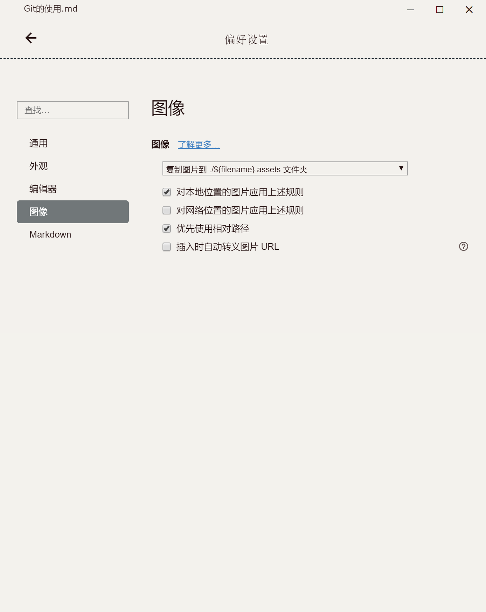
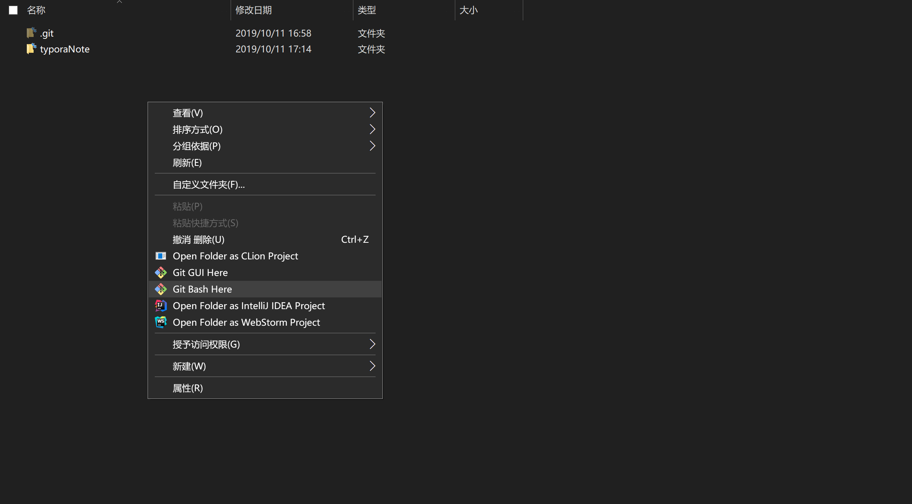
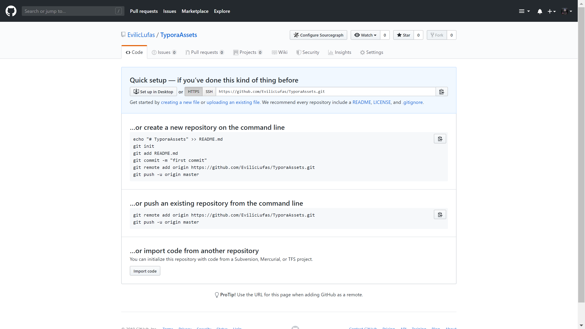
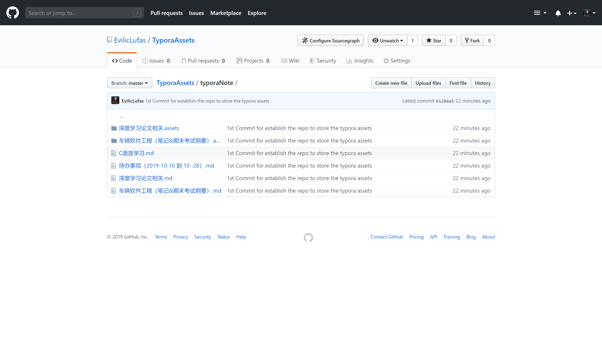
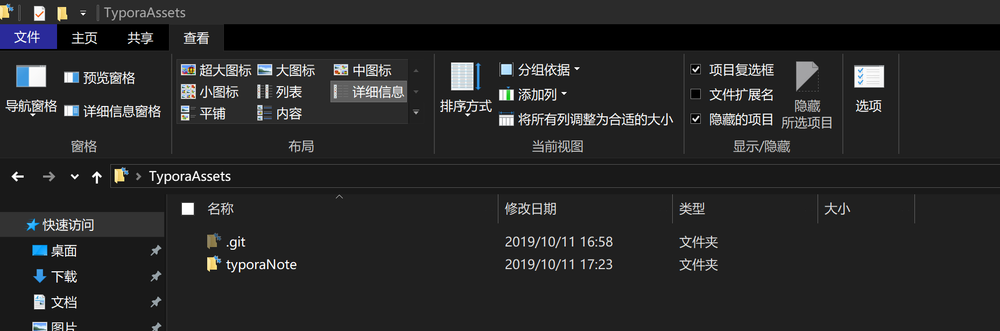

# Git的使用


## I. 使用Git&GitHubRepo&Typora构建笔记  

##### 1.在typora偏好设置中选中存入图片复制到assets文件夹中

并且设置为**优先使用相关路径**（负责在Github中Typora仍然无法顺利显示图片）

> ###### 

##### 2.在整个存放TyporaNote与Assets的文件夹外建立git

安装git之后右键文件夹打开git bash here



使用git时,先设置

>```python
>git config --global user.name "Eviliclufas"
>git config --global user.email "123@outlook.com"
>
>```

> ```python
> 
> git init
> git add README.md
> git commit -m "first commit"
> ```

##### 3.在github建立新仓库



>```python
>git remote add origin https://github.com/EvilicLufas/TyporaAssets.git
>git push -u origin master
>```

至此你的Typora笔记以及Assets文件夹都已经上传到了github的仓库里



##### 4.该过程中可能出现的问题（在Github创建库时不要选择创建readme）

> git pull 失败 ,提示：`fatal: refusing to merge unrelated histories`
>
> 其实这个问题是因为 两个 根本不相干的 git 库， 一个是本地库， 一个是远端库， 然后本地要去推送到远端， 远端觉得这个本地库跟自己不相干， 所以告知无法合并
>
> 具体的方法， 一个种方法： 是 从远端库拉下来代码 ， 本地要加入的代码放到远端库下载到本地的库， 然后提交上去 ， 因为这样的话， 你基于的库就是远端的库， 这是一次[update](https://www.centos.bz/tag/update/)了
>
> 第二种方法：
> 使用这个强制的方法
>
> ```
> git pull origin master --allow-unrelated-histories
> ```
>
> 后面加上 `--allow-unrelated-histories` ， 把两段不相干的 分支进行强行合并
>
> 后面再push就可以了 `git push gitlab master:init`
>
> gitlab是别名 ， 使用
>
> Java代码
>
> ```
> git remote add gitlab ssh://xzh@192.168.1.91:50022/opt/gitrepo/withholdings/WithholdingTransaction`
> ```
>
> master是本地的branch名字
> init是远端要推送的branch名字
>
> 本地必须要先add ，[commit](https://www.centos.bz/tag/commit/)完了 才能推上去
>
> 关于这个问题，可以参考http://[stack](https://www.centos.bz/2018/03/git-出现-fatal-refusing-to-merge-unrelated-histories-错误/#)overflow.com/questions/37937984/git-refusing-to-merge-unrelated-histories。
>
> 在进行git pull 时，添加一个可选项
>
> ```
> git pull origin master --allow-unrelated-histories
> ```

##### 5.git init 之后选择隐藏的项目 才能看到.git文件夹

> 

## II. 使用Git更新项目到本地仓库

##### 1.使用git fetch更新，相当于是从远程获取最新版本到本地，不会自动merge

```

git fetch origin master
git log -p master..origin/master
git merge origin/master
```

首先从远程的origin的master主分支下载最新的版本到origin/master分支上
然后比较本地的master分支和origin/master分支的差别
最后进行合并
上述过程其实可以用以下更清晰的方式来进行:

```
git fetch origin master:tmp
git diff tmp 
git merge tmp
```

从远程获取最新的版本到本地的tmp分支上
之后再进行比较合并

##### 2.使用git pull 更新，相当于是从远程获取最新版本并merge到本地

```
git pull origin master
```

上述命令其实相当于git fetch 和 git merge
在实际使用中，git fetch更安全一些
因为在merge前，我们可以查看更新情况，然后再决定是否合并

## III. 本地改动导致git pull出现Error解决方法

```
From https://github.com/EvilicLufas/TyporaAssets
 * branch            master     -> FETCH_HEAD
   278ba10..83d7801  master     -> origin/master
error: Your local changes to the following files would be overwritten by merge:
        typoraNote/待办事项（2019-10-10  到   10 -28）.md
Please commit your changes or stash them before you merge.
Aborting
Updating f90196a..83d7801

```

 通过git stash将工作区恢复到上次提交的内容，同时备份本地所做的修改，之后就可以正常git pull了，git pull完成后，执行git stash pop将之前本地做的修改应用到当前工作区。

```
git stash
git pull
git stash pop 
```

git stash: 备份当前的工作区的内容，从最近的一次提交中读取相关内容，让工作区保证和上次提交的内容一致。同时，将当前的工作区内容保存到Git栈中。

git pull:拉取服务器上的代码；

git stash pop: 从Git栈中读取最近一次保存的内容，恢复工作区的相关内容。由于可能存在多个Stash的内容，所以用栈来管理，pop会从最近的一个stash中读取内容并恢复。

git stash list: 显示Git栈内的所有备份，可以利用这个列表来决定从那个地方恢复。

git stash clear: 清空Git栈。此时使用gitg等图形化工具会发现，原来stash的哪些节点都消失了。
