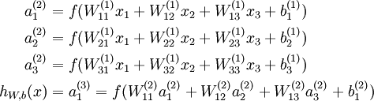
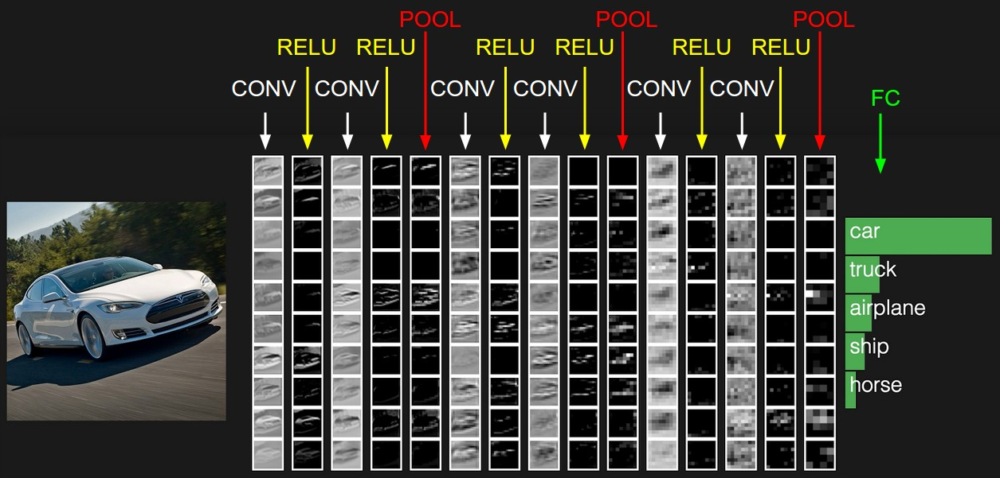
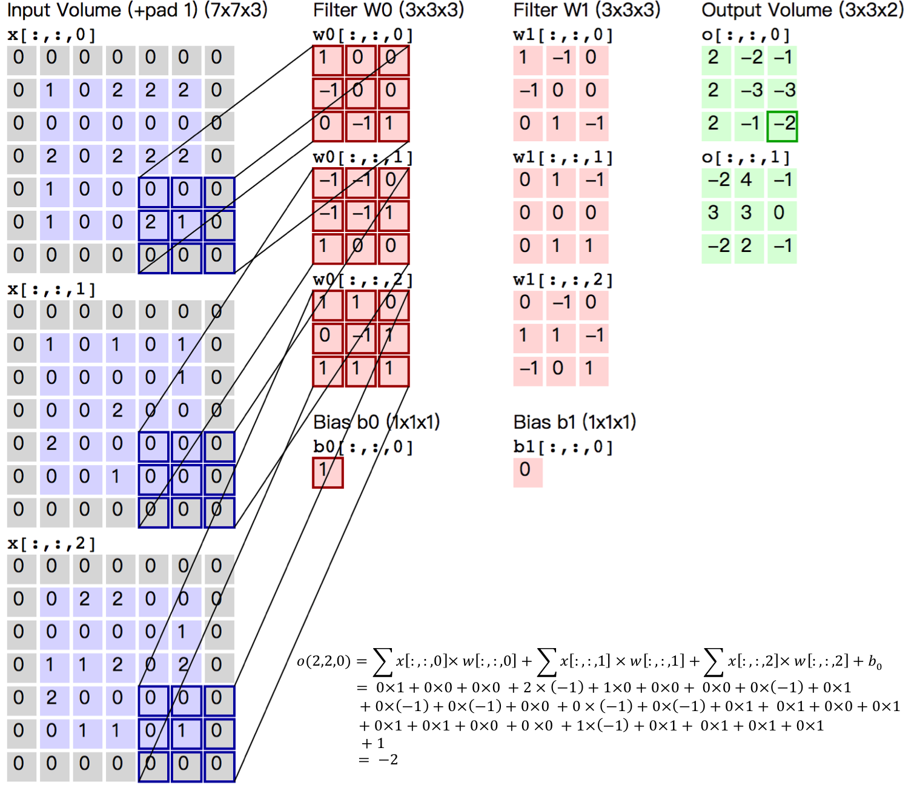
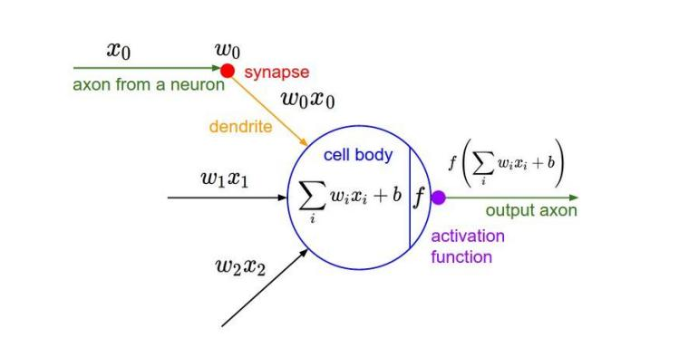
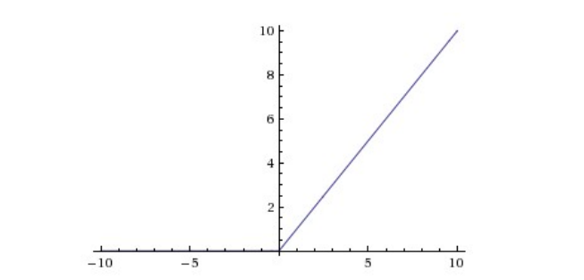

# I. Ideas of Remote Sensing Image Semantic Segmentation using DL

[TOC]


# Original Ideas

## 1.现有框架中可以考虑进去的：

  （1）若按照现有思路进行实验，得分高的patch里面可能含有得分低的像素，这种情况如何处理。

  （2）部分Class的最高得分仍然较低，这种情况如何处理。

  （3）取出各Class得分最高的x%的像素，该操作迭代多次的可能性？每迭代一次，得分最高的像素的变化情况？还是原来的那些像素吗？

​    (4) CNN与CRF结合，与现有思路结合？再加DeepLab V3+/PSPNet 

  （5）迭代多次，不应完全抛弃之前的结果只是取得最后一次的结果（x），应该考虑之前的结果进行merge

  （6）得分分布情况是否有所改变

  （7）是否可以从得分最低的x%像素进行处理？

 使用在线绘制卷积层的工具： https://cbovar.github.io/ConvNetDraw/ 


## 2.研究问题

### 2.1 研究问题

输入一张遥感图像到模型中，
$$
w*d*f (w,d： 位置， f: 通道数patch)
$$
得到带有各个像素类别标签与输入分辨率的图像
$$
w*d*N(w,d：位置，N: 维度为Class类别数量的向量Vector)
$$
整体框架为：

Image-----预处理--->n 张图片------------------>Model---------------n张图片-------------------->Image'

Model可为CNN，PSPNet，DeepLabV3+, AlexNet, U-net

训练的时候输入为 （x，y）
$$
x为 w*d*f
$$

$$
y为w*d*l
$$

需要明确数据集的输入格式

### 2.2 具体步骤

#### 2.2.1 准备训练集和测试集

（1）需要对原始图片进行分割，采用影像重叠策略，确定切割尺寸，降低边缘识别不准的错误率。

（2）对分割后的图像进行随机角度旋转，增加噪声。

（3）确定 batch size

（4）通过K折交叉验证来确定训练集和测试集

#### 2.2.2 确定使用的网络是CNN，来研究各类重新训练像素的比例

（1）确定网络的结构

（2）研究不同Label的比例是否有区别（同一数据集）

（3）使用分辨率不同（每一像素代表的实际尺度的数据集），研究比例的变化关系

#### 2.2.3 使用不同的网络，来研究比例是否有变化

（1）确定网络结构：AlexNet, U-net, PSPNet, DeepLab V3+...

（2）确定CNN的最优比例在使用不同的网络上是否仍旧最优？若不是最优，与网络又有什么样的关系，并且尝试解决或者优化。

#### 2.2.4 通用性：不同的遥感类型的图片，是否都有所作用

（1）能否成为一种通用的技巧

#### 2.2.5 输入与输出格式

输入： 一张遥感图像对应的多为矩阵，
$$
(w,d,f,l)->w,d：位置->f:通道数->l: ground-truth
$$
经过模型处理

输出：每个像素的Label
$$
(w,d,f,l,y)->w,d: 位置->y:n维向量
$$

$$
n为Label的个数，每一个便确定其对应的score
$$

带有多个像素类别标签的与输入高分辨率的图像

最终结果的确定：

对预测后的结果进行相应的旋转还原，然后对结果取平均，或对整张图进行旋转。

将训练中训练集训练结果较好的数据集，取出进行重复的训练，反向调参，以来期待这样的调参效果更好，使得最后的模型识别度更高。

#### 2.2.6 返回训练图示


以下为常规模型


分类的时候像素的分类结果正确，但是它对应的分是五六十分，这说明这些像素上的特征学习的不是很好，那么再次进行学习的时候应该是会把这些像素上的特征进行调整，来提高分数

现在想的是选各类得分最高的5%再次进行训练，如果全部正确的都返回在训练的话，感觉可能会过拟合

这个百分比的分析也可以作为实验的一部分进行


# II. 用于图像语义分割 Semantic Segmentation 的CNN 

## 一文概览用于图像分割的CNN

 https://zhuanlan.zhihu.com/p/48106193 

在计算机视觉领域，图像分割指的是为图像中的每个像素分配一个标签的任务，它也可以被看作是dense prediction task，对图像中每个像素进行分类。和使用矩形候选框的目标检测不同，图像分割需要精确到像素级位置，因此它在医学分析、卫星图像物体检测、虹膜识别和自动驾驶汽车等任务中起着非常重要的作用。

随着深度学习的不断发展，近年来图像分割技术也在速度和准确率上迎来了一次次突破。现在，我们能在几分之一秒内完成分割，同时保证极高的准确性。在这篇文章中，我们将介绍一些用于图像分割的主要技术及其背后的简单思路。我们将从最基础的语义分割（semantic segmentation）开始，慢慢进阶到更复杂的实例分割（instance segmentation）。

  

### 语义分割

语义图像分割是为图像中的每个像素分配语义类别标签的任务，它不分割对象实例。现在，处理这类任务的主流方法是FCN及其衍生，所以我们先从FCN看起。

### [全卷积网络（FCN）](https://link.zhihu.com/?target=https%3A//people.eecs.berkeley.edu/~jonlong/long_shelhamer_fcn.pdf)

#### 简述


创建FCN的方法很简单，我们只需把CNN里的所有全连接层替换成宽高1×1的卷积层，这时卷积层的filter数量等于全连接层的神经元（输出）数量，所有层都是卷积层，故称全卷积网络。之所以要这么做，是因为每个像素的空间位置对于分割来说都很重要，而卷积层能分类全连接层无法处理的单个像素。作为处理结果，神经网络较高层中的位置会对应于它们路径连接的图像中的位置，即它们的感受野。

如上图所示，FCN的架构非常简单，主要由编码器CNN（以VGG为例）构成，只不过其中和分类网络对应的最后三层被改成了(4096,1,1)(4096,1,1)(N+1,1,1)的卷积层（N表示类别数量）。编码器后是一个解码器网络，它只包含一个反向的卷积层（也称为转置卷积transposed convolution或反卷积deconvolution）。它的输出与输入图像具有相同的空间维度，并具有N+1个通道，每个通道预测一个类别。

  

 仍以VGG为例，由于前面采样部分过大，有时候会导致后面进行反向卷积操作得到的结果分辨率较低，会出现细节丢失等问题。为此，FCN的解决方法是叠加第三、四、五层池化层的特征，以生成更精准的边界分割。如下图所示 

  


以下为论文中的原图


 需要注意的一点是，在进行上采样之前，所有池化特征都会先通过(N+1,1,1)这个卷积层。 


#### 论文

Fully Convolutional Networks for Semantic Segmentation

##### Abstract

> Convolutional networks are powerful visual models that yield hierarchies of features. We show that convolutional networks by themselves, trained end-to-end, pixelstopixels, exceed the state-of-the-art in semantic segmentation.
> Our key insight is to build “fully convolutional” networks that take input of arbitrary size and produce correspondingly-sized output with efficient inference and learning. We define and detail the space of fully convolutional networks, explain their application to spatially dense prediction tasks, and draw connections to prior models. We adapt contemporary classification networks (AlexNet [22], the VGG net [34], and GoogLeNet [35]) into fully convolutional networks and transfer their learned representations by fine-tuning [5] to the segmentation task. We then define a skip architecture that combines semantic information from a deep, coarse layer with appearance information from a shallow, fine layer to produce accurate and detailed segmentations.
> Our fully convolutional network achieves stateofthe-art segmentation of PASCAL VOC (20% relative improvement to 62.2% mean IU on 2012), NYUDv2, and SIFT Flow, while inference takes less than one fifth of a second for a typical image.

卷积网络是强大的视觉模型，可产生要素层次结构。我们展示了卷积网络本身，即经过端到端训练的像素到像素，在语义分割方面超过了最新技术。
我们的主要见识是建立“完全卷积”的网络，该网络可以接受任意大小的输入，并通过有效的推理和学习产生相应大小的输出。我们定义和详细说明了全卷积网络的空间，解释了它们在空间密集的预测任务中的应用，并绘制了与先前模型的联系。我们将当代分类网络（AlexNet [22]，VGG net [34]和GoogLeNet [35]）改编为完全卷积网络，并通过微调[5]将其学习的表示传递给分割任务。然后，我们定义一个跳过体系结构，该体系结构将来自较深的粗糙层的语义信息与来自较浅的精细层的外观信息相结合，以产生准确而详细的细分。
我们的全卷积网络实现了PASCAL VOC（20％的相对改进，到2012年平均IU达到62.2％），NYUDv2和SIFT Flow的最新分割，而对于典型图像而言，推理所需的时间不到五分之一秒。

##### Introduction

> We show that a fully convolutional network (FCN) trained end-to-end, pixels-to-pixels on semantic segmentation exceeds the state-of-the-art without further machinery.
> To our knowledge, this is the first work to train FCNs end-to-end (1) for pixelwise prediction and (2) from supervised pre-training. Fully convolutional versions of existing networks predict dense outputs from arbitrary-sized inputs.
> Both learning and inference are performed whole-image-atatime by dense feedforward computation and backpropagation.
> In-network upsampling layers enable pixelwise prediction and learning in nets with subsampled pooling.
> This method is efficient, both asymptotically and absolutely, and precludes the need for the complications in other works. Patchwise training is common [30, 3, 9, 31, 11], but lacks the efficiency of fully convolutional training. Our approach does not make use of pre- and post-processing complications, including superpixels [9, 17], proposals [17, 15], or post-hoc refinement by random fields or local classifiers [9, 17]. Our model transfers recent success in classification [22, 34, 35] to dense prediction by reinterpreting classification nets as fully convolutional and fine-tuning from their learned representations. In contrast, previous works have applied small convnets without supervised pre-training [9, 31, 30].

我们展示了在语义分割上经过端到端，像素到像素训练的全卷积网络（FCN）超过了最新技术，而没有其他机制。
据我们所知，这是端到端训练FCN的第一项工作（1）用于像素预测，而（2）则来自监督式预训练。现有网络的完全卷积版本可以预测任意大小输入的密集输出。
学习和推理都是通过密集的前馈计算和反向传播在整个图像时间进行的。
网络内上采样层可通过子采样池在网络中实现像素级预测和学习。
这种方法在渐近性和绝对性上都是有效的，并且不需要其他工作中的复杂性。逐行训练是常见的[30、3、9、31、11]，但缺乏完全卷积训练的效率。我们的方法没有利用前后处理的复杂性，包括超像素[9，17]，建议[17，15]或通过随机字段或局部分类器进行的事后细化[9，17]。我们的模型通过将分类网络重新解释为完全卷积并根据其学习表示进行微调，将最近在分类[22、34、35]中的成功转移到密集预测。相反，以前的工作在没有监督预训练的情况下应用了小型卷积网络[9，31，30]。

> Semantic segmentation faces an inherent tension between semantics and location: global information resolves what while local information resolves where. Deep feature hierarchies encode location and semantics in a nonlinear local-to-global pyramid. We define a skip architecture to take advantage of this feature spectrum that combines deep, coarse, semantic information and shallow, fine, appearance information in Section 4.2 (see Figure 3).

语义分割面临着语义和位置之间的固有矛盾：全局信息解决了什么，而本地信息解决了什么。深度特征层次结构在非线性局部到全局金字塔中编码位置和语义。我们定义了一个跳过体系结构，以利用此功能范围，该功能范围在4.2节中结合了深层，粗略，语义信息和浅层，精细，外观信息（请参见图3）。

##### 3. Fully convolutional networks

> Each layer of data in a convnet is a three-dimensional array of size
> $$
> h*w*d
> $$
>  , where h and w are spatial dimensions, and d is the feature or channel dimension. The first layer is the image, with pixel size h * w, and d color channels.
> Locations in higher layers correspond to the locations in the image they are path-connected to, which are called their receptive fields.
> Convnets are built on translation invariance. Their basic components (convolution, pooling, and activation functions) operate on local input regions, and depend only on relative spatial coordinates. Writing Xij for the data vector at location (i; j) in a particular layer, and yij for the following layer, these functions compute outputs yij by
>
> where k is called the kernel size, s is the stride or subsampling factor, and fks determines the layer type: a matrix multiplication for convolution or average pooling, a spatial max for max pooling, or an elementwise nonlinearity for an activation function, and so on for other types of layers.
> This functional form is maintained under composition, with kernel size and stride obeying the transformation rule
>
> While a general deep net computes a general nonlinear function, a net with only layers of this form computes a nonlinear filter, which we call a deep filter or fully convolutional network. An FCN naturally operates on an input of any size, and produces an output of corresponding (possibly resampled) spatial dimensions.

卷积网络中的每一层数据都是大小为h w d的三维数组，其中h和w是空间维，而d是特征或通道维。第一层是图像，像素大小为h w，颜色通道为d。
较高层中的位置对应于它们在路径上连接到的图像中的位置，这些位置称为它们的接收场。
卷积建立在翻译不变性上。它们的基本组件（卷积，池化和激活函数）在局部输入区域上运行，并且仅取决于相对空间坐标。将xij写入特定层中位置（i; j）上的数据矢量，并将yij写入下一层，这些函数通过以下方式计算输出yij 


其中k称为内核大小，s为跨度或二次采样因子，而fks确定层类型：用于卷积或平均池的矩阵乘法，用于最大池的空间最大值，或用于激活函数的元素非线性，等等。
在其他类型的图层上。
该功能形式保持组成不变，内核大小和步幅遵循转换规则


一般的深层网络计算一般的非线性函数，而只有这种形式的层的网络计算非线性滤波器，我们称其为深层滤波器或完全卷积网络。FCN自然可以在任何大小的输入上运行，并产生对应的（可能是重新采样的）空间尺寸的输出。

##### 3.3. Upsampling is backwards strided convolution

> Another way to connect coarse outputs to dense pixels is interpolation. For instance, simple bilinear interpolation computes each output yij from the nearest four inputs by a linear map that depends only on the relative positions of the input and output cells.
> In a sense, upsampling with factor f is convolution with a fractional input stride of 1=f. So long as f is integral, a natural way to upsample is therefore backwards convolution (sometimes called deconvolution) with an output stride of f. Such an operation is trivial to implement, since it simply reverses the forward and backward passes of convolution.
> Thus upsampling is performed in-network for end-to-end learning by backpropagation from the pixelwise loss.
> Note that the deconvolution filter in such a layer need not be fixed (e.g., to bilinear upsampling), but can be learned.
> A stack of deconvolution layers and activation functions can even learn a nonlinear upsampling.
>
> In our experiments, we find that in-network upsampling is fast and effective for learning dense prediction. Our best segmentation architecture uses these layers to learn to upsample for refined prediction in Section 4.2.

将粗略输出连接到密集像素的另一种方法是插值。
例如，简单的双线性插值通过仅依赖于输入和输出像元的相对位置的线性映射从最近的四个输入计算每个输出yij。
从某种意义上说，因子为f的上采样是卷积，输入步幅为1 = f。
只要f是整数，向上采样的自然方法就是输出步幅为f的向后卷积（有时称为反卷积）。
这样的操作很容易实现，因为它简单地反转了卷积的前进和后退。
因此，通过从像素方向的损失进行反向传播，在网络中执行上采样以进行端到端学习。
注意，在这样的层中的去卷积滤波器不必是固定的（例如，为双线性上采样），而是可以学习的。
一堆解卷积层和激活函数甚至可以学习非线性上采样。

在我们的实验中，我们发现网络内上采样对于学习密集预测是快速有效的。我们最好的分割架构使用这些层来学习上采样，以进行第4.2节中的精确预测。

##### 4. Segmentation Architecture

> We cast ILSVRC classifiers into FCNs and augment them for dense prediction with in-network upsampling and a pixelwise loss. We train for segmentation by fine-tuning.
> Next, we add skips between layers to fuse coarse, semantic and local, appearance information. This skip architecture is learned end-to-end to refine the semantics and spatial precision of the output.
> For this investigation, we train and validate on the PASCAL VOC 2011 segmentation challenge [8]. We train with a per-pixel multinomial logistic loss and validate with the standard metric of mean pixel intersection over union, with the mean taken over all classes, including background. The training ignores pixels that are masked out (as ambiguous or difficult) in the ground truth.

我们将ILSVRC分类器转换为FCN，并通过网络内上采样和逐像素损失对它们进行增强以进行密集的预测。我们通过微调训练细分。
接下来，我们在各层之间添加跳跃，以融合粗略的，语义的和局部的外观信息。可以从端到端学习该跳过体系结构，以改进输出的语义和空间精度。
对于此调查，我们训练并验证了PASCAL VOC 2011细分挑战[8]。我们使用每像素多项式逻辑损失进行训练，并使用平均像素相交与并集的标准度量进行验证，并采用包括背景在内的所有类别的均值。训练会忽略在真实情况下被掩盖（模糊或困难）的像素。

> Note that not every possible patch is included this way, since the receptive fields of the final layer units lie on a fixed, strided grid. However, by shifting the image right and down by a random value up to the stride, random selection from all possible patches may be recovered.

请注意，并非所有可能的patch都以这种方式包括在内，因为最终层单元的接收场位于固定的，呈网格状的网格上。然而，通过将图像右移和右移一个随机值直到步幅，可以恢复从所有可能的色块中的随机选择。


> Figure 3. Our DAG nets learn to combine coarse, high layer information with fine, low layer information. Pooling and prediction layers are shown as grids that reveal relative spatial coarseness, while intermediate layers are shown as vertical lines. First row (FCN-32s): Our singlestream net, described in Section 4.1, upsamples stride 32 predictions back to pixels in a single step. Second row (FCN-16s): Combining predictions from both the final layer and the pool4 layer, at stride 16, lets our net predict finer details, while retaining high-level semantic information. Third row (FCN-8s): Additional predictions from pool3, at stride 8, provide further precision.

图3.我们的DAG网络学习将粗糙的高层信息与精细的低层信息相结合。池化层和预测层显示为显示相对空间粗糙度的网格，而中间层显示为垂直线。第一行（FCN-32s）：如第4.1节所述，我们的单数据流网络仅一步就将32个预测的步幅扩大回像素。第二行（FCN-16）：在第16步结合来自最后一层和pool4层的预测，使我们的网络可以预测更精细的细节，同时保留高级语义信息。第三行（FCN-8s）：在第8步中来自pool3的其他预测提供了更高的精度。


### [U-NET](https://link.zhihu.com/?target=https%3A//arxiv.org/abs/1505.04597)

#### 简述


U-NET常被用于生物医学图像分割，它遵循了FCN的编码器-解码器结构，不使用任何全连接层。如上图所示，常规情况下，U-NET的编码器是一个包含10个卷积层的CNN，中间包含最大池化层（红色箭头）。它的解码器会对feature map进行多次上采样和卷积，目的是为了提取更高效、更抽象的特征。得到heatmap后，U-NET最后再用1×1的卷积层做分类，也就是说解码器一共有13层，整个架构总共由23层可学习的卷积层组成。

#####   为什么要做上采样？

答：池化层会丢失图像信息和降低图像分辨率且是不可逆的操作，对图像分割任务有一些影响。上采样可以补足一些图片的信息，但是信息补充的肯定不完全，所以还需要与左边的分辨率比较高的图片相连接起来（直接复制过来再裁剪到与上采样图片一样大小），这就相当于在高分辨率和更抽象特征当中做一个折衷，因为随着卷积次数增多，提取的特征也更加有效，更加抽象。


#### 论文

##### Network Architecture 

>  The network architecture is illustrated in Figure 1. It consists of a contracting path (left side) and an expansive path (right side). The contracting path follows the typical architecture of a convolutional network. It consists of the repeated application of two 3x3 convolutions (unpadded convolutions), each followed by a rectied linear unit (ReLU) and a 2x2 max pooling operation with stride 2 for downsampling. At each downsampling step we double the number of feature channels. Every step in the expansive path consists of an upsampling of the feature map followed by a 2x2 convolution (\up-convolution") that halves the number of feature channels, a concatenation with the correspondingly cropped feature map from the contracting path, and two 3x3 convolutions, each followed by a ReLU. The cropping is necessary due to the loss of border pixels in every convolution. At the nal layer a 1x1 convolution is used to map each 64component feature vector to the desired number of classes. In total the network has 23 convolutional layers.
> To allow a seamless tiling of the output segmentation map (see Figure 2), it is important to select the input tile size such that all 2x2 max-pooling operations are applied to a layer with an even x- and y-size.

网络体系结构

络体系结构如图1所示。它由一个收缩路径（左侧）和一个扩展路径（右侧）组成。
收缩路径遵循卷积网络的典型架构。
它由两个3x3卷积（未填充卷积）的重复应用组成，每个卷积后跟一个矩形线性单位（ReLU）和一个2x2最大合并运算，步长为2用于下采样。
在每个降采样步骤中，我们将特征通道的数量加倍。
扩展路径中的每个步骤都包括对特征图进行上采样，然后进行2x2卷积（\ up-convolution“），以将特征通道的数量减半，并与从收缩路径中相应裁剪的特征图进行级联，再加上两个3x3 卷积，每个卷积后跟一个ReLU。由于每次卷积中边界像素的丢失，裁剪是必要的。在nal层，使用1x1卷积将每个64分量特征向量映射到所需的类数。
整个网络有23个卷积层。
为了无缝拼接输出分割图（请参见图2），重要的是选择输入图块大小，以便将所有2x2最大合并操作应用于x和y大小均等的图层。


### [SEGNET](https://link.zhihu.com/?target=https%3A//arxiv.org/abs/1511.00561)

#### 简述


SegNet的全称是“用于图像分割的深度卷积编码器-解码器架构”，事实上，大多数语义分割方法都遵循这种基本架构，它们的编码器都是用VGG16，解码器都仿照U-NET——多次上采样后再卷积。但是，SegNet有自己独到的特点：

- 上采样是不可学习的
- 解码器使用和编码器相同的卷积（filter大小和相应层的通道数量）

SegNet中的上采样是一种反向最大池化操作。为了补足图像信息，U-NET会对编码阶段的特征做通道降维，再把它和特征反向卷积后得到上采样进行相加，这一过程需要学习。而SegNet采用的方法是记录下编码阶段的最大池化index，比如在某层移动2×2的最大池化窗口时最高值像素的位置，然后把这个index用于解码阶段的上采样。空白的值用0填充：


在这个稀疏feature map进行正常卷积后，我们就能得到密集feature map。因此相比较FCN，SegNet的内存利用率更高，计算效率也更高。
 需要注意的是，一般来说，解码器每一层的输入通道数和feature map大小都与其对应的编码器相同，但第一层不是。编码器的第一层都3个输入通道（RGB），但解码器第一层有更多通道，这是为了给每个类别生成分割掩膜。

####  论文

SegNet: A Deep Convolutional Encoder-Decoder Architecture for Image Segmentation

##### Abstarct

> Abstract—We present a novel and practical deep fully convolutional neural network architecture for semantic pixel-wise segmentation termed SegNet. This core trainable segmentation engine consists of an encoder network, a corresponding decoder network followed by a pixel-wise classification layer. The architecture of the encoder network is topologically identical to the 13 convolutional layers in the VGG16 network [1]. The role of the decoder network is to map the low resolution encoder feature maps to full input resolution feature maps for pixel-wise classification. The novelty of SegNet lies is in the manner in which the decoder upsamples its lower resolution input feature map(s). Specifically, the decoder uses pooling indices computed in the max-pooling step of the corresponding encoder to perform non-linear upsampling. This eliminates the need for learning to upsample. The upsampled maps are sparse and are then convolved with trainable filters to produce dense feature maps. We compare our proposed architecture with the widely adopted FCN [2] and also with the well known DeepLab-LargeFOV [3], DeconvNet [4] architectures. This comparison reveals the memory versus accuracy trade-off involved in achieving good segmentation performance.
> SegNet was primarily motivated by scene understanding applications. Hence, it is designed to be efficient both in terms of memory and computational time during inference. It is also significantly smaller in the number of trainable parameters than other competing architectures and can be trained end-to-end using stochastic gradient descent. We also performed a controlled benchmark of SegNet and other architectures on both road scenes and SUN RGB-D indoor scene segmentation tasks. These quantitative assessments show that SegNet provides good performance with competitive inference time and most efficient inference memory-wise as compared to other architectures. We also provide a Caffe implementation of SegNet and a web demo at http://mi.eng.cam.ac.uk/projects/segnet/.
> Index Terms—Deep Convolutional Neural Networks, Semantic Pixel-Wise Segmentation, Indoor Scenes, Road Scenes, Encoder, Decoder, Pooling, Upsampling.

摘要—我们提出了一种新颖实用的深度全卷积神经网络架构，用于语义像素分割，称为SegNet。这个核心的可训练分段引擎由一个编码器网络，一个相应的解码器网络以及一个逐像素分类层组成。编码器网络的架构在拓扑上与VGG16网络中的13个卷积层相同[1]。解码器网络的作用是将低分辨率编码器特征图映射到全输入分辨率特征图，以进行像素分类。SegNet的新颖之处在于解码器对其较低分辨率的输入特征图进行升采样的方式。具体地，解码器使用在相应编码器的最大合并步骤中计算的合并索引来执行非线性上采样。这消除了学习上采样的需要。上采样的地图是稀疏的，然后与可训练的滤波器卷积以生成密集的特征图。我们将我们提出的架构与广泛采用的FCN [2]以及著名的DeepLab-LargeFOV [3]，DeconvNet [4]架构进行了比较。这种比较揭示了实现良好的分割性能所涉及的内存与准确性之间的权衡。
SegNet的主要动力是场景理解应用程序。因此，它被设计为在推理期间的存储和计算时间方面都是高效的。与其他竞争架构相比，它的可训练参数数量也明显更少，并且可以使用随机梯度下降进行端到端训练。我们还在道路场景和SUN RGB-D室内场景分割任务上执行了SegNet和其他体系结构的受控基准测试。这些定量评估表明，与其他架构相比，SegNet在竞争性推理时间和最有效的推理存储方面提供了良好的性能。我们还在http://mi.eng.cam.ac.uk/projects/segnet/提供了SegNet的Caffe实现和Web演示。
索引词-深度卷积神经网络，语义像素明智分割，室内场景，道路场景，编码器，解码器，合并，上采样。


# III. 系统学习机器学习之随机场(三)--MRF,CRF及几种模型对比


https://blog.csdn.net/app_12062011/article/details/53665360

#### [机器学习 —— 概率图模型（学习：CRF与MRF）](https://www.cnblogs.com/ironstark/p/5285410.html)


## 后端

终于到后端了，后端这里会讲几个场，涉及到一些数学的东西。

## 全连接条件随机场(DenseCRF)

对于每个像素i具有类别标签xi还有对应的观测值yi，这样每个像素点作为节点，像素与像素间的关系作为边，即构成了一个条件随机场。而且我们通过观测变量yi来推测像素i对应的类别标签xi。条件随机场如下： 


条件随机场符合吉布斯分布：(此处的x即上面说的观测值) 
$$
P(X=x|I)=1Z(I)exp(−E(x|I))
$$

其中的E(x|I)是能量函数，为了简便，以下省略全局观测I： 
$$
E(x)=∑iΨu(xi)+∑i<jΨp(xi,xj)
$$

其中的一元势函数∑iΨu(xi)即来自于前端FCN的输出。而二元势函数如下： 


$$
Ψp(xi,xj)=u(xi,xj)∑m=1Mω(m)k(m)G(fi,fj)
$$
二元势函数就是描述像素点与像素点之间的关系，鼓励相似像素分配相同的标签，而相差较大的像素分配不同标签，而这个“距离”的定义与颜色值和实际相对距离有关。所以这样CRF能够使图片尽量在边界处分割。而全连接条件随机场的不同就在于，二元势函数描述的是每一个像素与其他所有像素的关系，所以叫“全连接”。

 

关于这一堆公式大家随意理解一下吧… …而直接计算这些公式是比较麻烦的（我想也麻烦），所以一般会使用平均场近似方法进行计算。而平均场近似又是一堆公式，这里我就不给出了（我想大家也不太愿意看），原意了解的同学直接看论文吧。

## CRFasRNN

最开始使用DenseCRF是直接加在FCN的输出后面，可想这样是比较粗糙的。而且在深度学习中，我们都追求end-to-end的系统，所以CRFasRNN这篇文章将DenseCRF真正结合进了FCN中。这篇文章也使用了平均场近似的方法，因为分解的每一步都是一些相乘相加的计算，和普通的加减（具体公式还是看论文吧），所以可以方便的把每一步描述成一层类似卷积的计算。这样即可结合进神经网络中，并且前后向传播也不存在问题。当然，这里作者还将它进行了迭代，不同次数的迭代得到的结果优化程度也不同（一般取10以内的迭代次数），所以文章才说是as RNN。优化结果如下： 


## 马尔科夫随机场(MRF)

在Deep Parsing Network中使用的是MRF，它的公式具体的定义和CRF类似，只不过作者对二元势函数进行了修改： 

Ψ(yui,yvi)=∑k=1Kλkuk(i,u,j,v)∑∀z∈Njd(j,z)pvz

其中，作者加入的λk为label context，因为uk只是定义了两个像素同时出现的频率，而λk可以对一些情况进行惩罚，比如，人可能在桌子旁边，但是在桌子下面的可能性就更小一些。所以这个量可以学习不同情况出现的概率。而原来的距离d(i,j)只定义了两个像素间的关系，作者在这儿加入了个triple penalty，即还引入了j附近的z，这样描述三方关系便于得到更充足的局部上下文。具体结构如下： 


 

这个结构的**优点**在于：

- 将平均场构造成了CNN
- 联合训练并且可以one-pass inference，而不用迭代

## 高斯条件随机场(G-CRF)

这个结构使用CNN分别来学习一元势函数和二元势函数。这样的结构是我们更喜欢的： 


而此中的能量函数又不同于之前： 

E(x)=12xT(A+λI)x−Bx


而当(A+λI)是对称正定时，求E(x)的最小值等于求解： 

(A+λI)x=B

 

而G-CRF的优点在于：

- 二次能量有明确全局
- 解线性简便很多

# 感悟

- FCN更像一种技巧。随着基本网络（如VGG， ResNet）性能的提升而不断进步。
- 深度学习+概率图模型（GPM）是一种趋势。其实DL说白了就是进行特征提取，而GPM能够从数学理论很好的解释事物本质间的联系。
- 概率图模型的网络化。因为GPM通常不太方便加入DL的模型中，将GPM网络化后能够是GPM参数自学习，同时构成end-to-end的系统。


# IV. 各网络介绍与对比

## 图像分割综述【深度学习方法】

https://blog.csdn.net/weixin_41923961/article/details/80946586

## CNN图像语义分割基本上是这个套路：

1. **下采样+上采样：Convlution + Deconvlution／Resize**
2. **多尺度特征融合：特征逐点相加／特征channel维度拼接**
3. **获得像素级别的segement map：对每一个像素点进行判断类别**

即使是更复杂的DeepLab v3+依然也是这个基本套路。


## Image Segmentation（图像分割）网络结构比较

| 网络          |      | 父辈          | 生辰     | 增加的结构                                                   | 丢弃的结构   | 优势               | 劣势     |
| :------------ | :--- | :------------ | :------- | :----------------------------------------------------------- | :----------- | :----------------- | :------- |
| **VGG16**     |      | FCN的灵感来源 |          |                                                              |              |                    |          |
| **FCN**       |      | **VGG16**     | **2014** | **一个Deconv层(从无到有)**                                   | **所有fc层** | **简单**           | **粗糙** |
| **DeconvNet** |      | **FCN**       | **2015** | **Unpooling层（从无到有）、多个Deconv层（层数增加）、fc层（从无到有）** |              |                    |          |
| **SegNet**    |      | **DeconvNet** | **2016** | **每个max_pooling的max索引**                                 | **所有fc层** |                    |          |
| **DeepLab**   |      | **FCN**       |          |                                                              |              |                    |          |
| **PSPNet**    |      |               |          |                                                              |              |                    |          |
| **Mask-RCNN** |      |               | **2017** |                                                              |              | **真正做到像素级** |          |

## Image Segmentation（图像分割）族谱

### FCN

- DeepLab
- DeconvNet
  - SegNet
- PSPNet
- Mask-RCNN

## 按分割目的划分

- ### 普通分割

  将不同分属不同物体的像素区域分开。 
  如前景与后景分割开，狗的区域与猫的区域与背景分割开。

- ### 语义分割

  在普通分割的基础上，分类出每一块区域的语义（即这块区域是什么物体）。 
  如把画面中的所有物体都指出它们各自的类别。

- ### 实例分割

  在语义分割的基础上，给每个物体编号。 
  如这个是该画面中的狗A，那个是画面中的人C。


## 论文推荐：


图像的语义分割（Semantic Segmentation）是计算机视觉中非常重要的任务。它的目标是为图像中的每个像素分类。如果能够快速准去地做图像分割，很多问题将会迎刃而解。因此，它的应用领域就包括但不限于：自动驾驶、图像美化、三维重建等等。

语义分割是一个非常困难的问题，尤其是在深度学习之前。深度学习使得图像分割的准确率提高了很多，下面我们就总结一下近年来最具有代表性的方法和论文。

## Fully Convolutional Networks (FCN)

我们介绍的第一篇论文是***Fully convolutional Networks for Semantic Segmentation* **，简称**FCN**。这篇论文是第一篇成功使用深度学习做图像语义分割的论文。论文的主要贡献有两点：

1. 提出了全卷积网络。将全连接网络替换成了卷积网络，使得网络可以接受任意大小的图片，并输出和原图一样大小的分割图。只有这样，才能为每个像素做分类。
2. 使用了**反卷积层（Deconvolution）**。分类神经网络的特征图一般只有原图的几分之一大小。想要映射回原图大小必须对特征图进行**上采样**，这就是反卷积层的作用。虽然名字叫反卷积层，但其实它并不是卷积的逆操作，更合适的名字叫做**转置卷积（Transposed Convolution）**，作用是**从小的特征图卷出大的特征图**。

这是神经网络做语义分割的开山之作，需彻底理解。

CNN的强大之处在于它的多层结构能自动学习特征，并且可以学习到多个层次的特征：较浅的卷积层感知域较小，学习到一些局部区域的特征；较深的卷积层具有较大的感知域，能够学习到更加抽象一些的特征。这些抽象特征对物体的大小、位置和方向等敏感性更低，从而有助于识别性能的提高。

这些抽象的特征对分类很有帮助，可以很好地判断出一幅图像中包含什么类别的物体，但是因为丢失了一些物体的细节，不能很好地给出物体的具体轮廓、指出每个像素具体属于哪个物体，因此做到精确的分割就很有难度。

传统的基于CNN的分割方法的做法通常是：为了对一个像素分类，使用该像素周围的一个图像块作为CNN的输入用于训练和预测。这种方法有几个缺点：一是存储开销很大。例如对每个像素使用的图像块的大小为15x15，则所需的存储空间为原来图像的225倍。二是计算效率低下。相邻的像素块基本上是重复的，针对每个像素块逐个计算卷积，这种计算也有很大程度上的重复。三是像素块大小的限制了感知区域的大小。通常像素块的大小比整幅图像的大小小很多，只能提取一些局部的特征，从而导致分类的性能受到限制。

针对这个问题, UC Berkeley的Jonathan Long等人提出了Fully convolutional Networks (FCN)用于图像的分割。该网络试图从抽象的特征中恢复出每个像素所属的类别。即从图像级别的分类进一步延伸到像素级别的分类。

#### FCN的原理

 https://blog.csdn.net/boss2967/article/details/78929288 

FCN将传统CNN中的全连接层转化成一个个的卷积层。如下图所示，在传统的CNN结构中，前5层是卷积层，第6层和第7层分别是一个长度为4096的一维向量，第8层是长度为1000的一维向量，分别对应1000个类别的概率。FCN将这3层表示为卷积层，卷积核的大小(通道数，宽，高)分别为（4096,1,1）、（4096,1,1）、（1000,1,1）。所有的层都是卷积层，故称为全卷积网络。 

 

可以发现，经过多次卷积（还有pooling）以后，得到的图像越来越小,分辨率越来越低（粗略的图像），那么FCN是如何得到图像中每一个像素的类别的呢？为了从这个分辨率低的粗略图像恢复到原图的分辨率，FCN使用了上采样。例如经过5次卷积(和pooling)以后，图像的分辨率依次缩小了2，4，8，16，32倍。对于最后一层的输出图像，需要进行32倍的上采样，以得到原图一样的大小。

这个上采样是通过反卷积（deconvolution）实现的。对第5层的输出（32倍放大）反卷积到原图大小，得到的结果还是不够精确，一些细节无法恢复。于是Jonathan将第4层的输出和第3层的输出也依次反卷积，分别需要16倍和8倍上采样，结果就精细一些了。下图是这个卷积和反卷积上采样的过程： 

下图是32倍，16倍和8倍上采样得到的结果的对比，可以看到它们得到的结果越来越精确：

 

#### FCN的优点和不足

与传统用CNN进行图像分割的方法相比，FCN有两大明显的优点：一是可以接受任意大小的输入图像，而不用要求所有的训练图像和测试图像具有同样的尺寸。二是更加高效，因为避免了由于使用像素块而带来的重复存储和计算卷积的问题。

同时FCN的缺点也比较明显：一是得到的结果还是不够精细。进行8倍上采样虽然比32倍的效果好了很多，但是上采样的结果还是比较模糊和平滑，对图像中的细节不敏感。二是对各个像素进行分类，没有充分考虑像素与像素之间的关系，忽略了在通常的基于像素分类的分割方法中使用的空间规整（spatial regularization）步骤，缺乏空间一致性。

#### CRF全连接条件随机场 ---FCN的扩展

虽然FCN不够完美，但是其全新的思路开辟了一个新的图像分割方向，对这个领域的影响是十分巨大的，从2015年3月在arxiv和6月在CVPR会议上发表到写下这篇博客的时候一年的时间，该文章已被引用高达400次。

在FCN的基础上，UCLA DeepLab的Liang-Chieh Chen等在得到像素分类结果后使用了全连接的条件随机场（fully connected conditional random fields），考虑图像中的空间信息，得到更加精细并且具有空间一致性的结果。

Liang-Chieh的这篇文章有两大特点，一是忽略下采样过程，转而使用稀疏的卷积核以增加感知范围。如下图所示： 

  

二是使用了Fully Connected CRF。CRF的能量函数中包括数据项和平滑项两部分，数据项与各个像素属于各类别的概率有关，平滑项控制像素与像素间类别的一致性。传统的CRF的平滑项只考虑相邻像素类别的关联性，而Fully Connected CRF将图像中任意两个像素之间的类别关联性都考虑进来。

下图是CNN与Fully Connected CRF结合的示意图。 

  

 实际上，CRF或者Fully Connected CRF是对CNN或者FCN输出的一种后处理技术。像素分类和空间规整这两步是分别进行的。Shuai Zheng等人将Fully Connected CRF表示成回流神经网络的结构(recurrent neuron network，RNN)，将CNN与这个RNN放到一个统一的框架中，可以一步到位地对两者同时进行训练。将图像分割中的三个步骤：特征提取、分类器预测和空间规整全部自动化处理，通过学习获得，得到的结果比FCN-8s和DeepLab的方法的效果好了许多。如下图结果：  

 

CNN、FCN与Fully Connected CRF的结合及统一的自动训练具有很不错的应用价值，已有很多的研究对这几篇文章进行跟进（[2]和[3]的引用都已过百）。例如，帝国理工的Konstantinos Kamnitsas，Daniel Rueckert等人在这几篇文章的基础上，提出了三维的多尺度CNN和全连接CRF结合的方法，称为DeepMedic, 用于脑肿瘤的分割，最近（4月4号）刚发表于arXiv。 


### DeepLab

##### deeplab系列总结（deeplab v1& v2 & v3 & v3+）https://blog.csdn.net/Dlyldxwl/article/details/81148810

##### DeepLab 语义分割模型 v1、v2、v3、v3+ 概要（附 Pytorch 实现）https://zhuanlan.zhihu.com/p/68531147

##### [Deeplab v3+的结构代码简要分析](https://www.cnblogs.com/ywheunji/p/10479019.html)

DeepLab有**v1/ v2 / v3 / v3+**，第一篇名字叫做 ***DeepLab: Semantic Image Segmentation with Deep convolutional Nets, Atrous convolution, and Fully Connected CRFs***。这一系列论文引入了以下几点比较重要的方法：

## I. 空洞卷积

https://blog.csdn.net/comeontoto/article/details/79983557

https://www.zhihu.com/question/54149221

英文名叫做 **Dilated convolution**，或者 **Atrous convolution** 带洞卷积实际上就是普通的卷积核中间插入了几个洞，如下图。


**Standard Convolution with a 3 x 3 kernel (and padding):**


**Dilated Convolution with a 3 x 3 kernel and dilation rate 2:**


首先是诞生背景，在图像分割领域，图像输入到CNN（典型的网络比如FCN[3]）中，FCN先像传统的CNN那样对图像做卷积再pooling，降低图像尺寸的同时增大感受野，但是由于图像分割预测是pixel-wise的输出，所以要将pooling后较小的图像尺寸upsampling到原始的图像尺寸进行预测（upsampling一般采用deconv反卷积操作），之前的pooling操作使得每个pixel预测都能看到较大感受野信息。因此图像分割FCN中有两个关键，一个是pooling减小图像尺寸增大感受野，另一个是upsampling扩大图像尺寸。在先减小再增大尺寸的过程中，肯定有一些信息损失掉了，那么能不能设计一种新的操作，不通过pooling也能有较大的感受野看到更多的信息呢？答案就是dilated conv。

下面看一下dilated conv原始论文[4]中的示意图：


(a)图对应3x3的1-dilated conv，和普通的卷积操作一样，(b)图对应3x3的2-dilated conv，实际的卷积kernel size还是3x3，但是空洞为1，也就是对于一个7x7的图像patch，只有9个红色的点和3x3的kernel发生卷积操作，其余的点略过。也可以理解为kernel的size为7x7，但是只有图中的9个点的权重不为0，其余都为0。 可以看到虽然kernel size只有3x3，但是这个卷积的感受野已经增大到了7x7（如果考虑到这个2-dilated conv的前一层是一个1-dilated conv的话，那么每个红点就是1-dilated的卷积输出，所以感受野为3x3，所以1-dilated和2-dilated合起来就能达到7x7的conv）,(c)图是4-dilated conv操作，同理跟在两个1-dilated和2-dilated conv的后面，能达到15x15的感受野。对比传统的conv操作，3层3x3的卷积加起来，stride为1的话，只能达到(kernel-1)*layer+1=7的感受野，也就是和层数layer成线性关系，而dilated conv的感受野是指数级的增长。

dilated的好处是不做pooling损失信息的情况下，加大了感受野，让每个卷积输出都包含较大范围的信息。在图像需要全局信息或者语音文本需要较长的sequence信息依赖的问题中，都能很好的应用dilated conv，比如图像分割[3]、语音合成WaveNet[2]、机器翻译ByteNet[1]中。简单贴下ByteNet和WaveNet用到的dilated conv结构，可以更形象的了解dilated conv本身。

**ByteNet**


**WaveNet**


下面再阐述下deconv和dilated conv的区别：

> deconv的其中一个用途是做upsampling，即增大图像尺寸。而dilated conv并不是做upsampling，而是增大感受野。

可以形象的做个解释：

对于标准的k*k卷积操作，stride为s，分三种情况：

(1) s>1，即卷积的同时做了downsampling，卷积后图像尺寸减小；

(2) s=1，普通的步长为1的卷积，比如在tensorflow中设置padding=SAME的话，卷积的图像输入和输出有相同的尺寸大小；

(3) 0convolution，相当于对图像做upsampling。比如s=0.5时，意味着在图像每个像素之间padding一个空白的像素后，stride改为1做卷积，得到的feature map尺寸增大一倍。

而dilated conv不是在像素之间padding空白的像素，而是在已有的像素上，skip掉一些像素，或者输入不变，对conv的kernel参数中插一些0的weight，达到一次卷积看到的空间范围变大的目的。

当然将普通的卷积stride步长设为大于1，也会达到增加感受野的效果，但是stride大于1就会导致downsampling，图像尺寸变小。大家可以从以上理解到deconv，dilated conv，pooling/downsampling，upsampling之间的联系与区别


## 重新思考卷积： Rethinking Convolution

在赢得其中一届ImageNet比赛里VGG网络的文章中，他最大的贡献并不是VGG网络本身，而是他对于卷积叠加的一个巧妙观察。

> This (stack of three 3 × 3 conv layers) can be seen as imposing a regularisation on the 7 × 7 conv. filters, forcing them to have a decomposition through the 3 × 3 filters (with non-linearity injected in between).

这里意思是 7 x 7 的卷积层的正则等效于 3 个 3 x 3 的卷积层的叠加。而这样的设计不仅可以大幅度的减少参数，其本身带有正则性质的 convolution map 能够更容易学一个 generlisable, expressive feature space。这也是现在绝大部分基于卷积的深层网络都在用小卷积核的原因。


然而 Deep CNN 对于其他任务还有一些致命性的缺陷。较为著名的是 up-sampling 和 pooling layer 的设计。这个在 Hinton 的演讲里也一直提到过。

主要问题有：

1. Up-sampling / pooling layer (e.g. bilinear interpolation) is deterministic. (a.k.a. not learnable)
2. 内部数据结构丢失；空间层级化信息丢失。
3. 小物体信息无法重建 (假设有四个pooling layer 则 任何小于 2^4 = 16 pixel 的物体信息将理论上无法重建。)

在这样问题的存在下，语义分割问题一直处在瓶颈期无法再明显提高精度， 而 dilated convolution 的设计就良好的避免了这些问题。

## 空洞卷积的拯救之路：Dilated Convolution to the Rescue

题主提到的这篇文章 MULTI-SCALE CONTEXT AGGREGATION BY DILATED  convolution S 可能(?) 是第一篇尝试用 dilated  convolution 做语义分割的文章。后续图森组和 Google Brain 都对于 dilated convolution 有着更细节的讨论，推荐阅读：Understanding convolution for Semantic Segmentation Rethinking Atrous convolution for Semantic Image Segmentation 。

对于 dilated  convolution ， 我们已经可以发现他的优点，即内部数据结构的保留和避免使用 down-sampling 这样的特性。但是完全基于 dilated convolution 的结构如何设计则是一个新的问题。

**潜在问题 1：The Gridding Effect**

假设我们仅仅多次叠加 dilation rate 2 的 3 x 3 kernel 的话，则会出现这个问题：


我们发现我们的 kernel 并不连续，也就是并不是所有的 pixel 都用来计算了，因此这里将信息看做 checker-board 的方式会损失信息的连续性。这对 pixel-level dense prediction 的任务来说是致命的。

**潜在问题 2：Long-ranged information might be not relevant.**

我们从 dilated convolution 的设计背景来看就能推测出这样的设计是用来获取 long-ranged information。然而光采用大 dilation rate 的信息或许只对一些大物体分割有效果，而对小物体来说可能则有弊无利了。如何同时处理不同大小的物体的关系，则是设计好 dilated convolution 网络的关键。

## 通向标准化设计：Hybrid Dilated Convolution (HDC)

对于上个 section 里提到的几个问题，图森组的文章对其提出了较好的解决的方法。他们设计了一个称之为 HDC 的设计结构。

第一个特性是，叠加卷积的 dilation rate 不能有大于1的公约数。比如 [2, 4, 6] 则不是一个好的三层卷积，依然会出现 gridding effect。

第二个特性是，我们将 dilation rate 设计成 锯齿状结构，例如 [1, 2, 5, 1, 2, 5] 循环结构。

第三个特性是，我们需要满足一下这个式子： ![[公式]](https://www.zhihu.com/equation?tex=M_i%3D%5Cmax%5BM_%7Bi%2B1%7D-2r_i%2CM_%7Bi%2B1%7D-2%28M_%7Bi%2B1%7D-r_i%29%2Cr_i%5D)

其中   是 i 层的 dilation rate 而  是指在 i 层的最大dilation rate，那么假设总共有n层的话，默认  。假设我们应用于 kernel 为 k x k 的话，我们的目标则是  ，这样我们至少可以用 dilation rate 1 即 standard convolution的方式来覆盖掉所有洞。

一个简单的例子:  dilation rate [1, 2, 5] with 3 x 3 kernel (可行的方案)


而这样的锯齿状本身的性质就比较好的来同时满足小物体大物体的分割要求(小 dilation rate 来关心近距离信息，大 dilation rate 来关心远距离信息)。

这样我们的卷积依然是连续的也就依然能满足VGG组观察的结论，大卷积是由小卷积的 regularisation 的 叠加。

以下的对比实验可以明显看出，一个良好设计的 dilated convolution 网络能够有效避免 gridding effect.


## 多尺度分割的另类解：Atrous Spatial Pyramid Pooling (ASPP)

在处理多尺度物体分割时，我们通常会有以下几种方式来操作：


然仅仅(在一个卷积分支网络下)使用 dilated convolution 去抓取多尺度物体是一个不正统的方法。比方说，我们用一个 HDC 的方法来获取一个大（近）车辆的信息，然而对于一个小（远）车辆的信息都不再受用。假设我们再去用小 dilated convolution 的方法重新获取小车辆的信息，则这么做非常的冗余。

基于港中文和商汤组的 PSPNet 里的 Pooling module （其网络同样获得当年的SOTA结果），ASPP 则在网络 decoder 上对于不同尺度上用不同大小的 dilation rate 来抓去多尺度信息，每个尺度则为一个独立的分支，在网络最后把他合并起来再接一个卷积层输出预测 label。这样的设计则有效避免了在 encoder 上冗余的信息的获取，直接关注与物体之间之内的相关性。

## 总结

Dilated convolution 个人认为想法简单，直接且优雅，并取得了相当不错的效果提升。他起源于语义分割，大部分文章也用于语义分割，具体能否对其他应用有价值姑且还不知道，但确实是一个不错的探究方向。有另外的答主提到WaveNet, ByteNet 也用到了 dilated convolution 确实是一个很有趣的发现，因为本身 sequence-to-sequence learning 也是一个需要关注多尺度关系的问题。则在 sequence-to-sequence learning 如何实现，如何设计，跟分割或其他应用的关联是我们可以重新需要考虑的问题。


## Pyramid Scene Parsing Network

Pyramid Scene Parsing Network的核心贡献是Global Pyramid Pooling，翻译成中文叫做全局金字塔池化。它将特征图缩放到几个不同的尺寸，使得特征具有更好地全局和多尺度信息，这一点在准确率提升上上非常有用。


其实不光是语义分割，金字塔多尺度特征对于各类视觉问题都是挺有用的。

## Mask R-CNN

Mask R-CNN是大神何凯明的力作，将Object Detection与Semantic Segmentation合在了一起做。它的贡献主要是以下几点。

第一，神经网络有了多个分支输出。Mask R-CNN使用类似Faster R-CNN的框架，Faster R-CNN的输出是物体的bounding box和类别，而Mask R-CNN则多了一个分支，用来预测物体的语义分割图。也就是说神经网络同时学习两项任务，可以互相促进。

第二，在语义分割中使用Binary Mask。原来的语义分割预测类别需要使用0 1 2 3 4等数字代表各个类别。在Mask R-CNN中，检测分支会预测类别。这时候分割只需要用0 1预测这个物体的形状面具就行了。

第三，Mask R-CNN提出了RoiAlign用来替换Faster R-CNN中的RoiPooling。RoiPooling的思想是将输入图像中任意一块区域对应到神经网络特征图中的对应区域。RoiPooling使用了化整的近似来寻找对应区域，导致对应关系与实际情况有偏移。这个偏移在分类任务中可以容忍，但对于精细度更高的分割则影响较大。

为了解决这个问题，RoiAlign不再使用化整操作，而是使用线性插值来寻找更精准的对应区域。效果就是可以得到更好地对应。实验也证明了效果不错。下面展示了与之前方法的对比，下面的图是Mask R-CNN，可以看出精细了很多。


# IV.卷积神经网络各层分析

### 4.1  [卷积神经网络（CNN）详解](https://www.cnblogs.com/duanhx/p/9655223.html) 

 https://www.cnblogs.com/duanhx/p/9655223.html 

#### 一、卷积神经网络的基本概念

​    卷积神经网络与普通神经网络的区别在于，卷积神经网络包含了一个由卷积层和子采样层（池化层）构成的特征抽取器。在卷积神经网络的卷积层中，一个神经元只与部分邻层神经元连接。在CNN的一个卷积层中，通常包含若干个特征图(featureMap)，每个特征图由一些矩形排列的的神经元组成，同一特征图的神经元共享权值，这里共享的权值就是卷积核。卷积核一般以随机小数矩阵的形式初始化，在网络的训练过程中卷积核将学习得到合理的权值。共享权值（卷积核）带来的直接好处是减少网络各层之间的连接，同时又降低了过拟合的风险。子采样也叫做池化（pooling），通常有均值子采样（mean pooling）和最大值子采样（max pooling）两种形式。子采样可以看作一种特殊的卷积过程。卷积和子采样大大简化了模型复杂度，减少了模型的参数。

#### 二、卷积神经网络的基本原理

2.1 神经网络

​    首先介绍神经网络，神经网络的每个单元如下：


​    其对应的公式如下：


​    其中，该单元也可以被称作是Logistic回归模型。当将多个单元组合起来并具有分层结构时，就形成了神经网络模型。下图展示了一个具有一个隐含层的神经网络。


​    其对应的公式如下：



​    比较类似的，可以拓展到有2,3,4,5，…个隐含层。

​    神经网络的训练方法也同Logistic类似，不过由于其多层性，还需要利用链式求导法则对隐含层的节点进行求导，即梯度下降+链式求导法则，专业名称为反向传播。关于训练算法的相关原理及操作过程，可参见之前写的关于BP算法https://blog.csdn.net/qq_42570457/article/details/81454008。


##### 2.2 卷积神经网络

   首先，我们先获取一个感性认识，下图是一个卷积神经网络的实例：



卷积神经网络通常包含以下几种层：

- 卷积层（Convolutional layer），卷积神经网路中每层卷积层由若干卷积单元组成，每个卷积单元的参数都是通过反向传播算法优化得到的。卷积运算的目的是提取输入的不同特征，第一层卷积层可能只能提取一些低级的特征如边缘、线条和角等层级，更多层的网络能从低级特征中迭代提取更复杂的特征。
- 线性整流层（Rectified Linear Units layer, ReLU layer），这一层神经的活性化函数（Activation function）使用线性整流（Rectified Linear Units, ReLU）f(x)=max(0,x)f(x)=max(0,x)。
- 池化层（Pooling layer），通常在卷积层之后会得到维度很大的特征，将特征切成几个区域，取其最大值或平均值，得到新的、维度较小的特征。
- 全连接层（ Fully-Connected layer）, 把所有局部特征结合变成全局特征，用来计算最后每一类的得分。

###### 2.2.1 卷积层（convolutional layer）

​    卷积层是卷积神经网络的核心基石。在图像识别里我们提到的卷积是二维卷积，即离散二维滤波器（也称作卷积核）与二维图像做卷积操作，简单的讲是二维滤波器滑动到二维图像上所有位置，并在每个位置上与该像素点及其领域像素点做内积。卷积操作被广泛应用与图像处理领域，不同卷积核可以提取不同的特征，例如边沿、线性、角等特征。在深层卷积神经网络中，通过卷积操作可以提取出图像低级到复杂的特征

  

 上图给出一个卷积计算过程的示例图，输入图像大小为H=5,W=5,D=3，即5×5大小的3通道（RGB，也称作深度）彩色图像。这个示例图中包含两（用K表示）组卷积核，即图中滤波器W0和W1。在卷积计算中，通常对不同的输入通道采用不同的卷积核，如图示例中每组卷积核包含（D=3）个3×3（用F×F表示）大小的卷积核。另外，这个示例中卷积核在图像的水平方向（W方向）和垂直方向（H方向）的滑动步长为2（用S表示）；对输入图像周围各填充1（用P表示）个0，即图中输入层原始数据为蓝色部分，灰色部分是进行了大小为1的扩展，用0来进行扩展。经过卷积操作得到输出为3×3×2（用Ho×Wo×K表示）大小的特征图，即3×3大小的2通道特征图，其中Ho计算公式为：Ho=(H−F+2×P)/S+1，Wo同理。 而输出特征图中的每个像素，是每组滤波器与输入图像每个特征图的内积再求和，再加上偏置bo，偏置通常对于每个输出特征图是共享的。输出特征图o[:,:,0]中的最后一个−2计算如上图右下角公式所示。 

记住这几个符号：

- H：图片高度；
- W：图片宽度；
- D：原始图片通道数，也是卷积核个数；
- F：卷积核高宽大小；
- P：图像边扩充大小；
- S：滑动步长。
- K： 深度，输出单元的深度

 在卷积操作中卷积核是可学习的参数，经过上面示例介绍，每层卷积的参数大小为D×F×F×K。卷积层的参数较少，这也是由卷积层的主要特性即局部连接和共享权重所决定。

- 局部连接：每个神经元仅与输入神经元的一块区域连接，这块局部区域称作感受野（receptive field）。在图像卷积操作中，即神经元在空间维度（spatial dimension，即上图示例H和W所在的平面）是局部连接，但在深度上是全部连接。对于二维图像本身而言，也是局部像素关联较强。这种局部连接保证了学习后的过滤器能够对于局部的输入特征有最强的响应。局部连接的思想，也是受启发于生物学里面的视觉系统结构，视觉皮层的神经元就是局部接受信息的。
- 权重共享：计算同一个深度切片的神经元时采用的滤波器是共享的。例上图中计算o[:,:,0]的每个每个神经元的滤波器均相同，都为W0，这样可以很大程度上减少参数。共享权重在一定程度上讲是有意义的，例如图片的底层边缘特征与特征在图中的具体位置无关。但是在一些场景中是无意的，比如输入的图片是人脸，眼睛和头发位于不同的位置，希望在不同的位置学到不同的特征 。请注意权重只是对于同一深度切片的神经元是共享的，在卷积层，通常采用多组卷积核提取不同特征，即对应不同深度切片的特征，不同深度切片的神经元权重是不共享。另外，偏重对同一深度切片的所有神经元都是共享的。

通过介绍卷积计算过程及其特性，可以看出卷积是线性操作，并具有平移不变性（shift-invariant），平移不变性即在图像每个位置执行相同的操作。卷积层的局部连接和权重共享使得需要学习的参数大大减小，这样也有利于训练较大卷积神经网络。

整体计算过程如下（与上图中的数据不同，但是计算过程相同）：

  

###### 2.2.2 线性整流层（Rectified Linear Units layer, ReLU layer）--激励层 

  把卷积层输出结果做非线性映射。 

  

CNN采用的激励函数一般为ReLU(The Rectified Linear Unit/修正线性单元)，它的特点是收敛快，求梯度简单，但较脆弱，图像如下。 

  

 激励层的实践经验：
　　①不要用sigmoid！不要用sigmoid！不要用sigmoid！
　　② 首先试RELU，因为快，但要小心点
　　③ 如果2失效，请用Leaky ReLU或者Maxout
　　④ 某些情况下tanh倒是有不错的结果，但是很少 

###### 2.2.3 池化层（Pooling layer） 

池化（pool）即下采样（downsamples），目的是为了减少特征图，主要作用是通过减少网络的参数来减小计算量，并且能够在一定程度上控制过拟合。通常在卷积层的后面会加上一个池化层。池化操作对每个深度切片独立，规模一般为 2＊2，相对于卷积层进行卷积运算，池化层进行的运算一般有以下几种： 
   \* 最大池化（Max Pooling）。取4个点的最大值。这是最常用的池化方法。 
   \* 均值池化（Mean Pooling）。取4个点的均值。 
   \* 高斯池化。借鉴高斯模糊的方法。不常用。 
   \* 可训练池化。训练函数 ff ，接受4个点为输入，出入1个点。不常用。

最常见的池化层是规模为2*2， 步幅为2，对输入的每个深度切片进行下采样。每个MAX操作对四个数进行，如下图所示： 

  

池化操作将保存深度大小不变。如果池化层的输入单元大小不是二的整数倍，一般采取边缘补零（zero-padding）的方式补成2的倍数，然后再池化。 

###### 2.2.4 全连接层（ Fully-Connected layer） 

 全连接层和卷积层可以相互转换： 
    \* 对于任意一个卷积层，要把它变成全连接层只需要把权重变成一个巨大的矩阵，其中大部分都是0 除了一些特定区块（因为局部感知），而且好多区块的权值还相同（由于权重共享）。 
  \* 相反地，对于任何一个全连接层也可以变为卷积层。 

##### 2.2.5 反向传播 

下面讲解卷积层的反向传播过程：

###### 反向传播算法推导-卷积神经网络

https://mp.weixin.qq.com/s?__biz=MzU4MjQ3MDkwNA==&mid=2247485971&idx=1&sn=632e3c135ead5f0ac730eee5b6a05647&chksm=fdb69784cac11e9258f67312fa2798e9c8210b8f77741a3d7bab4c1ccfa1c1f66632183f4f26&scene=0#rd 


#### 三、其他

一般CNN结构依次为

1. INPUT
2. [[CONV -> RELU]*N -> POOLING]*M 
3. [FC -> RELU]*K
4. FC

卷积神经网络之训练算法

1. 同一般机器学习算法，先定义Loss function，衡量和实际结果之间差距。
2. 找到最小化损失函数的W和b， CNN中用的算法是SGD（随机梯度下降）。

卷积神经网络之优缺点
优点
　　• 共享卷积核，对高维数据处理无压力
　　• 无需手动选取特征，训练好权重，即得特征分类效果好
缺点
　　• 需要调参，需要大样本量，训练最好要GPU
　　• 物理含义不明确（也就说，我们并不知道没个卷积层到底提取到的是什么特征，而且神经网络本身就是一种难以解释的“黑箱模型”）

卷积神经网络之典型CNN
　　• LeNet，这是最早用于数字识别的CNN
　　• AlexNet， 2012 ILSVRC比赛远超第2名的CNN，比
　　• LeNet更深，用多层小卷积层叠加替换单大卷积层。
　　• ZF Net， 2013 ILSVRC比赛冠军
　　• GoogLeNet， 2014 ILSVRC比赛冠军
　　• VGGNet， 2014 ILSVRC比赛中的模型，图像识别略差于GoogLeNet，但是在很多图像转化学习问题(比如object detection)上效果奇好


### 4.2 ResNet, AlexNet, VGG, Inception: 理解各种各样的CNN架构

 https://zhuanlan.zhihu.com/p/32116277 


# V. 超像素

## 2. 超像素 Superpixel

### 2.1 原理介绍

SLIC算法是simple linear iterative cluster的简称，该算法用来生成超像素（superpixel）

算法步骤：

- 已知一副图像大小M*N,可以从RGB空间转换为LAB空间，LAB颜色空间表现的颜色更全面
- 假如预定义参数K，K为预生成的超像素数量，即预计将M*N大小的图像(像素数目即为M*N)分隔为K个超像素块，每个超像素块范围大小包含[（M*N）/K]个像素
- 假设每个超像素区域长和宽都均匀分布的话，那么每个超像素块的长和宽均可定义为S，S=sqrt(M*N/K)
- 遍历操作，将每个像素块的中心点的坐标(x,y)及其lab的值保存起来，加入到事先定义好的集合中
- 每个像素块的中心点默认是(S/2,S/2)进行获取的，有可能落在噪音点或者像素边缘（所谓像素边缘，即指像素突变处，比如从黑色过渡到白色的交界处），这里，利用差分方式进行梯度计算，调整中心点：

​     算法中，使用中心点的8领域像素点，计算获得最小梯度值的像素点，并将其作为新的中心点，差分计算梯度的公式：

> Gradient(x,y)=dx(i,j) + dy(i,j);
> dx(i,j) = I(i+1,j) - I(i,j); 
> dy(i,j) = I(i,j+1) - I(i,j);    
> 遍历现中心点的8领域像素点，将其中计算得到最小Gradient值的像素点作为新的中心点

- 调整完中心点后即需要进行像素点的聚类操作

> 通过聚类的方式迭代计算新的聚类中心；
> 首先，需要借助K-means聚类算法，将像素点进行归类，通过变换的欧氏聚距离公式进行，公式如下（同时参考像素值和坐标值提取相似度）： 

$$
dc = \sqrt{(l_j - l_i)^2+(a_j-a_i)^2+(b_j-b_i)^2}
$$

$$
d_s = \sqrt{(x_j-x_i)^2+(y_j-y_i)^2}
$$

$$
D' = \sqrt{(d_c/m)^2+(d_s/S)^2}
$$

> 通过两个参数m和S来协调两种距离的比例分配。参数S即是上面第③步计算得出的每个像素块的长度值，而参数M为LAB空间的距离可能最大值，其可取的范围建议为[1,40]
> 为了节省时间，只遍历每个超像素块中心点周边的2S*2S区域内的像素点，计算该区域内每个像素点距离哪一个超像素块的中心点最近，并将其划分到其中；完成一次迭代后，重新计算每个超像素块的中心点坐标，并重新进行迭代（注：衡量效率和效果后一般选择迭代10次）

#### 像素分割

在计算机视觉中，图像分割是个非常重要且基础的研究方向。简单来说，图像分割（image segmentation）就是根据某些规则把图片中的像素分成不同的部分（加不同的标签）。

图像分割中的一些常见的术语有：superpixels（超像素）、Semantic Segmentation（语义分割）、Instance Segmentation（实例分割）、Panoptic Segmentation（全景分割）。他们之间到底有什么区别呢？如果你对这几个术语非常了解了，那么恭喜你！可以直接把文章拖到结尾，顺手点个广告，就可以返回了（笑）。

不过很多刚接触这个领域的同学有点搞不太清楚上面的区别，那么跟我一起来学习一下吧！

##### superpixels（超像素）

第一次听说这个超像素很容易理解错误，以为是在普通的像素基础上继续像微观细分，如果这样理解就恰好理解反了，其实超像素是一系列像素的集合，这些像素具有类似的颜色、纹理等特征，距离也比较近。用超像素对一张图片进行分割的结果见下图，其中每个白色线条区域内的像素集合就是一个超像素。需要注意的是，超像素很可能把同一个物体的不同部分分成多个超像素。
超像素最早的定义来自2003年 Xiaofeng Ren等人的一篇论文《Learning a Classification Model for Segmentation》。

其中超像素中比较常用的一种方法是SLIC（simple linear iterative clustering），是Achanta 等人2010年提出的一种思想简单、实现方便的算法，将彩色图像转化为CIELAB颜色空间和XY坐标下的5维特征向量，然后对5维特征向量构造距离度量标准，对图像像素进行局部聚类的过程。SLIC算法能生成紧凑、近似均匀的超像素，在运算速度，物体轮廓保持、超像素形状方面具有较高的综合评价，比较符合人们期望的分割效果。

 

##### Semantic Segmentation（语义分割）

语义分割还是比较常见的，就是把图像中每个像素赋予一个类别标签（比如汽车、建筑、地面、天空等），比如下图就把图像分为了草地（浅绿）、人（红色）、树木（深绿）、天空（蓝色）等标签，用不同的颜色来表示。

不过这种分割方式存在一些问题，比如如果一个像素被标记为红色，那就代表这个像素所在的位置是一个人，但是如果有两个都是红色的像素，这种方式无法判断它们是属于同一个人还是不同的人。也就是说语义分割只能判断类别，无法区分个体。

  

##### Instance Segmentation（实例分割）

实例分割方式有点类似于物体检测，不过物体检测一般输出的是 bounding box，实例分割输出的是一个mask。

实例分割和上面的语义分割也不同，它不需要对每个像素进行标记，它只需要找到感兴趣物体的边缘轮廓就行，比如下图中的人就是感兴趣的物体。该图的分割方法采用了一种称为Mask R-CNN的方法。我们可以看到每个人都是不同的颜色的轮廓，因此我们可以区分出单个个体。

  

##### Panoptic Segmentation（全景分割）

最后说说全景分割，它是语义分割和实例分割的结合。如下图所示，每个像素都被分为一类，如果一种类别里有多个实例，会用不同的颜色进行区分，我们可以知道哪个像素属于哪个类中的哪个实例。比如下图中黄色和红色都属于人这一个类别里，但是分别属于不同的实例（人），因此我们可以通过mask的颜色很容易分辨出不同的实例。
  

#### 超像素分割详解 

 https://www.jianshu.com/p/d0ef931b3ddf 

### 2.2 代码实现

```Python
import math
from skimage import io, color
import numpy as np

class Cluster(object):

    cluster_index = 1

    def __init__(self, row, col, l=0, a=0, b=0):
        self.update(row, col, l, a, b)
        self.pixels = []
        self.no = self.cluster_index
        Cluster.cluster_index += 1

    def update(self, row, col, l, a, b):
        self.row = row
        self.col = col
        self.l = l
        self.a = a
        self.b = b


class SLICProcessor(object):
    @staticmethod
    def open_image(path):
        rgb = io.imread(path)
        lab_arr = color.rgb2lab(rgb)
        return lab_arr

    @staticmethod
    def save_lab_image(path, lab_arr):
        rgb_arr = color.lab2rgb(lab_arr)
        io.imsave(path, rgb_arr)

    def make_cluster(self, row, col):
        row=int(row)
        col=int(col)
        return Cluster(row, col,
                       self.data[row][col][0],
                       self.data[row][col][1],
                       self.data[row][col][2])

    def __init__(self, filename, K, M):
        self.K = K
        self.M = M

        self.data = self.open_image(filename)
        self.rows = self.data.shape[0]
        self.cols = self.data.shape[1]
        self.N = self.rows * self.cols
        self.S = int(math.sqrt(self.N / self.K))

        self.clusters = []
        self.label = {}
        self.dis = np.full((self.rows, self.cols), np.inf)

    def init_clusters(self):
        row = self.S / 2
        col = self.S / 2
        while row < self.rows:
            while col < self.cols:
                self.clusters.append(self.make_cluster(row, col))
                col+= self.S
            col = self.S / 2
            row += self.S

    def get_gradient(self, row, col):
        if col + 1 >= self.cols:
            col = self.cols - 2
        if row + 1 >= self.rows:
            row = self.rows - 2

        gradient = (self.data[row + 1][col][0] +self.data[row][col+1][0]-2*self.data[row][col][0])+ \
                   (self.data[row + 1][col][1] +self.data[row][col+1][1]-2*self.data[row][col][1]) + \
                   (self.data[row + 1][col][2] +self.data[row][col+1][2]-2*self.data[row][col][2])

        return gradient

    def move_clusters(self):
        for cluster in self.clusters:
            cluster_gradient = self.get_gradient(cluster.row, cluster.col)
            for dh in range(-1, 2):
                for dw in range(-1, 2):
                    _row = cluster.row + dh
                    _col = cluster.col + dw
                    new_gradient = self.get_gradient(_row, _col)
                    if new_gradient < cluster_gradient:
                        cluster.update(_row, _col, self.data[_row][_col][0], self.data[_row][_col][1], self.data[_row][_col][2])
                        cluster_gradient = new_gradient

    def assignment(self):
        for cluster in self.clusters:
            for h in range(cluster.row - 2 * self.S, cluster.row + 2 * self.S):
                if h < 0 or h >= self.rows: continue
                for w in range(cluster.col - 2 * self.S, cluster.col + 2 * self.S):
                    if w < 0 or w >= self.cols: continue
                    L, A, B = self.data[h][w]
                    Dc = math.sqrt(
                        math.pow(L - cluster.l, 2) +
                        math.pow(A - cluster.a, 2) +
                        math.pow(B - cluster.b, 2))
                    Ds = math.sqrt(
                        math.pow(h - cluster.row, 2) +
                        math.pow(w - cluster.col, 2))
                    D = math.sqrt(math.pow(Dc / self.M, 2) + math.pow(Ds / self.S, 2))
                    if D < self.dis[h][w]:
                        if (h, w) not in self.label:
                            self.label[(h, w)] = cluster
                            cluster.pixels.append((h, w))
                        else:
                            self.label[(h, w)].pixels.remove((h, w))
                            self.label[(h, w)] = cluster
                            cluster.pixels.append((h, w))
                        self.dis[h][w] = D

    def update_cluster(self):
        for cluster in self.clusters:
            sum_h = sum_w = number = 0
            for p in cluster.pixels:
                sum_h += p[0]
                sum_w += p[1]
                number += 1
                _h =int( sum_h / number)
                _w =int( sum_w / number)
                cluster.update(_h, _w, self.data[_h][_w][0], self.data[_h][_w][1], self.data[_h][_w][2])

    def save_current_image(self, name):
        image_arr = np.copy(self.data)
        for cluster in self.clusters:
            for p in cluster.pixels:
                image_arr[p[0]][p[1]][0] = cluster.l
                image_arr[p[0]][p[1]][1] = cluster.a
                image_arr[p[0]][p[1]][2] = cluster.b
            image_arr[cluster.row][cluster.col][0] = 0
            image_arr[cluster.row][cluster.col][1] = 0
            image_arr[cluster.row][cluster.col][2] = 0
        self.save_lab_image(name, image_arr)

    def iterates(self):
        self.init_clusters()
        self.move_clusters()
        #考虑到效率和效果，折中选择迭代10次
        for i in range(10):
            self.assignment()
            self.update_cluster()
        self.save_current_image("output.jpg")


if __name__ == '__main__':
    p = SLICProcessor('beauty.jpg', 200, 40)
    p.iterates()
```

------


## 3.PSPNet

### 3.1 语义分割之PSPNet个人总结

#### 3.1.1 Architecture

作者想解决的问题有:
(1) 由于没有理解上下文语义关系导致类的错分，如水上的船被错分为car，而事实是car一般不在水上。
(2) 相似类的混淆: 如 摩天大楼、building、wall。
(3) 不显眼的类的划分，如路灯。
作者认为想解决这三个问题，在于要利用不同感受野的信息，并且要理解上下文语义关系。

于是作者致敬SPPNet，也采用了多尺度池化。

主要核心在于后面的金字塔池化，最后再进行concat。


#### 3.2.2 Auxiliary Loss

这是专门针对ResNet的。虽然ResNet已经通过残差块来解决梯度消失的问题，但作者认为加一个loss层会使优化问题更简单。于是在如图位置加了一个loss。最后乘以一个权重alpha 与最后一层连接的loss相加，形成最终的loss。


### 3.2 PSPNet论文翻译及解读（中英文对照）

 https://www.jianshu.com/p/57329a0b7a2d 


## 4.深度学习调参

 https://blog.csdn.net/qq_20259459/article/details/70316511 


# VI.  Image Segementation 资源

## 图像分割 （Image Segmentation) 重大资源：

### 入门学习

1. A 2017 Guide to Semantic Segmentation with Deep Learning 概述——用深度学习做语义分割
   - [http://blog.qure.ai/notes/semantic-segmentation-deep-learning-review]
   - 中文翻译：[http://simonduan.site/2017/07/23/notes-semantic-segmentation-deep-learning-review/]
2. 从全卷积网络到大型卷积核：深度学习的语义分割全指南
   - [https://www.jiqizhixin.com/articles/2017-07-14-10]
3. Fully Convolutional Networks
   - [http://simtalk.cn/2016/11/01/Fully-Convolutional-Networks/]
4. 语义分割中的深度学习方法全解：从FCN、SegNet到各代DeepLab
   - [https://zhuanlan.zhihu.com/p/27794982]
5. 图像语义分割之FCN和CRF
   - [https://zhuanlan.zhihu.com/p/22308032]
6. 从特斯拉到计算机视觉之「图像语义分割」
   - [http://www.52cs.org/?p=1089]
7. 计算机视觉之语义分割
   - [http://blog.geohey.com/ji-suan-ji-shi-jue-zhi-yu-yi-fen-ge/]
8. Segmentation Results: VOC2012 PASCAL语义分割比赛排名
   - [http://host.robots.ox.ac.uk:8080/leaderboard/displaylb.php?challengeid=11&compid=6]

### 进阶论文

1. U-Net [https://arxiv.org/pdf/1505.04597.pdf]
2. SegNet [https://arxiv.org/pdf/1511.00561.pdf]
3. DeepLab [https://arxiv.org/pdf/1606.00915.pdf]
4. FCN [https://arxiv.org/pdf/1605.06211.pdf]
5. ENet [https://arxiv.org/pdf/1606.02147.pdf]
6. LinkNet [https://arxiv.org/pdf/1707.03718.pdf]
7. DenseNet [https://arxiv.org/pdf/1608.06993.pdf]
8. Tiramisu [https://arxiv.org/pdf/1611.09326.pdf]
9. DilatedNet [https://arxiv.org/pdf/1511.07122.pdf]
10. PixelNet [https://arxiv.org/pdf/1609.06694.pdf]
11. ICNet [https://arxiv.org/pdf/1704.08545.pdf]
12. ERFNet [http://www.robesafe.uah.es/personal/eduardo.romera/pdfs/Romera17iv.pdf]
13. RefineNet [https://arxiv.org/pdf/1611.06612.pdf]
14. PSPNet [https://arxiv.org/pdf/1612.01105.pdf]
15. CRFasRNN [[http://www.robots.ox.ac.uk/%7Eszheng/papers/CRFasRNN.pdf](http://www.robots.ox.ac.uk/~szheng/papers/CRFasRNN.pdf)]
16. Dilated convolution [https://arxiv.org/pdf/1511.07122.pdf]
17. DeconvNet [https://arxiv.org/pdf/1505.04366.pdf]
18. FRRN [https://arxiv.org/pdf/1611.08323.pdf]
19. GCN [https://arxiv.org/pdf/1703.02719.pdf]
20. DUC, HDC [https://arxiv.org/pdf/1702.08502.pdf]
21. Segaware [https://arxiv.org/pdf/1708.04607.pdf]
22. Semantic Segmentation using Adversarial Networks [https://arxiv.org/pdf/1611.08408.pdf]

### 综述

1. A Review on Deep Learning Techniques Applied to Semantic Segmentation Alberto Garcia-Garcia, Sergio Orts-Escolano, Sergiu Oprea, Victor Villena-Martinez, Jose Garcia-Rodriguez 2017
   - [https://arxiv.org/abs/1704.06857]
2. Computer Vision for Autonomous Vehicles: Problems, Datasets and State-of-the-Art
   - [https://arxiv.org/abs/1704.05519]
3. 基于内容的图像分割方法综述 姜 枫 顾 庆 郝慧珍 李 娜 郭延文 陈道蓄 2017
   - [http://www.jos.org.cn/ch/reader/create_pdf.aspx?file_no=5136&journal_id=jos\]

### Tutorial

1. Semantic Image Segmentation with Deep Learning
   - [http://www.robots.ox.ac.uk/~sadeep/files/crfasrnn_presentation.pdf\]
2. A 2017 Guide to Semantic Segmentation with Deep Learning
   - [http://blog.qure.ai/notes/semantic-segmentation-deep-learning-review]
3. Image Segmentation with Tensorflow using CNNs and Conditional Random Fields
   - [http://warmspringwinds.github.io/tensorflow/tf-slim/2016/12/18/image-segmentation-with-tensorflow-using-cnns-and-conditional-random-fields/]

### 视频教程

1. CS231n: Convolutional Neural Networks for Visual Recognition Lecture 11 Detection and Segmentation 
   - [http://cs231n.stanford.edu/syllabus.html]
2. Machine Learning for Semantic Segmentation - Basics of Modern Image Analysis
   - [https://www.youtube.com/watch?v=psLChcm8aiU]

### 代码

#### Semantic segmentation

1. U-Net (

   https://arxiv.org/pdf/1505.04597.pdf

   )

   - https://lmb.informatik.uni-freiburg.de/people/ronneber/u-net/ (Caffe - Matlab)
   - https://github.com/jocicmarko/ultrasound-nerve-segmentation (Keras)
   - https://github.com/EdwardTyantov/ultrasound-nerve-segmentation(Keras)
   - https://github.com/ZFTurbo/ZF_UNET_224_Pretrained_Model (Keras)
   - https://github.com/yihui-he/u-net (Keras)
   - https://github.com/jakeret/tf_unet (Tensorflow)
   - https://github.com/DLTK/DLTK/blob/master/examples/Toy_segmentation/simple_dltk_unet.ipynb (Tensorflow)
   - https://github.com/divamgupta/image-segmentation-keras (Keras)
   - https://github.com/ZijunDeng/pytorch-semantic-segmentation (PyTorch)
   - https://github.com/akirasosa/mobile-semantic-segmentation (Keras)
   - https://github.com/orobix/retina-unet (Keras)

2. SegNet (

   https://arxiv.org/pdf/1511.00561.pdf

   )

   - https://github.com/alexgkendall/caffe-segnet (Caffe)
   - https://github.com/developmentseed/caffe/tree/segnet-multi-gpu (Caffe)
   - https://github.com/preddy5/segnet (Keras)
   - https://github.com/imlab-uiip/keras-segnet (Keras)
   - https://github.com/andreaazzini/segnet (Tensorflow)
   - https://github.com/fedor-chervinskii/segnet-torch (Torch)
   - https://github.com/0bserver07/Keras-SegNet-Basic (Keras)
   - https://github.com/tkuanlun350/Tensorflow-SegNet (Tensorflow)
   - https://github.com/divamgupta/image-segmentation-keras (Keras)
   - https://github.com/ZijunDeng/pytorch-semantic-segmentation (PyTorch)
   - https://github.com/chainer/chainercv/tree/master/examples/segnet(Chainer)
   - https://github.com/ykamikawa/keras-SegNet (Keras)

3. DeepLab (

   https://arxiv.org/pdf/1606.00915.pdf

   )

   - https://bitbucket.org/deeplab/deeplab-public/ (Caffe)
   - https://github.com/cdmh/deeplab-public (Caffe)
   - https://bitbucket.org/aquariusjay/deeplab-public-ver2 (Caffe)
   - https://github.com/TheLegendAli/DeepLab-Context (Caffe)
   - https://github.com/msracver/Deformable-ConvNets/tree/master/deeplab(MXNet)
   - https://github.com/DrSleep/tensorflow-deeplab-resnet (Tensorflow)
   - https://github.com/muyang0320/tensorflow-deeplab-resnet-crf(TensorFlow)
   - https://github.com/isht7/pytorch-deeplab-resnet (PyTorch)
   - https://github.com/bermanmaxim/jaccardSegment (PyTorch)
   - https://github.com/martinkersner/train-DeepLab (Caffe)
   - https://github.com/chenxi116/TF-deeplab (Tensorflow)

4. FCN (

   https://arxiv.org/pdf/1605.06211.pdf

   )

   - https://github.com/vlfeat/matconvnet-fcn (MatConvNet)
   - https://github.com/shelhamer/fcn.berkeleyvision.org (Caffe)
   - https://github.com/MarvinTeichmann/tensorflow-fcn (Tensorflow)
   - https://github.com/aurora95/Keras-FCN (Keras)
   - https://github.com/mzaradzki/neuralnets/tree/master/vgg_segmentation_keras (Keras)
   - https://github.com/k3nt0w/FCN_via_keras (Keras)
   - https://github.com/shekkizh/FCN.tensorflow (Tensorflow)
   - https://github.com/seewalker/tf-pixelwise (Tensorflow)
   - https://github.com/divamgupta/image-segmentation-keras (Keras)
   - https://github.com/ZijunDeng/pytorch-semantic-segmentation (PyTorch)
   - https://github.com/wkentaro/pytorch-fcn (PyTorch)
   - https://github.com/wkentaro/fcn (Chainer)
   - https://github.com/apache/incubator-mxnet/tree/master/example/fcn-xs(MxNet)
   - https://github.com/muyang0320/tf-fcn (Tensorflow)
   - https://github.com/ycszen/pytorch-seg (PyTorch)
   - https://github.com/Kaixhin/FCN-semantic-segmentation (PyTorch)

5. ENet (

   https://arxiv.org/pdf/1606.02147.pdf

   )

   - https://github.com/TimoSaemann/ENet (Caffe)
   - https://github.com/e-lab/ENet-training (Torch)
   - https://github.com/PavlosMelissinos/enet-keras (Keras)

6. LinkNet (

   https://arxiv.org/pdf/1707.03718.pdf

   )

   - https://github.com/e-lab/LinkNet (Torch)

7. DenseNet (

   https://arxiv.org/pdf/1608.06993.pdf

   )

   - https://github.com/flyyufelix/DenseNet-Keras (Keras)

8. Tiramisu (

   https://arxiv.org/pdf/1611.09326.pdf

   )

   - https://github.com/0bserver07/One-Hundred-Layers-Tiramisu (Keras)
   - https://github.com/SimJeg/FC-DenseNet (Lasagne)

9. DilatedNet (

   https://arxiv.org/pdf/1511.07122.pdf

   )

   - https://github.com/nicolov/segmentation_keras (Keras)

10. PixelNet (

    https://arxiv.org/pdf/1609.06694.pdf

    )

    - https://github.com/aayushbansal/PixelNet (Caffe)

11. ICNet (

    https://arxiv.org/pdf/1704.08545.pdf

    )

    - https://github.com/hszhao/ICNet (Caffe)

12. ERFNet (

    http://www.robesafe.uah.es/personal/eduardo.romera/pdfs/Romera17iv.pdf

    )

    - https://github.com/Eromera/erfnet (Torch)

13. RefineNet (

    https://arxiv.org/pdf/1611.06612.pdf

    )

    - https://github.com/guosheng/refinenet (MatConvNet)

14. PSPNet (

    https://arxiv.org/pdf/1612.01105.pdf

    )

    - https://github.com/hszhao/PSPNet (Caffe)
    - https://github.com/ZijunDeng/pytorch-semantic-segmentation (PyTorch)
    - https://github.com/mitmul/chainer-pspnet (Chainer)
    - https://github.com/Vladkryvoruchko/PSPNet-Keras-tensorflow(Keras/Tensorflow)
    - https://github.com/pudae/tensorflow-pspnet (Tensorflow)

15. CRFasRNN (

    http://www.robots.ox.ac.uk/%7Eszheng/papers/CRFasRNN.pdf

    )

    - https://github.com/torrvision/crfasrnn (Caffe)
    - https://github.com/sadeepj/crfasrnn_keras (Keras)

16. Dilated convolution (

    https://arxiv.org/pdf/1511.07122.pdf

    )

    - https://github.com/fyu/dilation (Caffe)
    - https://github.com/fyu/drn#semantic-image-segmentataion (PyTorch)
    - https://github.com/hangzhaomit/semantic-segmentation-pytorch (PyTorch)

17. DeconvNet (

    https://arxiv.org/pdf/1505.04366.pdf

    )

    - http://cvlab.postech.ac.kr/research/deconvnet/ (Caffe)
    - https://github.com/HyeonwooNoh/DeconvNet (Caffe)
    - https://github.com/fabianbormann/Tensorflow-DeconvNet-Segmentation(Tensorflow)

18. FRRN (

    https://arxiv.org/pdf/1611.08323.pdf

    )

    - https://github.com/TobyPDE/FRRN (Lasagne)

19. GCN (

    https://arxiv.org/pdf/1703.02719.pdf

    )

    - https://github.com/ZijunDeng/pytorch-semantic-segmentation (PyTorch)
    - https://github.com/ycszen/pytorch-seg (PyTorch)

20. DUC, HDC (

    https://arxiv.org/pdf/1702.08502.pdf

    )

    - https://github.com/ZijunDeng/pytorch-semantic-segmentation (PyTorch)
    - https://github.com/ycszen/pytorch-seg (PyTorch)

21. Segaware (

    https://arxiv.org/pdf/1708.04607.pdf

    )

    - https://github.com/aharley/segaware (Caffe)

22. Semantic Segmentation using Adversarial Networks (

    https://arxiv.org/pdf/1611.08408.pdf

    )

    - https://github.com/oyam/Semantic-Segmentation-using-Adversarial-Networks (Chainer)

#### Instance aware segmentation

1. FCIS [

   https://arxiv.org/pdf/1611.07709.pdf

   ]

   - https://github.com/msracver/FCIS [MxNet]

2. MNC [

   https://arxiv.org/pdf/1512.04412.pdf

   ]

   - https://github.com/daijifeng001/MNC [Caffe]

3. DeepMask [

   https://arxiv.org/pdf/1506.06204.pdf

   ]

   - https://github.com/facebookresearch/deepmask [Torch]

4. SharpMask [

   https://arxiv.org/pdf/1603.08695.pdf

   ]

   - https://github.com/facebookresearch/deepmask [Torch]

5. Mask-RCNN [

   https://arxiv.org/pdf/1703.06870.pdf

   ]

   - https://github.com/CharlesShang/FastMaskRCNN

     [Tensorflow]

     1. https://github.com/jasjeetIM/Mask-RCNN [Caffe]

   - https://github.com/TuSimple/mx-maskrcnn [MxNet]

   - https://github.com/matterport/Mask_RCNN [Keras]

6. RIS [

   https://arxiv.org/pdf/1511.08250.pdf

   ]

   - https://github.com/bernard24/RIS [Torch]

7. FastMask [

   https://arxiv.org/pdf/1612.08843.pdf

   ]

   - https://github.com/voidrank/FastMask [Caffe]

#### Satellite images segmentation

- https://github.com/mshivaprakash/sat-seg-thesis
- https://github.com/KGPML/Hyperspectral
- https://github.com/lopuhin/kaggle-dstl
- https://github.com/mitmul/ssai
- https://github.com/mitmul/ssai-cnn
- https://github.com/azavea/raster-vision
- https://github.com/nshaud/DeepNetsForEO
- https://github.com/trailbehind/DeepOSM

#### Video segmentation

- https://github.com/shelhamer/clockwork-fcn
- https://github.com/JingchunCheng/Seg-with-SPN

#### Autonomous driving

- https://github.com/MarvinTeichmann/MultiNet
- https://github.com/MarvinTeichmann/KittiSeg
- https://github.com/vxy10/p5_VehicleDetection_Unet [Keras]
- https://github.com/ndrplz/self-driving-car
- https://github.com/mvirgo/MLND-Capstone

#### Annotation Tools:

- https://github.com/AKSHAYUBHAT/ImageSegmentation
- https://github.com/kyamagu/js-segment-annotator
- https://github.com/CSAILVision/LabelMeAnnotationTool
- https://github.com/seanbell/opensurfaces-segmentation-ui
- https://github.com/lzx1413/labelImgPlus
- https://github.com/wkentaro/labelme

### Datasets

1. Stanford Background Dataset[

   http://dags.stanford.edu/projects/scenedataset.html

   ]

   1. Sift Flow Dataset[http://people.csail.mit.edu/celiu/SIFTflow/]
   2. Barcelona Dataset[http://www.cs.unc.edu/~jtighe/Papers/ECCV10/]
   3. Microsoft COCO dataset[http://mscoco.org/]
   4. MSRC Dataset[http://research.microsoft.com/en-us/projects/objectclassrecognition/]
   5. LITS Liver Tumor Segmentation Dataset[https://competitions.codalab.org/competitions/15595]
   6. KITTI[http://www.cvlibs.net/datasets/kitti/eval_road.php]
   7. Stanford background dataset[http://dags.stanford.edu/projects/scenedataset.html]
   8. Data from Games dataset[https://download.visinf.tu-darmstadt.de/data/from_games/]
   9. Human parsing dataset[https://github.com/lemondan/HumanParsing-Dataset]
   10. Silenko person database[https://github.com/Maxfashko/CamVid]
   11. Mapillary Vistas Dataset[https://www.mapillary.com/dataset/vistas]
   12. Microsoft AirSim[https://github.com/Microsoft/AirSim]
   13. MIT Scene Parsing Benchmark[http://sceneparsing.csail.mit.edu/]
   14. COCO 2017 Stuff Segmentation Challenge[http://cocodataset.org/#stuff-challenge2017]
   15. ADE20K Dataset[http://groups.csail.mit.edu/vision/datasets/ADE20K/]
   16. INRIA Annotations for Graz-02[http://lear.inrialpes.fr/people/marszalek/data/ig02/]

### 比赛

1. MSRC-21 [http://rodrigob.github.io/are_we_there_yet/build/semantic_labeling_datasets_results.html]
2. Cityscapes [https://www.cityscapes-dataset.com/benchmarks/]
3. VOC2012 [http://host.robots.ox.ac.uk:8080/leaderboard/displaylb.php?challengeid=11&compid=6]

### 领域专家

1. Jonathan Long
   - [http://people.eecs.berkeley.edu/~jonlong/\]
2. Liang-Chieh Chen
   - [http://liangchiehchen.com/]
3. Hyeonwoo Noh
   - [http://cvlab.postech.ac.kr/~hyeonwoonoh/\]
4. Bharath Hariharan
   - [http://home.bharathh.info/]
5. Fisher Yu
   - [http://www.yf.io/]
6. Vijay Badrinarayanan
   - [https://sites.google.com/site/vijaybacademichomepage/home/papers]
7. Guosheng Lin
   - [https://sites.google.com/site/guoshenglin/]


## Related Websites

##### Large-Scale Point Cloud Classification Benchmark

 http://www.semantic3d.net/ 

##### 【阅读笔记】（语义分割最全总结，综述）《A Review on Deep Learning Techniques Applied to Semantic Segmentation》  2019.2.25

https://blog.csdn.net/ShuqiaoS/article/details/87690424#hyperspectral_images_73

##### A Review on Deep Learning Techniques Applied to Semantic Segmentation

https://arxiv.org/pdf/1704.06857.pdf

##### A 2017 Guide to Semantic Segmentation with Deep Learning

http://simonduan.site/2017/07/23/notes-semantic-segmentation-deep-learning-review/

##### 计算机视觉 - 常见的图片分类模型【架构演变】

https://www.cnblogs.com/viredery/p/convolution_neural_networks_for_classification.html

##### 如何优化你的图像分类模型效果？

https://www.jianshu.com/p/09883093cf13

##### 【Keras】基于SegNet和U-Net的遥感图像语义分割

https://www.cnblogs.com/skyfsm/p/8330882.html

##### Kaggle: Dstl Satellite Imagery Feature Detection

https://www.kaggle.com/c/dstl-satellite-imagery-feature-detection

##### A 2017 Guide to Semantic Segmentation with Deep Learning    Sasank Chilamkurthy   July 5, 2017

http://blog.qure.ai/notes/semantic-segmentation-deep-learning-review

##### 图像语义分割综述（semantic segmentation) 上篇

https://blog.csdn.net/Biyoner/article/details/82591370

##### Jeremy Jordan

[https://www.jeremyjordan.me/semantic-segmentation/%C2%A0/](https://www.jeremyjordan.me/semantic-segmentation/ /)

##### （超详细很完整）tensorflow下利用deeplabv3+对自己的数据进行训练

https://blog.csdn.net/malvas/article/details/90776327

##### 使用 deeplabv3+ 训练自己的数据集经验总结

https://blog.csdn.net/Kelvin_XX/article/details/81946091

##### 【语义分割】综述——一文搞定语义分割

https://blog.csdn.net/ShuqiaoS/article/details/87360693

##### tensorflow随笔——图像分类、检测，语义分割综述

https://blog.csdn.net/neil3611244/article/details/81740077

##### 关于图像语义分割的总结和感悟

https://www.2cto.com/kf/201609/545237.html

##### Semi-Supervised-Semantic-Segmentation-GAN

https://github.com/gengyanlei/Semi-Supervised-Semantic-Segmentation-GAN

##### PSPNet Deeplab_v3+ pytorch复现

https://blog.csdn.net/LEILEI18A/article/details/80702481

##### PSPNet(Pyramid Scene Parsing Network)

https://blog.csdn.net/u011961856/article/details/77165427

##### Special Issue "Image Segmentation for Environmental Monitoring"

https://www.mdpi.com/journal/remotesensing/special_issues/image-segentation

##### An overview of semantic image segmentation.

https://www.jeremyjordan.me/semantic-segmentation/


