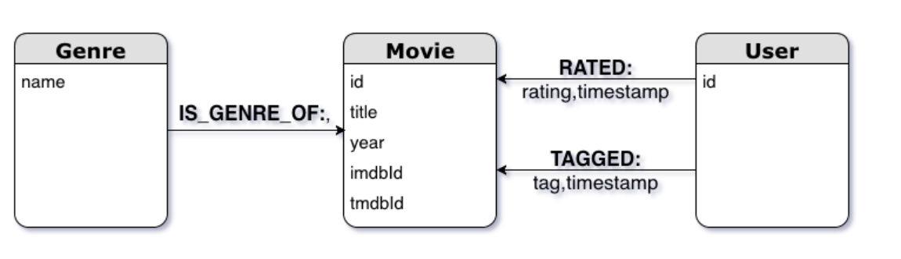
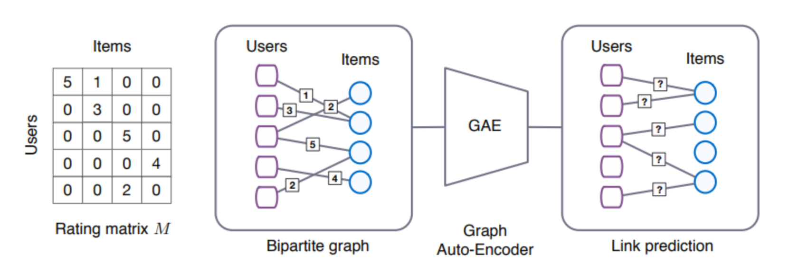

# RS-Movie  Report

### Data collecting

We have used [**Movielens**](https://grouplens.org/datasets/movielens/) **[1]** dataset ([ml-latest-small](http://files.grouplens.org/datasets/movielens/ml-latest-small.zip)). This dataset describes **5-star** rating and free-text tagging activity from [MovieLens](http://movielens.org/), a movie recommendation service. It contains **100004 ratings** and **1296 tag applications** across **9125 movies**. These data were created by **671 users** between January 09, 1995 and October 16, 2016.

MovieLens **1M** movie ratings. Stable benchmark dataset. 1 million ratings from 6000 users on 4000 movies. Released 2/2003.

https://grouplens.org/datasets/movielens/


```markdown
RATINGS FILE DESCRIPTION
================================================================================

All ratings are contained in the file "ratings.dat" and are in the
following format:

UserID::MovieID::Rating::Timestamp

- UserIDs range between 1 and 6040 
- MovieIDs range between 1 and 3952
- Ratings are made on a 5-star scale (whole-star ratings only)
- Timestamp is represented in seconds since the epoch as returned by time(2)
- Each user has at least 20 ratings

USERS FILE DESCRIPTION
================================================================================

User information is in the file "users.dat" and is in the following
format:

UserID::Gender::Age::Occupation::Zip-code

All demographic information is provided voluntarily by the users and is
not checked for accuracy.  Only users who have provided some demographic
information are included in this data set.

- Gender is denoted by a "M" for male and "F" for female
- Age is chosen from the following ranges:

	*  1:  "Under 18"
	* 18:  "18-24"
	* 25:  "25-34"
	* 35:  "35-44"
	* 45:  "45-49"
	* 50:  "50-55"
	* 56:  "56+"

- Occupation is chosen from the following choices:

	*  0:  "other" or not specified
	*  1:  "academic/educator"
	*  2:  "artist"
	*  3:  "clerical/admin"
	*  4:  "college/grad student"
	*  5:  "customer service"
	*  6:  "doctor/health care"
	*  7:  "executive/managerial"
	*  8:  "farmer"
	*  9:  "homemaker"
	* 10:  "K-12 student"
	* 11:  "lawyer"
	* 12:  "programmer"
	* 13:  "retired"
	* 14:  "sales/marketing"
	* 15:  "scientist"
	* 16:  "self-employed"
	* 17:  "technician/engineer"
	* 18:  "tradesman/craftsman"
	* 19:  "unemployed"
	* 20:  "writer"

MOVIES FILE DESCRIPTION
================================================================================

Movie information is in the file "movies.dat" and is in the following
format:

MovieID::Title::Genres

- Titles are identical to titles provided by the IMDB (including
year of release)
- Genres are pipe-separated and are selected from the following genres:

	* Action
	* Adventure
	* Animation
	* Children's
	* Comedy
	* Crime
	* Documentary
	* Drama
	* Fantasy
	* Film-Noir
	* Horror
	* Musical
	* Mystery
	* Romance
	* Sci-Fi
	* Thriller
	* War
	* Western

- Some MovieIDs do not correspond to a movie due to accidental duplicate
entries and/or test entries
- Movies are mostly en
```


## Data Storing with Neo4j

### Load Data in Neo4j


##### Ratings Data File Structure (ratings.csv)

All ratings are contained in the file `ratings.csv`. Each line of this file after the header row represents one rating of one movie by one user, and has the following format:

```
userId,movieId,rating,timestamp
```

##### Tags Data File Structure (tags.csv)

All tags are contained in the file `tags.csv`. Each line of this file after the header row represents one tag applied to one movie by one user, and has the following format:

```
userId,movieId,tag,timestamp
```

##### Movies Data File Structure (movies.csv)

Movie information is contained in the file `movies.csv`. Each line of this file after the header row represents one movie, and has the following format:

```
movieId,title,genres
```

##### Links Data File Structure (links.csv)

Identifiers that can be used to link to other sources of movie data are contained in the file `links.csv`. Each line of this file after the header row represents one movie, and has the following format:

```
movieId,imdbId,tmdbId
```

### Graph Structure

The graph structure consists of nodes with 3 distinct labels (Genre, Movie, User), and 3 relationships (RATED, TAGGED, IS_GENRE_OF). Links are added as additional properties to movie nodes.



### Steps

- Create **Genre** nodes

- Load

   

  movies.csv

  - Create **Movie** nodes
  - Create Movie-Genre relationships

- Load

   

  ratings.csv

  - Create **User** nodes
  - Create User-Movie **rating** relationships

- Load

   

  tags.csv

  - Create User-Movie **tag** relationships

- Load

   

  links.csv

  - Update Movie nodes properties with links

### API

#### Description

API documentation is generated using *Swagger* and *Connexion*.

One example:

**/api/movie/ratings/[TITLE]**

Returns the ratings submitted for a given movie.

http://localhost:5000/api/movie/ratings/Braveheart

will return:

```
[
  {
    "rating": 4.0, 
    "user": "User 1"
  }, 
  {
    "rating": 4.0, 
    "user": "User 5"
  }, 
  {
    "rating": 5.0, 
    "user": "User 6"
  }
]
```


## Model establishing&training with multi-methods

#### Step 1: Data Processing

```python
import pandas as pd
import numpy as np
import tensorflow as tf
ratings_df = pd.read_csv('ratings.csv')
ratings_df.tail()
movies_df = pd.read_csv('movies.csv')
movies_df['movieRow'] = movies_df.index

```

steps in brief:

1.filter the features in the movies_df

2.replacing the moviesId in the ratings_df

3.filter the features in the movies_df

4.Create movie rating matrix and rating record matrix


Movie rating The format of movie rating is: UserID :: MovieID :: Rating :: Timestamp UserID: [1-6040] MovieIDs: [1,3952] Ratings: an integer of 1-5 Timestamp: Timestamp has at least 20 per user  Scoring data preprocessing and network model design In the MovieLens data set, UserID, Gender, Age, Job, and MovieID in the movie feature can be considered as category data. One-Hot coding is usually used.

However, there are many types of MovieID and UserID. If you use One-Hot encoding, each value will be encoded into a sparse vector with a high dimension. As a neural network input, it is computationally intensive.

In addition, with One-Hot coding, the distances of different attribute values are equal, for example, the square of the distance between "less than 18 years old" and "50+" and "45-49" and "50+" are 2.

Therefore, in the data preprocessing phase, we do not use One-Hot encoding, but only encode these data into numbers, and use these data as the index of the embedding matrix.

The first layer of the neural network uses an embedding layer, and the embedding matrix is obtained through learning. Movie themes and movie names are special, they can be regarded as multi-valued attributes, and the length is not acceptable.  For movie themes, because there are not many types, Multi-Hot coding can be used directly. In the neural network, the encoded vectors are multiplied with the embedding matrix to achieve different length inputs.  The processing of movie names is a little more complicated. First, create a mapping dictionary of word-> int, then use a list of numbers to encode, fill them with the same length, go through an LSTM network, and average all outputs of the network to get the movie name features.
    

UserID, Occupation, MovieID unchanged Gender fields: 'F' and 'M' need to be converted into 0 and 1 Age fields: 7 consecutive numbers 0-6 Genres field: Multi-valued attribute, use Multi-Hot  Encoding, dimension is 18 Title field: create a mapping dictionary of word-> int, then use a list of numbers to encode, and fill it with the same length, dimension is 15 

#### Step 2: model establishing 

With the explosive growth of e-commerce and social media platforms, recommendation algorithms have become indispensable tools for many businesses. Two main branches of recommender algorithms are often distinguished: content-based recommender systems and collaborative filtering models. Content-based recommender systems use content information of users and items, such as their respective occupation and genre, to predict the next purchase of a user or rating of an item. Collaborative filtering models solve the matrix completion task by taking into account the collective interaction data to predict future ratings or purchases.

In this work, we view matrix completion as a link prediction problem on graphs: the interaction data in collaborative filtering can be represented by a bipartite graph between user and item nodes, with observed ratings/purchases represented by links. Content information can naturally be included in this framework  in the form of node features. Predicting ratings then reduces to predicting labeled links in the bipartite user-item graph.

#### Goal:

In this work a recommender system for a movie database using neo4j which will be able to:   – suggest top N movies similar to a given movie title to users  – predict user votes for the movies they have not voted for.

#### Innovation:

In this work, we view matrix completion as a link prediction problem on graphs: the interaction data in collaborative filtering can be represented by a bipartite graph between user and item nodes, with observed ratings/purchases represented by links. Content information can naturally be included in this framework  in the form of node features. Predicting ratings then reduces to predicting labeled links in the bipartite user-item graph.

We propose graph convolutional matrix completion (GC-MC): a graph-based auto-encoder framework for matrix completion, which builds on recent progress in deep learning on graphs [2, 6, 19, 5, 15, 30, 14].
The auto-encoder produces latent features of user and item nodes through a form of message passing on the bipartite interaction graph. These latent user and item representations are used to reconstruct the rating links through a bilinear decoder.

The benefit of formulating matrix completion as a link prediction task on a bipartite graph becomes especially apparent when recommender graphs are accompanied with structured external information such as social networks. Combining such external information with interaction data can alleviate performance bottlenecks related to the cold start problem. We demonstrate that our graph auto-encoder model efficiently combines interaction data with side information, without resorting to recurrent frameworks.

Consider a rating matrix M of shape Nu × Nv, where Nu is the number of users and Nv is the number of items. Entries Mij in this matrix encode either an observed rating (user i rated item j) from a set of discrete possible rating values, or the fact that the rating is unobserved (encoded by the value 0). See Figure 1 for an illustration. The task of matrix completion or recommendation can be seen as predicting the value of unobserved entries in M.



#### Step 3: model training

code: 


#### Step 4: Evaluate the model

code: 


#### Step 5: Build a recommendation system

the movie website development environment: IntelliJ IDEA + maven + git + linux + powerdesigner software architecture: neo4j + mybatis + spring + springmvc


Recommended system Development environment: IntelliJ IDEA + maven + git + linux 

Software architecture: hadoop + zookeeper + flume + kafka + nginx + spark + hive + neo4j  

Events (such as which movie the user likes or scores for a certain movie) and pass the information to the recommendation system, the recommendation system will make corresponding processing according to the information, store the recommendation result in the mysql database, and the web front end will query the database  Show recommended movies to users.  The recommended process is as follows: