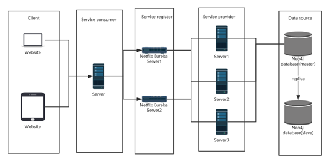

# RS-Movie Team Report


### Work Distribution

| Team member        | 肖斌（leader）20175308                                       | 高歌   20175045                                              | 汪禹霖20175226                                      | 林伟立20175347                                       | 叶方扬20175356                                               |
| ------------------ | ------------------------------------------------------------ | ------------------------------------------------------------ | --------------------------------------------------- | ---------------------------------------------------- | ------------------------------------------------------------ |
| Work Distributed   | 1.Data   pre-processing   and collection                   2. System   Deployment   Plan   3.presentation (Ch II,VI) | 1. Data collecting and  database design        2.    Algorithm model design and training    (Ch II,III,IV) | Service   interface design and  UI design (Ch VII ) | Analyzes the project and writes  project plan (Ch I) | 1. System   Architecture design   2. User   guides   (Ch V,VII) |
| Contribution ratio | 20%                                                          | 20%                                                          | 20%                                                 | 20%                                                  | 20%                                                          |


[TOC]


## Ch I . Project Plan

 

### 1. introduction

#### 1.1 project

Based on the study, users may not be able to find movies they are really interested most of the time, even if they are given a large number of movies and are classified according to factors such as the type, year, and origin of the film.

There are many problems in the traditional mode of searching movies, among which the most important and profound problem is the problem of information overload. Users can not get the information that is really useful to them. For example, each action of searching for a movie is independent of each other, unable to make effective use of the previous movie viewing records and search records of users, and not fully combined with the habits of users; every search for a movie must be accurately searched, the search method is too mechanized, the search results must be strongly related to the keywords used for searching, resulting in a large number of similar but Not what the user expected.

In order to solve the disadvantages of traditional movie search mode, we have the idea of movie recommendation based on graphics, and judge the movies that users need or are interested in according to their historical behavior, interest points, social relations and other information.

#### 1.2 project objectives

This project will develop a movie recommendation system based on graphics. This system will realize the function of recommending movies for users. The key point is to recommend movies for users based on the keywords input by users in combination with users' viewing habits.

 

#### 1.3 project delivery products

All documents need to be submitted in electronic version and printed version.

 

1) Project management plan


2) Requirement specification


3) Design report


4) Test report

 

5) System architecture diagram and configuration

 

6) User manual

 

7) User action menu

 

8) Executable package

 

9) Training materials

 

10) Project work report (one for each)

 

 

### 2. project organization

#### 2.1 process model

1)     Gantt chart of process model progress


2)     Process model schedule

| critical time    | tasks                                                        |
| ---------------- | ------------------------------------------------------------ |
| Week 1           | draft project plan                                           |
| Week 2           | complete the first draft of   requirement specification, design report, system architecture diagram and   configuration |
| Week 3 to week 6 | centralized development                                      |
| Week 7           | check the system operation                                   |
| Week 8           | complete the first draft of test   report                    |
| Week 9           | complete the first draft of user   manual and user operation menu |
| Week 10, week 11 | complete the first draft of training   materials             |
| Week 12          | report the project work                                      |
| Week 13          | deliver software project                                     |

 

 

#### 2.2 division and cooperation of the team

| member      | role                                                    | responsibilities                                             |
| ----------- | ------------------------------------------------------- | ------------------------------------------------------------ |
| Ye Fangyang | Document maintainer and Secretary                       | Sort out the requirement analysis   and write the requirement analysis report, maintain and timely modify and release   the updated technical documents. |
| Gao Ge      | Algorithm Engineer, software R &   D.                   | Responsible for the research and   development of the system and the core logic of recommendation algorithm. |
| Xiao Bin    | Data development engineer and   software R & D Engineer | Responsible for data format, data   processing and further review and design with the data set obtained from big   data analysis |
| Wang Yulin  | UI designer                                             | Responsible for the interface design   of human-computer interaction |
| Lin Weili   | Project manager                                         | Analyzes the project and writes it   project management plan |

 

### 3. project management

#### 3.1 management objectives and priorities

Basic management principle: each member is not only an active speaker, but also a responsible cooperator, and also a decision maker. The decision should be made by everyone on the basis of full discussion. Once the decision is made, it must be carried out timely and effectively. No more objections.

 

Goal 1: complete the basic functions of the project on time and on time, and release the products and documents on time, which is the highest goal of the team.

 

Objective 2: follow the standardized project operation standard, strictly and completely document, fully annotated code, convenient for subsequent maintenance, which is the second objective.

 

Objective 3: the product is stable, user-friendly and easy to operate. Try to see the problem from the user's point of view and put forward solutions.

 

Goal 4: focus on team building, reasonable division of labor, tacit cooperation and harmonious atmosphere. The weekly discussion was a positive one. Actively cooperate in the development process.

 

Goal 5: try to be innovative and bright in project design and development.

 

 

#### 3.2 project risk management

 

| risk type                                                    | existing risk                                                | Ways to circumvent                                           |
| ------------------------------------------------------------ | ------------------------------------------------------------ | ------------------------------------------------------------ |
| schedule risk                                                | The project cannot be completed on   schedule due to time constraints. | ake full account of various potential   factors and leave room appropriately; the task decomposition shall be   detailed and easy to assess; during the implementation process, it is   necessary to emphasize the important items of the project implementation   according to the schedule, and take maintaining the schedule as the   precondition when any problems are considered; at the same time, make full   use of resources by reasonably using the methods such as time limit and quick   follow-up. In case of delay, the group leader shall communicate with the   relevant person in charge of the bank in time and apply for the extension   time. |
| The system does not have enough test   time.                 | Continuous monitoring, project progress   control with the progress of the project, to ensure that each link has enough   time. |                                                              |
| technical risk                                               | There are problems in the development of software architecture,   resulting in the failure of the completed software products to achieve the   intended goals. | Use genuine software development.                            |
| The lack of in-depth understanding of the development software   results in poor performance and quality of the developed products. | Make a two-week learning plan in advance, and focus on the   technology stack used. |                                                              |
| quality risk                                                 | Quality does not meet user requirements.                     | Communicate work results with users frequently. The management   adopts the development process meeting the requirements, carefully organizes   the inspection and review of the output, plans and organizes strict   independent testing, etc. |
| tool risk                                                    | The management tools, development tools and test tools necessary   for software project development and implementation are not in place in time. | In the start-up phase of   the project, the source of various tools or possible alternative tools shall be   implemented, and the tools shall be tracked and put in place before they need   to be used. Before the project development, the infrastructure of the system   is designed and built and the performance test is carried out to ensure that   the architecture meets the performance indicators before the subsequent work. |
| human resource risk                                          | Team members, because they think they can't participate.     | Discuss solutions with users in   advance.                   |


#### 3.3 project communication management

Reporting mechanism:

\1. Each team member is required to record the progress of work in weekly units, form development logs, and submit them to the Secretary in the form of electronic documents for sorting out, and finally maintain them by the document maintainer.

 

\2. At the weekly regular meeting, each team member actively reviews and makes suggestions on the current development work. The team leader makes the final oral summary, and the Secretary presides over the meeting and records and sorts out the contents of the meeting. The document maintainer shall modify and maintain the corresponding documents and submit them to the group for meeting review and comments.

 

\3. All team members shall closely monitor the risk status and submit the risk report after the risk occurs. The Secretary submits risk reports on a regular basis. If necessary, all team members shall be informed of the unexpected risks, and the team leader shall make a temporary decision. Then, at the regular meeting of the week, the group members will discuss the handling opinions on risks. And form the log of risk treatment as the future experience.

 

\4. In the process of the project, the team members should conduct informal communication in various forms to make the communication more convenient and quick.

 

 

 

#### 3.4 project human resource management

 

Personnel required for the project:

 

| Person                        | Job                                                          | Requirements                                                 |
| ----------------------------- | ------------------------------------------------------------ | ------------------------------------------------------------ |
| Gao Ge                        | Algorithm Engineer                                           | familiar with common recommended   algorithms and Python Programming |
| Wang Yulin                    | UI Designer                                                  | familiar with Photoshop, HTML, CSS,   JavaScript             |
| Xiao Bin                      | Data Development Engineer                                    | familiar with neo4j database                                 |
| Software Development Engineer | familiar with Java programming,   spring cloud and other micro Service Frameworks |                                                              |
| Ye Fangyang                   | Document maintainer                                          | familiar with word and power point                           |
| Software Development Engineer | familiar with Java programming,   spring cloud and other micro Service Frameworks |                                                              |
| Lin Weili                     | Project Manager                                              | write the project management plan                            |

 

### 4. technical process

#### 4.1 development tools, methods and technologies

 

1) Programming languages: Java, Python

 

2) Development environment: IntelliJ idea, pycharm

 

3) Database: neo4j

 

4) Code control software: git, gitlab

 

#### 4.2 documents to be delivered for software

1) Project management plan

The document, completed by the project manager, describes the entire management process for the project. This document is completed at the initial stage of software design requirements analysis, which is updated by the document maintainer.

2) Requirements specification sit

During the requirements analysis phase, all team members collect and analyze the user's needs and make decisions at the regular meeting, and the document maintainer writes the first draft of the requirements specification specification, and updates the requirements changeat sits at each subsequent stage.

3) Design report

In the requirements analysis phase, the whole team collects and analyzes the user's needs, analyzes and designs the software system according to the requirements, makes decisions at the regular meeting, writes the first draft of the design report by the document maintainer, and updates the requirements change at each stage.

4) Test report

During the software development phase, testers are required to write test specification documentation and update it during subsequent testing phases. The developer will establish the test environment and prepare the test data based on the test specification documentation.

5) User manual

During the update requirements analysis phase, testers need to begin writing user manuals and form a first draft after the requirements analysis is completed.

6) User Action Menu

During the update requirements analysis phase, testers need to begin writing user action menus and form a first draft after the requirements analysis is completed.


## Ch II . Data collecting

We have used [**Movielens**](https://grouplens.org/datasets/movielens/) **[1]** dataset ([ml-latest-small](http://files.grouplens.org/datasets/movielens/ml-latest-small.zip)). This dataset describes **5-star** rating and free-text tagging activity from [MovieLens](http://movielens.org/), a movie recommendation service. It contains **100004 ratings** and **1296 tag applications** across **9125 movies**. These data were created by **671 users** between January 09, 1995 and October 16, 2016.

MovieLens **1M** movie ratings. Stable benchmark dataset. 1 million ratings from 6000 users on 4000 movies. Released 2/2003.

https://grouplens.org/datasets/movielens/

The format and other information of the data are stated below:

```markdown
RATINGS FILE DESCRIPTION
================================================================================

All ratings are contained in the file "ratings.dat" and are in the
following format:

UserID::MovieID::Rating::Timestamp

- UserIDs range between 1 and 6040 
- MovieIDs range between 1 and 3952
- Ratings are made on a 5-star scale (whole-star ratings only)
- Timestamp is represented in seconds since the epoch as returned by time(2)
- Each user has at least 20 ratings

USERS FILE DESCRIPTION
================================================================================

User information is in the file "users.dat" and is in the following
format:

UserID::Gender::Age::Occupation::Zip-code

All demographic information is provided voluntarily by the users and is
not checked for accuracy.  Only users who have provided some demographic
information are included in this data set.

- Gender is denoted by a "M" for male and "F" for female
- Age is chosen from the following ranges:

	*  1:  "Under 18"
	* 18:  "18-24"
	* 25:  "25-34"
	* 35:  "35-44"
	* 45:  "45-49"
	* 50:  "50-55"
	* 56:  "56+"

- Occupation is chosen from the following choices:

	*  0:  "other" or not specified
	*  1:  "academic/educator"
	*  2:  "artist"
	*  3:  "clerical/admin"
	*  4:  "college/grad student"
	*  5:  "customer service"
	*  6:  "doctor/health care"
	*  7:  "executive/managerial"
	*  8:  "farmer"
	*  9:  "homemaker"
	* 10:  "K-12 student"
	* 11:  "lawyer"
	* 12:  "programmer"
	* 13:  "retired"
	* 14:  "sales/marketing"
	* 15:  "scientist"
	* 16:  "self-employed"
	* 17:  "technician/engineer"
	* 18:  "tradesman/craftsman"
	* 19:  "unemployed"
	* 20:  "writer"

MOVIES FILE DESCRIPTION
================================================================================

Movie information is in the file "movies.dat" and is in the following
format:

MovieID::Title::Genres

- Titles are identical to titles provided by the IMDB (including
year of release)
- Genres are pipe-separated and are selected from the following genres:

	* Action
	* Adventure
	* Animation
	* Children's
	* Comedy
	* Crime
	* Documentary
	* Drama
	* Fantasy
	* Film-Noir
	* Horror
	* Musical
	* Mystery
	* Romance
	* Sci-Fi
	* Thriller
	* War
	* Western

- Some MovieIDs do not correspond to a movie due to accidental duplicate
entries and/or test entries
- Movies are mostly en
```

####  description for each file 

| Filename    | ratings.csv                                                  |
| ----------- | ------------------------------------------------------------ |
| Description | User’s ratings on each movie                                 |
| Properties  |                                                              |
| userId      | The id of user                                               |
| movieId     | The id of movie                                              |
| Rating      | Ratings are made on a 5-star scale, with   half-star increments (0.5 stars - 5.0 stars). |
| timestamp   | Timestamps represent seconds since   midnight Coordinated Universal Time (UTC) of January 1, 1970. |

 

| Filename    | movies.csv                                                   |
| ----------- | ------------------------------------------------------------ |
| Description | offers the url for each movie from three   website sources   |
| Properties  |                                                              |
| movieId     | The id of movie                                              |
| title       | Movie titles are entered manually or   imported from <https://www.themoviedb.org/>, and include the year of   release in parentheses. Errors and inconsistencies may exist in these titles. |
| genres      | Genres are a pipe-separated list, and are   selected from the following:   * Action   * Adventure   * Animation   * Children's   * Comedy   * Crime   * Documentary   * Drama   * Fantasy   * Film-Noir   * Horror   * Musical   * Mystery   * Romance   * Sci-Fi   * Thriller   * War   * Western |

 

| Filename    | tags.csv                                                     |
| ----------- | ------------------------------------------------------------ |
| Description | All ratings are contained in the file   `ratings.csv`        |
| Properties  |                                                              |
| userId      | The id of user                                               |
| movieId     | The id of movie                                              |
| tag         | Tags are user-generated metadata about   movies. Each tag is typically a single word or short phrase. The meaning,   value, and purpose of a particular tag is determined by each user. |
| timestamp   | Timestamps represent seconds since   midnight Coordinated Universal Time (UTC) of January 1, 1970. |

 

| Filename    | links.csv                                                    |
| ----------- | ------------------------------------------------------------ |
| Description | offers the url for each movie from three   website sources   |
| Properties  |                                                              |
| movieId     | an identifier for movies used by   <https://movielens.org>.  |
| imdbId      | an identifier for movies used by   <http://www.imdb.com>.    |
| tmdbId      | an identifier for movies used by   <https://www.themoviedb.org>.. |

### Data Storing with Neo4j

#### Load Data in Neo4j


##### Ratings Data File Structure (ratings.csv)

All ratings are contained in the file `ratings.csv`. Each line of this file after the header row represents one rating of one movie by one user, and has the following format:

```
userId,movieId,rating,timestamp
```

##### Tags Data File Structure (tags.csv)

All tags are contained in the file `tags.csv`. Each line of this file after the header row represents one tag applied to one movie by one user, and has the following format:

```
userId,movieId,tag,timestamp
```

##### Movies Data File Structure (movies.csv)

Movie information is contained in the file `movies.csv`. Each line of this file after the header row represents one movie, and has the following format:

```
movieId,title,genres
```

##### Links Data File Structure (links.csv)

Identifiers that can be used to link to other sources of movie data are contained in the file `links.csv`. Each line of this file after the header row represents one movie, and has the following format:

```
movieId,imdbId,tmdbId
```

### Graph Structure

The graph structure consists of nodes with 3 distinct labels (Genre, Movie, User), and 3 relationships (RATED, TAGGED, IS_GENRE_OF). Links are added as additional properties to movie nodes.


### Steps

- Create **Genre** nodes

- Load

  movies.csv

  - Create **Movie** nodes
- Create Movie-Genre relationships
  
- Load

  ratings.csv

  - Create **User** nodes
- Create User-Movie **rating** relationships
  
- Load

  tags.csv

  - Create User-Movie **tag** relationships

- Load

  links.csv

  - Update Movie nodes properties with links

### API

#### Description

API documentation is generated using *Swagger* and *Connexion*.

One example:

**/api/movie/ratings/[TITLE]**

Returns the ratings submitted for a given movie.

http://localhost:5000/api/movie/ratings/Braveheart

will return:

```python
[
  {
    "rating": 4.0, 
    "user": "User 1"
  }, 
  {
    "rating": 4.0, 
    "user": "User 5"
  }, 
  {
    "rating": 5.0, 
    "user": "User 6"
  }
]
```


## Ch III . Data Processing and Model Establishing 

### 1. Data Processing

```python
import pandas as pd
import numpy as np
import tensorflow as tf
ratings_df = pd.read_csv('ratings.csv')
ratings_df.tail()
movies_df = pd.read_csv('movies.csv')
movies_df['movieRow'] = movies_df.index

```

**steps in brief:**

1.filter the features in the movies_df

2.replacing the moviesId in the ratings_df

3.filter the features in the movies_df

4.Create movie rating matrix and rating record matrix


The format of movie rating is: UserID :: MovieID :: Rating :: Timestamp UserID: [1-6040] MovieIDs: [1,3952] Ratings: an integer of 1-5 Timestamp: Timestamp has at least 20 per user  Scoring data preprocessing and network model design In the MovieLens data set, UserID, Gender, Age, Job, and MovieID in the movie feature can be considered as category data. One-Hot coding is usually used.

However, there are many types of MovieID and UserID. If you use One-Hot encoding, each value will be encoded into a sparse vector with a high dimension. As a neural network input, it is computationally intensive.

In addition, with One-Hot coding, the distances of different attribute values are equal, for example, the square of the distance between "less than 18 years old" and "50+" and "45-49" and "50+" are 2.

Therefore, in the data preprocessing phase, we do not use One-Hot encoding, but only encode these data into numbers, and use these data as the index of the embedding matrix.

The first layer of the neural network uses an embedding layer, and the embedding matrix is obtained through learning. Movie themes and movie names are special, they can be regarded as multi-valued attributes, and the length is not acceptable.  For movie themes, because there are not many types, Multi-Hot coding can be used directly. In the neural network, the encoded vectors are multiplied with the embedding matrix to achieve different length inputs.  The processing of movie names is a little more complicated. First, create a mapping dictionary of word-> int, then use a list of numbers to encode, fill them with the same length, go through an LSTM network, and average all outputs of the network to get the movie name features.
    

UserID, Occupation, MovieID unchanged Gender fields: 'F' and 'M' need to be converted into 0 and 1 Age fields: 7 consecutive numbers 0-6 Genres field: Multi-valued attribute, use Multi-Hot  Encoding, dimension is 18 Title field: create a mapping dictionary of word-> int, then use a list of numbers to encode, and fill it with the same length, dimension is 15 

### 2. Model establishing 

With the explosive growth of e-commerce and social media platforms, recommendation algorithms have become indispensable tools for many businesses. Two main branches of recommender algorithms are often distinguished: content-based recommender systems and collaborative filtering models. Content-based recommender systems use content information of users and items, such as their respective occupation and genre, to predict the next purchase of a user or rating of an item. Collaborative filtering models solve the matrix completion task by taking into account the collective interaction data to predict future ratings or purchases.

In the academic world, generally speaking, recommendation engines are optimized around the effects of a single algorithm, such as recommendation by content, collaborative filtering (including item-based, user-based, SVD decomposition, etc.), context  Recommendations, Constraint-based recommendations, graph relationship mining, etc.  Many single algorithms that compare cattle can achieve better results on certain indicators, such as MAE, RMSE.  .  .  However, each algorithm has its own advantages. Each algorithm also has its own disadvantages, such as recommending items based on content to recommend similar items to the user's historical results, and general item-based easy to recommend popular items (voted by more people).  .  .  .  Therefore, in the industry, such as various Internet companies, various algorithms are used to cooperate with each other to learn from each other's strengths and enhance product effectiveness.  And in the complete recommendation system, not only traditional Rating recommendations, but also a lot of mining, Ranking to achieve the desired effect.

In this work, we view matrix completion as a link prediction problem on graphs: the interaction data in collaborative filtering can be represented by a bipartite graph between user and item nodes, with observed ratings/purchases represented by links. Content information can naturally be included in this framework  in the form of node features. Predicting ratings then reduces to predicting labeled links in the bipartite user-item graph.

#### 2.1 Goal:

In this work a recommender system for a movie database using neo4j which will be able to:   – suggest top N movies similar to a given movie title to users  – predict user votes for the movies they have not voted for.

- 1.Giving user id and movie id to predict a rating.
- 2.Recommanding a same Genres's movies.
- 3.Recommanding your favorites movies.
- 4.Recommanding Watched the same movie's people who favorites movies.

#### 2.2 Innovation:

In this work, we view matrix completion as a link prediction problem on graphs: the interaction data in collaborative filtering can be represented by a bipartite graph between user and item nodes, with observed ratings/purchases represented by links. Content information can naturally be included in this framework  in the form of node features. Predicting ratings then reduces to predicting labeled links in the bipartite user-item graph.

We propose graph convolutional matrix completion (GC-MC): a graph-based auto-encoder framework for matrix completion, which builds on recent progress in deep learning on graphs [2, 6, 19, 5, 15, 30, 14].
The auto-encoder produces latent features of user and item nodes through a form of message passing on the bipartite interaction graph. These latent user and item representations are used to reconstruct the rating links through a bilinear decoder.

The benefit of formulating matrix completion as a link prediction task on a bipartite graph becomes especially apparent when recommender graphs are accompanied with structured external information such as social networks. Combining such external information with interaction data can alleviate performance bottlenecks related to the cold start problem. We demonstrate that our graph auto-encoder model efficiently combines interaction data with side information, without resorting to recurrent frameworks.

Consider a rating matrix M of shape Nu × Nv, where Nu is the number of users and Nv is the number of items. Entries Mij in this matrix encode either an observed rating (user i rated item j) from a set of discrete possible rating values, or the fact that the rating is unobserved (encoded by the value 0). See Figure 1 for an illustration. The task of matrix completion or recommendation can be seen as predicting the value of unobserved entries in M.


#### 2.3 Neural network Construction


###### (1) Define the user's embedding matrix

```python
def get_user_embedding(uid, user_gender, user_age, user_job):     
    with tf.name_scope("user_embedding"):
```

###### (2) User's embedded matrix is fully connected together to generate User's features

```python
def get_user_feature_layer(uid_embed_layer, gender_embed_layer, age_embed_layer, job_embed_layer):
    with tf.name_scope("user_fc"):
```

###### (3) Define the embedding matrix for Movie ID

```python
def get_movie_id_embed_layer(movie_id):     
    with tf.name_scope("movie_embedding"):         
        movie_id_embed_matrix = tf.Variable(tf.random_uniform([movie_id_max, embed_dim], -1, 1), name = "movie_id_embed_matrix")         
        movie_id_embed_layer = tf.nn.embedding_lookup(movie_id_embed_matrix, movie_id, name = "movie_id_embed_layer")     		 
     return movie_id_embed_layer
```

###### (4) Sum multiple embedding vectors of movie type

```python
def get_movie_categories_layers(movie_categories):
    with tf.name_scope("movie_categories_layers"):
        movie_categories_embed_matrix = tf.Variable(tf.random_uniform([movie_categories_max, embed_dim], -1, 1), name = "movie_categories_embed_matrix")
        movie_categories_embed_layer = tf.nn.embedding_lookup(movie_categories_embed_matrix, movie_categories, name = "movie_categories_embed_layer")
        if combiner == "sum":
            movie_categories_embed_layer = tf.reduce_sum(movie_categories_embed_layer, axis=1, keep_dims=True)
    #     elif combiner == "mean":
 
    return movie_categories_embed_layer
```

###### (5) Implementation of Movie Title's Convolutional Network

```python
def get_movie_cnn_layer(movie_titles):
    #从嵌入矩阵中得到电影名对应的各个单词的嵌入向量
    with tf.name_scope("movie_embedding"):
        movie_title_embed_matrix = tf.Variable(tf.random_uniform([movie_title_max, embed_dim], -1, 1), name = "movie_title_embed_matrix")
        movie_title_embed_layer = tf.nn.embedding_lookup(movie_title_embed_matrix, movie_titles, name = "movie_title_embed_layer")
        movie_title_embed_layer_expand = tf.expand_dims(movie_title_embed_layer, -1)
 
    #对文本嵌入层使用不同尺寸的卷积核做卷积和最大池化
    pool_layer_lst = []
    for window_size in window_sizes:
        with tf.name_scope("movie_txt_conv_maxpool_{}".format(window_size)):
            filter_weights = tf.Variable(tf.truncated_normal([window_size, embed_dim, 1, filter_num],stddev=0.1),name = "filter_weights")
            filter_bias = tf.Variable(tf.constant(0.1, shape=[filter_num]), name="filter_bias")
 
            conv_layer = tf.nn.conv2d(movie_title_embed_layer_expand, filter_weights, [1,1,1,1], padding="VALID", name="conv_layer")
            relu_layer = tf.nn.relu(tf.nn.bias_add(conv_layer,filter_bias), name ="relu_layer")
 
            maxpool_layer = tf.nn.max_pool(relu_layer, [1,sentences_size - window_size + 1 ,1,1], [1,1,1,1], padding="VALID", name="maxpool_layer")
            pool_layer_lst.append(maxpool_layer)
 
    #Dropout层
    with tf.name_scope("pool_dropout"):
        pool_layer = tf.concat(pool_layer_lst, 3, name ="pool_layer")
        max_num = len(window_sizes) * filter_num
        pool_layer_flat = tf.reshape(pool_layer , [-1, 1, max_num], name = "pool_layer_flat")
 
        dropout_layer = tf.nn.dropout(pool_layer_flat, dropout_keep_prob, name = "dropout_layer")
    return pool_layer_flat, dropout_layer
```

###### (6) Fully connect the various layers of Movie together

```python
def get_movie_feature_layer(movie_id_embed_layer, movie_categories_embed_layer, dropout_layer):
    with tf.name_scope("movie_fc"):
        #第一层全连接
        movie_id_fc_layer = tf.layers.dense(movie_id_embed_layer, embed_dim, name = "movie_id_fc_layer", activation=tf.nn.relu)
        movie_categories_fc_layer = tf.layers.dense(movie_categories_embed_layer, embed_dim, name = "movie_categories_fc_layer", activation=tf.nn.relu)
 
        #第二层全连接
        movie_combine_layer = tf.concat([movie_id_fc_layer, movie_categories_fc_layer, dropout_layer], 2)  #(?, 1, 96)
        movie_combine_layer = tf.contrib.layers.fully_connected(movie_combine_layer, 200, tf.tanh)  #(?, 1, 200)
 
        movie_combine_layer_flat = tf.reshape(movie_combine_layer, [-1, 200])
    return movie_combine_layer, movie_combine_layer_flat
```

###### (7) Building a Computational Graph

```python
tf.reset_default_graph()
train_graph = tf.Graph()
with train_graph.as_default():
    #获取输入占位符
    uid, user_gender, user_age, user_job, movie_id, movie_categories, movie_titles, targets, lr, dropout_keep_prob = get_inputs()
    #获取User的4个嵌入向量
    uid_embed_layer, gender_embed_layer, age_embed_layer, job_embed_layer = get_user_embedding(uid, user_gender, user_age, user_job)
    #得到用户特征
    user_combine_layer, user_combine_layer_flat = get_user_feature_layer(uid_embed_layer, gender_embed_layer, age_embed_layer, job_embed_layer)
    #获取电影ID的嵌入向量
    movie_id_embed_layer = get_movie_id_embed_layer(movie_id)
    #获取电影类型的嵌入向量
    movie_categories_embed_layer = get_movie_categories_layers(movie_categories)
    #获取电影名的特征向量
    pool_layer_flat, dropout_layer = get_movie_cnn_layer(movie_titles)
    #得到电影特征
    movie_combine_layer, movie_combine_layer_flat = get_movie_feature_layer(movie_id_embed_layer, 
                                                                                movie_categories_embed_layer, 
                                                                                dropout_layer)
    #计算出评分，要注意两个不同的方案，inference的名字（name值）是不一样的，后面做推荐时要根据name取得tensor
    with tf.name_scope("inference"):
        #将用户特征和电影特征作为输入，经过全连接，输出一个值的方案
#         inference_layer = tf.concat([user_combine_layer_flat, movie_combine_layer_flat], 1)  #(?, 200)
#         inference = tf.layers.dense(inference_layer, 1,
#                                     kernel_initializer=tf.truncated_normal_initializer(stddev=0.01), 
#                                     kernel_regularizer=tf.nn.l2_loss, name="inference")
        #简单的将用户特征和电影特征做矩阵乘法得到一个预测评分
        inference = tf.matmul(user_combine_layer_flat, tf.transpose(movie_combine_layer_flat))
 
    with tf.name_scope("loss"):
        # MSE损失，将计算值回归到评分
        cost = tf.losses.mean_squared_error(targets, inference )
        loss = tf.reduce_mean(cost)
    # 优化损失 
#     train_op = tf.train.AdamOptimizer(lr).minimize(loss)  #cost
    global_step = tf.Variable(0, name="global_step", trainable=False)
    optimizer = tf.train.AdamOptimizer(lr)
    gradients = optimizer.compute_gradients(loss)  #cost
    train_op = optimizer.apply_gradients(gradients, global_step=global_step)
```


## Ch IV . Model Training and Evaluation 

### 1. Model training

###### Model-based collaborative filtering

Previously we used truncated SVD as a means to reduce the dimensionality of our matrices. To that end, we imputed the missing rating data with zero to compute SVD of a sparse matrix. However, one could also compute an estimate to SVD in an iterative learning process. For this purpose we only use the known ratings and try to minimize the error of computing the known rates via gradient descent. This algorithm was popularized during the Netflix prize for the best recommender system. Here is a more mathematical description.

###### Mathematical description

SVD factorizes our rating matrix $M_{m*n}$ with a rank of $k$, according to equation (1a) to
3 matrices of $Um×k,Um×k$, $Σk×k$ and $I^T_{n×k}$:

$$M=UΣ_kI^T                      $$	 													$(1a)$
$$M≈UΣ_k′I^T$$														$(1b)$

where U is the matrix of user preferences and I the item preferences and Σ the matrix of singular values. The beauty of SVD is in this simple notion that instead of a full kk vector space, we can approximate M on a much smaller k′ latent space as in (1b). This approximation will not only reduce the dimensions of the rating matrix, but it also takes into account only the most important singular values and leaves behind the smaller singular values which could otherwise result in noise. This concept was used for the dimensionality reduction above as well.
To approximate M, we would like to find U and I matrices in k′ space using all the known rates which would mean we will solve an optimization problem. According to (2), every rate entry in M, $r_{ui}$ can be written as a dot product of $p_u$ and $q_i$:

$$r_{ui}=p_u⋅q_i$$                           								  $(2)$

where $p_u$ makes up the rows of UU and $q_i$ the columns of $I^T$. Here we disregard the diagonal $Σ\Sigma$ matrix for simplicity (as it provides only a scaling factor). graphically it would look something like this:

[](https://blog.codecentric.de/files/2019/06/Screenshot-2019-05-28-at-15.22.31.png)

Finding all $p_u$ and $q_i$s for all users and items will be possible via the following minimisation:

$$min_{pu,qi}=∑_{r_ui∈M}(rui–pu⋅qi)^2 $$           (3)

A gradient descent (GD) algorithm (or a variant of it such as stochastic gradient descent SGD) can be used to solve the minimisation problem and to compute all $p_u$ and $q_i$s. 

###### Implementation

A SVD algorithm similar to the one described above has been implemented in Surprise library, which I will use here. Aside from SVD, deep neural networks have also been repeatedly used to calculate the rating predictions. This blog entry describes one such effort. SVD was chosen because it produces a comparable accuracy to neural nets with a simpler training procedure. In the following you can see the steps to train a SVD model in Surprise. We gain a root-mean-squared error (RMSE) accuracy of 0.77 (the lower the better!) for our rating data, which does not sound bad at all. In fact, with a memory-based prediction from the item-item collaborative filtering described in the previous section, I could not get an RMSE lower that 1.0; that’s 23% improvement in prediction! Next we use this trained model to predict ratings for the movies that a given user u, here e.g. with the id = 7010, has not rated yet. The top 10 highly rated movies can be recommended to user 7010 as you can see below.

```python
from surprise import Dataset, Reader, SVD, accuracy
from surprise.model_selection import train_test_split
 
# instantiate a reader and read in our rating data
reader = Reader(rating_scale=(1, 5))
data = Dataset.load_from_df(ratings_f[['userId','movieId','rating']], reader)
 
# train SVD on 75% of known rates
trainset, testset = train_test_split(data, test_size=.25)
algorithm = SVD()
algorithm.fit(trainset)
predictions = algorithm.test(testset)
 
# check the accuracy using Root Mean Square Error
accuracy.rmse(predictions)
RMSE: 0.7724
 
# check the preferences of a particular user
user_id = 7010
predicted_ratings = pred_user_rating(user_id)
pdf = pd.DataFrame(predicted_ratings, columns = ['movies','ratings'])
pdf.sort_values('ratings', ascending=False, inplace=True)  
pdf.set_index('movies', inplace=True)
pdf.head(10)
```

[](https://blog.codecentric.de/files/2019/06/LastFig.png)


###### Model Training

```python
%matplotlib inline
%config InlineBackend.figure_format = 'retina'
import matplotlib.pyplot as plt
import time
import datetime
 
losses = {'train':[], 'test':[]}
 
with tf.Session(graph=train_graph) as sess:
 
    #搜集数据给tensorBoard用
    # Keep track of gradient values and sparsity
    grad_summaries = []
    for g, v in gradients:
        if g is not None:
            grad_hist_summary = tf.summary.histogram("{}/grad/hist".format(v.name.replace(':', '_')), g)
            sparsity_summary = tf.summary.scalar("{}/grad/sparsity".format(v.name.replace(':', '_')), tf.nn.zero_fraction(g))
            grad_summaries.append(grad_hist_summary)
            grad_summaries.append(sparsity_summary)
    grad_summaries_merged = tf.summary.merge(grad_summaries)
 
    # Output directory for models and summaries
    timestamp = str(int(time.time()))
    out_dir = os.path.abspath(os.path.join(os.path.curdir, "runs", timestamp))
    print("Writing to {}\n".format(out_dir))
 
    # Summaries for loss and accuracy
    loss_summary = tf.summary.scalar("loss", loss)
 
    # Train Summaries
    train_summary_op = tf.summary.merge([loss_summary, grad_summaries_merged])
    train_summary_dir = os.path.join(out_dir, "summaries", "train")
    train_summary_writer = tf.summary.FileWriter(train_summary_dir, sess.graph)
 
    # Inference summaries
    inference_summary_op = tf.summary.merge([loss_summary])
    inference_summary_dir = os.path.join(out_dir, "summaries", "inference")
    inference_summary_writer = tf.summary.FileWriter(inference_summary_dir, sess.graph)
 
    sess.run(tf.global_variables_initializer())
    saver = tf.train.Saver()
    for epoch_i in range(num_epochs):
 
        #将数据集分成训练集和测试集，随机种子不固定
        train_X,test_X, train_y, test_y = train_test_split(features,  
                                                           targets_values,  
                                                           test_size = 0.2,  
                                                           random_state = 0)  
 
        train_batches = get_batches(train_X, train_y, batch_size)
        test_batches = get_batches(test_X, test_y, batch_size)
 
        #训练的迭代，保存训练损失
        for batch_i in range(len(train_X) // batch_size):
            x, y = next(train_batches)
 
            categories = np.zeros([batch_size, 18])
            for i in range(batch_size):
                categories[i] = x.take(6,1)[i]
 
            titles = np.zeros([batch_size, sentences_size])
            for i in range(batch_size):
                titles[i] = x.take(5,1)[i]
 
            feed = {
                uid: np.reshape(x.take(0,1), [batch_size, 1]),
                user_gender: np.reshape(x.take(2,1), [batch_size, 1]),
                user_age: np.reshape(x.take(3,1), [batch_size, 1]),
                user_job: np.reshape(x.take(4,1), [batch_size, 1]),
                movie_id: np.reshape(x.take(1,1), [batch_size, 1]),
                movie_categories: categories,  #x.take(6,1)
                movie_titles: titles,  #x.take(5,1)
                targets: np.reshape(y, [batch_size, 1]),
                dropout_keep_prob: dropout_keep, #dropout_keep
                lr: learning_rate}
 
            step, train_loss, summaries, _ = sess.run([global_step, loss, train_summary_op, train_op], feed)  #cost
            losses['train'].append(train_loss)
            train_summary_writer.add_summary(summaries, step)  #
 
            # Show every <show_every_n_batches> batches
            if (epoch_i * (len(train_X) // batch_size) + batch_i) % show_every_n_batches == 0:
                time_str = datetime.datetime.now().isoformat()
                print('{}: Epoch {:>3} Batch {:>4}/{}   train_loss = {:.3f}'.format(
                    time_str,
                    epoch_i,
                    batch_i,
                    (len(train_X) // batch_size),
                    train_loss))
 
        #使用测试数据的迭代
        for batch_i  in range(len(test_X) // batch_size):
            x, y = next(test_batches)
 
            categories = np.zeros([batch_size, 18])
            for i in range(batch_size):
                categories[i] = x.take(6,1)[i]
 
            titles = np.zeros([batch_size, sentences_size])
            for i in range(batch_size):
                titles[i] = x.take(5,1)[i]
 
            feed = {
                uid: np.reshape(x.take(0,1), [batch_size, 1]),
                user_gender: np.reshape(x.take(2,1), [batch_size, 1]),
                user_age: np.reshape(x.take(3,1), [batch_size, 1]),
                user_job: np.reshape(x.take(4,1), [batch_size, 1]),
                movie_id: np.reshape(x.take(1,1), [batch_size, 1]),
                movie_categories: categories,  #x.take(6,1)
                movie_titles: titles,  #x.take(5,1)
                targets: np.reshape(y, [batch_size, 1]),
                dropout_keep_prob: 1,
                lr: learning_rate}
 
            step, test_loss, summaries = sess.run([global_step, loss, inference_summary_op], feed)  #cost
 
            #保存测试损失
            losses['test'].append(test_loss)
            inference_summary_writer.add_summary(summaries, step)  #
 
            time_str = datetime.datetime.now().isoformat()
            if (epoch_i * (len(test_X) // batch_size) + batch_i) % show_every_n_batches == 0:
                print('{}: Epoch {:>3} Batch {:>4}/{}   test_loss = {:.3f}'.format(
                    time_str,
                    epoch_i,
                    batch_i,
                    (len(test_X) // batch_size),
                    test_loss))
 
    # Save Model
    saver.save(sess, save_dir)  #, global_step=epoch_i
    print('Model Trained and Saved')
```


### 2. Evaluate the model

###### (1) View visualization results in TensorBoard


###### Get Tensors

```python
def get_tensors(loaded_graph):
    uid = loaded_graph.get_tensor_by_name("uid:0")
    user_gender = loaded_graph.get_tensor_by_name("user_gender:0")
    user_age = loaded_graph.get_tensor_by_name("user_age:0")
    user_job = loaded_graph.get_tensor_by_name("user_job:0")
    movie_id = loaded_graph.get_tensor_by_name("movie_id:0")
    movie_categories = loaded_graph.get_tensor_by_name("movie_categories:0")
    movie_titles = loaded_graph.get_tensor_by_name("movie_titles:0")
    targets = loaded_graph.get_tensor_by_name("targets:0")
    dropout_keep_prob = loaded_graph.get_tensor_by_name("dropout_keep_prob:0")
    lr = loaded_graph.get_tensor_by_name("LearningRate:0")
    #两种不同计算预测评分的方案使用不同的name获取tensor inference
#     inference = loaded_graph.get_tensor_by_name("inference/inference/BiasAdd:0")
    inference = loaded_graph.get_tensor_by_name("inference/MatMul:0")#
    movie_combine_layer_flat = loaded_graph.get_tensor_by_name("movie_fc/Reshape:0")
    user_combine_layer_flat = loaded_graph.get_tensor_by_name("user_fc/Reshape:0")
    return uid, user_gender, user_age, user_job, movie_id, movie_categories, movie_titles, targets, lr, dropout_keep_prob, inference, movie_combine_layer_flat, user_combine_layer_flat
```

###### (2) Forward propagate the network and calculate the predicted score

```python
def rating_movie(user_id_val, movie_id_val):
    loaded_graph = tf.Graph()  #
    with tf.Session(graph=loaded_graph) as sess:  #
        # Load saved model
        loader = tf.train.import_meta_graph(load_dir + '.meta')
        loader.restore(sess, load_dir)
 
        # Get Tensors from loaded model
        uid, user_gender, user_age, user_job, movie_id, movie_categories, movie_titles, targets, lr, dropout_keep_prob, inference,_, __ = get_tensors(loaded_graph)  #loaded_graph
 
        categories = np.zeros([1, 18])
        categories[0] = movies.values[movieid2idx[movie_id_val]][2]
 
        titles = np.zeros([1, sentences_size])
        titles[0] = movies.values[movieid2idx[movie_id_val]][1]
 
        feed = {
              uid: np.reshape(users.values[user_id_val-1][0], [1, 1]),
              user_gender: np.reshape(users.values[user_id_val-1][1], [1, 1]),
              user_age: np.reshape(users.values[user_id_val-1][2], [1, 1]),
              user_job: np.reshape(users.values[user_id_val-1][3], [1, 1]),
              movie_id: np.reshape(movies.values[movieid2idx[movie_id_val]][0], [1, 1]),
              movie_categories: categories,  #x.take(6,1)
              movie_titles: titles,  #x.take(5,1)
              dropout_keep_prob: 1}
 
        # Get Prediction
        inference_val = sess.run([inference], feed)  
 
        return (inference_val)
```

###### (3) Generate Movie Feature Matrix

Combine the trained movie features into a movie feature matrix and save it locally

###### (4) Generate User Feature Matrix

Combine the trained user features into a user feature matrix and save it locally

###### (5) Use the produced user feature matrix and movie feature matrix to make movie recommendations

**(a)** The idea is to calculate the cosine similarity between the feature vector of the movie currently being watched and the feature matrix of the entire movie, and take the top_k with the highest similarity. Here, some random selections are added here to ensure that each recommendation is slightly different.

```python
def Recommendation_same_type_movie（movie_id_val，top_k = 20）：loaded_graph = tf.Graph（）
```

**(b) **The idea is to use the user feature vector and the movie feature matrix to calculate the ratings of all movies, take the top_k with the highest score, and also add some random selection parts.

**(c)** Those who have watched this movie also watched (liked) which movies first select the top_k people who like a certain movie and get the user feature vector of these people.
   Then calculate these people's ratings for all movies, select the movie with the highest rating for each person as a recommendation, and also add a random selection

The above is the commonly used recommendation function implemented. The network model is trained as a regression problem, and the trained user feature matrix and movie feature matrix are recommended for recommendation.


### 3. Result Comparison

We compare against current state-of-the-art collaborative filtering algorithms, such as AutoRec, LLorma, and CF-NADE. Results are reported as averages over the same five 90/10 training/test set splits as in and summarized in Table 1. Model choices are validated on an internal 95/5 split of the training set. For ML-1M we use accumulate messages through summation in Eq. (2), use a dropout rate of 0:7, and symmetric normalization. As ML-10M has twice the number of rating classes, we use twice the number of basis function matrices in the decoder. Furthermore, we use stacking accumulation, a dropout of 0:3 and symmetric normalization. We train for 3,500 full-batch epochs, and 18,000 mini-batch iterations (20 epochs with batch size 10,000) on the ML-1M and ML-10M dataset, respectively.


Table 1: Comparison of average test RMSE scores on five 90/10 training/test set splits  without the use of side information. For CF-NADE, we report the bestperforming model variant.


## Ch V . System Architecture

Good Movie is a web based movie recommendation system. Web architecture is still developing, from oldest single server system to nowadays micro service, it’s becoming smarter and capable for different tasks which requiring multiple functions and fast response. 

When designing this system ,we comply with MVC design protocols, that is we separate Model, View, Controller as different components of our system. Therefore, we can easily focus on each part of system without concerning their coupling problems. With MVC, Reusing developed components can be effective, and iterative developing and deploying will cost less.

Because the requirement of users change frequently, micro service architecture is adopted by our system. With micro service, we can divide our function into different services and deploy them on different servers thus they can work along without any impact on others. Also it’s easy to have duplication of services so that visiting pressure of one function can be balanced to different servers. 

Lastly, we use cache to cut down our system’s response time, use duplication of database in case of data missing. 

Here’s our system’s overall architecture:



**Picture 1.overall system architecture**

### 1.1 Technology requirements

As systems based on web becoming popular, they are facing more challenges and need mature technologies and designs to overcome those barriers. For our movie recommending system, the challenges are:

(1)  Ability to sustain high load pressure

The number of web users is growing, our system will face plenty of visits and service requirements. However, servers have their computing limitation. How to improve our servers’ ability of concurrency? 

(2)  Ability to response in limited time

Web application requires fast responding so that users have good experience. Users won’t visit a website which answers slowly. How to make our system responses quickly? 

(3)  Ability to recover from accident

Any system should safely keep information of users and valuable data. Once an accident happened(like power outrage), it should be able to get back all the data and work again. User won’t be happy if they find that their data have lost by accident. How can we achieve this ability?

(4)  Ability to tolerate faults and working while updating

Our system may meet server faults or changing requirements or need of new functions. We shouldn’t stop our service to repair those faults, or add functions. How can we archive this ability?

 

### 1.2 Design Details

In this part, we will discuss the details of our architecture, The solution of our technology requirements, including Cluster Deployment, Horizontal division of service, Vertical division of components ,cache, and micro services.


​                       **Picture 2. detail system architecture**

#### (1)  Cluster Deployment

Single server have its limitation of calculating ability, and as number of visits growing, users will get their response slower. In order to fulfill users’ visiting requirement, we need improve our system’s ability to sustain load pressure.

We use Cluster Deployment to achieve such requirement. We use multiple servers which form a cluster and provide same service. And there are multiple server clusters which provide different services. When a request come, an independent server(load balancing server) will be responsible for choosing a server to deal with the request. The choice depends on servers’ condition, thus make best use of server’s computing resources.

On the other hand, multiple servers means we can have better fault-tolerant service. System will still work normally even if one server break down, as long as there are other servers providing same service. 

With cluster deployment, we can make our system work efficiently.

#### (2)      Horizontal division of service

One server providing multiple services is not good. Firstly, the division of work is complex, which means it’s difficult to manage and update the system. Secondly, Change of one service will affect other services, which affects our developing efficiency.

We can divide the services horizontally. One server provides exactly one type of service. Services can contact with each other but have no impact on their work style. In our case, we can divide the system into 4 kinds of services: 1. recommend, 2. user info, 3. rating, 4. search.

In this way we can have unambiguous understanding of system functionality. We can deal         with each service independently, which means updating is easy.

#### (3)  Vertical division of component

Traditional web developing merge representing, controlling and data together, thus it’s difficult to update or find problems. In our system, we use MVC design model, therefore make components reusable and easy to manage. Each group of developers can focus on each part of system, and they can communicate to make components able to connect. 

#### (4)  cache

In order to reduce database access, cut down user’s waiting time, we can make use of cache to save data that are frequently accessed. Cache means read data from register, which is faster than read from disks.

We can use two kinds of cache:1. cache database, 2. browser cache

#### (5)  Micro service

After divide services horizontally and cluster deployment, we need a method to connect them together, so that they can cooperate and exchange information. We can use micro service tools to help register services, discover services, and balance load.

 

### 1.3 Technology choice

Here’s our technology stack of this system:


**Picture 3. technology stack**

**①**　**Vue:**

Vue.js is a progressive framework for building user interfaces. Different from other heavyweight frameworks, VUE adopts a design of bottom-up incremental development. 
         The goal of Vue.js is to implement data binding of responses and combined view components with as simple an API as possible

We choose Vue so that we can focus on the view component, without concerning logic implementation and create beautiful website quickly.

**②**　**Spring Cloud:**

Spring Cloud is an ordered set of frames. It skillfully simplifies the development of distributed system infrastructure by using the development convenience of Spring Boot, such as service discovery registration, configuration center, message bus, load balancing, circuit breaker, data monitoring, etc., which can be started and deployed with one key with Spring Boot's development style.

We choose Spring cloud because it’s mature and compatible. In side this framework, we have Eureka for registering and discovering services, Feign for restful access to services, Ribbon for load balance.

**③**　**Mahout:**

Mahout is an open source project under Apache Software Foundation (ASF), which provides the implementation of some extensible classical algorithms in the field of machine learning and aims to help developers create intelligent applications more conveniently and quickly. Mahout includes many implementations, including clustering, classification, recommendation filtering, and frequent subitem mining.

We choose Mahout to quickly implement our kernel function: movie recommendation.

**④**　**Neo4j:**

Because recommendation need a lot of calculation of relationships, using traditional sql database means huge calculation cost, so instead we choose Neo4j. 

It’s a graph database thus easy to deal with relationship. Also it has high performance, we can benefit from using it.

**⑤**　**Redis:**

Frequently access to database is slow, and has risk of system breaking down. So we need cache to replace part of database access.

Redis is a database based on register, we can use it to store data which are usually accessed, like user login information.

## Ch VI  .  System Deployment

### 1. storing with noe4j 

###### 1.2.1 introduction

Neo4j is a high-performance,NOSQL graph database that stores structured data on a network rather than in tables.It is an embedded, disk-based, fully transactional Java persistence engine, but it stores structured data on a network (mathematically called a graph) rather than in tables.Neo4j can also be thought of as a high-performance graph engine with all the features of a mature database.Programmers work in an object-oriented, flexible network structure rather than strict, static tables

###### 1.2.2 Transform csv data to Neo4j 

Using Neo4j-Importer to load csv data into Neo4j

### 2.Using Google Analytics to collect data

##### 2.1 Introduction

Google Analytics:

A website analysis tool launched by Google can be used to analyze the user-centered browsing data of websites. The tool can help website builders to better manage websites, track user behaviors and monitor website traffic in real time, so as to optimize websites. It includes a series of data analysis tools and visualization tools.

We can use Google Analytics to collect data on user behavior and use it as input to the recommendation algorithm model, making the recommendation algorithm more intelligent. 

The following are some of the information that we may use Google Analytitcs to extract useful for recommendation algorithms: 

Tracking the overall user behavior of the website: 

A. All Movies Viewed in Recent Seven Days 

B. Keywords frequently searched by users in the past seven days 

C. Number of views of the entire website in the past seven days 

Tracking of individual user behavior: 

A. Movie pages that the user has recently visited frequently 

B. The user's most recent search content 

C. The user stayed on a web page for more than three minutes

##### 2.2 Implementing：

2.1 register An Account 

​       To use google analytics ,the first thing is to register.Then Sign in to get the dashboard as below pictrues shows.


#### 2.2.configuration on the website

We use two ways to configure, the first is overall configuration which track the entire website and the second is local configuration which we can customize the actions of customers we want to track

For the implementation , there are also two api provided by google analytics .They are gtag.js and analytics.js we ‘d like to use gtag.js here for its convienience.

#### 2.1Global configuration

The global site tag (gtag.js) is a JavaScript tagging framework and API that allows you to send event data to Google Analytics, Google Ads, and Google Marketing Platform.

To configure it on the website we add below code(global snippet) on the page which you want to track


 

#### 2.2 Track info Configuration

u  Send Event data to Analytics 

​       For example to track the click event.We can use this to track the user click and search info.


u  Use gtag.js to measure user timing

 

Use the event command to send a timing_complete event and add the below code to send timing info. We could use this to track the stick time of user.


#### 2.3Track the PageView

The Google Analytics tag automatically sends a pageview hit, unless you disable pageview 

We could use this to track the popular movie site

#### 2.3 Extract the information from google analytics to Java 

We use core reporting API:

The Core Reporting API provides access to the tabular data in Google Analytics standard and custom reports. To access data, you create a query that specifies: the view (profile), the start and end dates, and the dimensions and metrics that make up the column headers in the table. This query is sent to the Core Reporting API and The Core Reporting API returns all the data in the form of a table.

##### 2.3.1 Build a Core Reporting API query

The analytics service object contains a method to build a Core Reporting API query.

​       Below is an example to get the data we want.


 

 

##### 2.3.2 Execute the query


```
HttpResponse response = apiQuery.executeUnparsed();
```

 

##### 2.3.3 Working with the API results

If the Core Reporting API query was successful, the API returns with the Analytics reporting data as well as other related information about the data. We could then use our data as an input of recommendation system

### 3.Deploy the application on the "Could "

*Cloud Compute Service (ECS) is a simple, efficient, safe and reliable computing service with flexible processing power. Its management method is simpler and more efficient than physical servers. Users can quickly create or release any number of cloud servers without purchasing hardware in advance.*

#### 1.   Choose appropriate cloud server

##### 1.1 Choose the Right Service 

Generally, cloud service types are divided into three categories, namely Infrastructure as a Service (IaaS), Platform as a Service (PaaS) and Software as a Service (SaaS). These three cloud computing services are sometimes called cloud computing stacks because they build stacks and they are located on top of each other. The following is an overview of these three services:

\1. Infrastructure as a Service IaaS) 

Infrastructure as a Service is one of the main service categories, which provides virtualized computing resources such as virtual machines, storage, networks and operating systems to individuals or organizations of cloud computing providers. [6] 

\2. Platform as a Service (PaaS) 

Platform as a Service is a service category that provides developers with a platform to build applications and services through the global Internet. Paas provides an on-demand development environment for developing, testing, and managing software applications. [6] 

\3. Software as a Service (SaaS) 

Software as a Service is also a category of its services. It provides on-demand software payment applications through the Internet. Cloud computing providers host and manage software applications and allow their users to connect to applications and access applications through the global Internet.


Based On the understanding and for the convience of deployment,we ‘d like to choose Paas service.

 

##### 1.2 Choose the appropriate Supplier

In china. There are a lots of cloud server suppliers including Aliyun tencentYun ,ChinaCache, wangsuScience and so on ,which are very popular .

Technical Indicator for choosing on supplier:   

Stable operation, good cost performance, flexibility and convenience, wide node coverage, guaranteed quality, rich industry experience and commendable service consciousness, 

According to official data from Gomez, *a global third-party speed measuring company, when the page is loaded for more than 7 seconds, 50% of users will choose to give up, and every additional delay of 1 second will bring about a 7% drop in the conversion rate.* In general, the total loading time of 100K web page materials is less than 250ms, which is considered as high-quality CDN. 
 The delay can be subdivided into four modules: **domain name resolution time, connection establishment time, first package time and content download time.**

\-        **Domain name resolution time**, this time dimension has a certain degree of relationship with CDN. Newly purchased domain names usually take a long time to resolve, sometimes exceeding 300ms or even reaching a few seconds. When the access bandwidth of the website exceeds 100M, the time will be smoothly controlled at 100 ~ 150ms. In addition, the length of time is also related to the local DNS caching policy of each province. 

\-        **The time to establish a connection** refers to the time from the completion of DNS resolution to the establishment of a TCP connection after the corresponding IP is found. Since the TCP establishment process is a fixed three-way handshake, this time can reflect the node resources and scheduling capability of CDN services, and the closer the node is, the shorter the connection establishment time is, generally within tens of ms. 

\-        **The first packet time** reflects the code capability of CDN service node programs. How long will the server program schedule processing after connection? If the time is too high, it is likely to lead to too high machine load. 

\-        **Content download time,** the download of small files has little influence, mainly media files such as MP4, FlV, MKV, WMV and other audio and video files have great influence, but the main core business of this application does not include video and audio download and play, so it is not considered.

 


We select Aliyun ECS Server for the below Advantages: 

u  Stability: instance availability reaches 99.95%, cloud disk data reliability is not less than 99.9999999%, automatic downtime migration, automatic snapshot backup and data recovery are more convenient; 

u  Flexibility: Free configuration of CPU, memory and bandwidth, upgrade at any time, no loss of upgrade configuration data, controllable business suspension time; 

u  High security: provide DDoS protection, Trojan horse detection and killing, anti-violence cracking and other services free of charge, which can easily realize multi-user access control to multi-server; 

u  Low cost: high cost performance, support annual and monthly charging or charging by volume, meet different needs, do not need maintenance such as server network and hardware, and have zero cost operation and maintenance; 

u  Ease of use: Rich operating systems and application software can be easily deployed with one key through mirror image, and the same mirror image can quickly copy the environment in multiple ECS and easily expand. 

u  Scalability: ECS can seamlessly connect with various rich cloud products of Aliyun, and can continuously provide complete computing, storage, security and other solutions for business development.

Based on our website backend architecture(soa).we choose the product below which is provided by aLiYun.

##### 1.3 Introduction to EDAS of AliYun


EDAS (Enterprise Distributed Application Service) is a PaaS platform for application hosting and micro-service management. It provides full stack solutions such as application development, deployment, monitoring, operation and maintenance. It also supports micro-service operating environments such as Apache Dubbo and Spring Cloud to help your applications easily go to the cloud.

u  Can quickly build applications based on mature micro-service frameworks: build micro-service applications on the cloud with Ali's proven micro-service framework HSF. 

u  Apache Dubbo and Spring Cloud: There is no need to build self-built services on which micro-services such as ZooKeeper, Eureka and Consul depend, greatly reducing operation and maintenance costs. 

u  Meet the requirements of enterprise-level advanced features: built-in enterprise-level advanced features such as gray scale publishing, flow control and environmental isolation.


#### 2.   Deploy our SOA Website on the EDAS server

We select the following way to deploy our application onto the EDAS

There are three types of java Application can be deployed on the EDAS .There is one type which we have satisfied  :Spring Cloud, Dubbo, normal Java Web or Spring MVC applications, and have not used Pandora or Pandora Boot, need to choose a standard Java application running environment when deploying through JAR packages.

2.1 


We choose the left approach to deploy which is more convenient .

##### 2.1Creating an application in an ECS cluster 

1. Log in to the EDAS console. 
2. Select Application Management > Application List in the left navigation
bar. 
3. Click Create Application in the upper left corner of the Application List
Application List page. 
4. By default, the new version of the application creation page will be
entered. For the operation steps of the new version of the application
creation, please refer to the introduction of quickly creating Demo
micro-service application. This article introduces the creation and application
of the old version. 
5. Click in the upper right corner of the Create Application page to switch
back to the old version. 
6. In the application basic information page for creating the application
process, enter the application basic information, and then click next to enter
the application deployment configuration page 

·         


##### 2.2Creating Instance 

\1. On the Application Configuration page, follow the page instructions to add an instance, and click OK to create when you are finished.

\2. After adding the instance, open the Deploy Now switch, set the deployment parameters, and then click OK to create.


##### 2.3 Configure Public Network Load Balancing and Access Applications

Since the published application is created in a proprietary network, if there is no special configuration, the application does not have a public network IP address, and the public network load balancing is configured, so as to distribute the access traffic of the application to ECS instances according to the forwarding policy, enhance the service capability of the application, and improve the availability of the application.

#### 												

#### 3. Scaled The application in the ECS cluster resiliently 

\- Background 

Flexible expansion and contraction is a very important operation and maintenance capability. Elastic expansion and contraction can sense the state of each instance in the application and dynamically realize the expansion and contraction of the application according to the state. While ensuring the quality of service, the availability rate of applications is improved.

Flexible expansion and contraction includes automatic expansion and contraction, and expansion rules or contraction rules can be configured separately.

1, login EDAS console.

\2. In the left navigation bar select administration > application list, in the application list page click the name of the specific application.

3, the application details page in the left navigation bar, click the elastic scaling.

\4. Click the expansion rules on the right side of the switch, and enable the expansion rules. 

5, expansion and configuration rule parameters, and then click save.. Sources (for instance the Docker application).

Existing resources: automatic expansion will select a specified number of free from the current application in the cluster expansion to the application of ECS instance and expanded into the application for expansion in ECS automatic deployment, start, good application,

Elastic resources: automatically add capacity using the ECS provides elastic scaling function and use the existing ECS (ESS) instance configuration or ECS start template to buy ECS and automatically to join the application of EDAS cluster (ECS) or Swarm clusters, expanded into the application, and in expansion into application for expansion in the ECS automatic deployment

 


## Ch VII . User Guide

\1.         Open a browser, enter the website”https://www.movie.xyz”, you can see the login page

​                                                      

\2.         You can enter your username and password, press “log in” button. Then you go to the home page (jump to 7.)

\3.         If you have no account, you can sign up for one, press “sign up” button, then you can see this page:


\4.         Enter your username, password of the account that you want create. Press next button

\5.         In order to know your taste of movies, the web page will constantly give you some movies and waiting for you to rate. You can click the stars to evaluate the movie. If you have not seen that movie or you have no idea, you can click “not seen” button.


 

\6.         After you have rated 10 or more movies, the page will change to home page. Or if you don’t want wasting time rating, you can click the “Good Movie” title, it also can bring you to home page:


\7.         In home page, there are 3 parts you can interact with:  

l  Search bar(jump to 8.)

l  Movies recommended to you(jump to 11.)

l  Top 20 popular movies(jump to )

\8.         You can input some key words(tags, genres etc.) into the search bar, click “recommend” button.

\9.         Then the web page gives you a list of movies recommend to you according to the key words.


 

 

 

 

 

 

\10.      You can click one of them, then you will find the details of that movie.


\11.      You can click one of the movies recommended to you on the page, then you can get the details of that movie

\12.      You can click one of the top 20 popular movies, then you can get the details of that movie.


## References

 

[1] [https://baike.baidu.com/item/MVC%E6%A1%86%E6%9E%B6/9241230?fromtitle=mvc&fromid=85990&fr=aladdin#6_1](https://baike.baidu.com/item/MVC框架/9241230?fromtitle=mvc&fromid=85990&fr=aladdin#6_1) baidu ：MVC Framework

[2] https://baike.baidu.com/item/mahout/8457919?fr=aladdin baidu：Mahout

[3] https://www.jianshu.com/p/56999f2b8e3b Redis Introduction

[4] https://baike.baidu.com/item/Neo4j/9952114?fr=aladdin baidu: Neo4j

[5] [https://baike.baidu.com/item/spring%20cloud/20269825?fr=aladdin](https://baike.baidu.com/item/spring cloud/20269825?fr=aladdin) baidu: Spring Cloud 

[6] Fei Tian, Bin Gao, Qing Cui, Enhong Chen, and TieYan Liu. Learning deep representations for graph clustering. In AAAI, pages 1293–1299, 2014.

[7] Miao Xu, Rong Jin, and Zhi-Hua Zhou. Speedup matrix completion with side information: Application to multi-label learning. In Advances in Neural Information Processing Systems, pages 2301–2309, 2013.

[8] Yin Zheng, Bangsheng Tang, Wenkui Ding, and Hanning Zhou. A neural autoregressive approach to collaborative filtering. In Proceedings of the 33nd International Conference on Machine Learning, pages 764–773, 2016.

[9] Dzmitry Bahdanau, Kyunghyun Cho, and Yoshua Bengio. Neural machine translation by jointly learning to align and translate. arXiv preprint arXiv:1409.0473, 2014.

[10] Joan Bruna, Wojciech Zaremba, Arthur Szlam, and Yann LeCun. Spectral networks and locally connected networks on graphs. arXiv preprint arXiv:1312.6203, 2013.

[11] Emmanuel Candes and Benjamin Recht. Exact matrix completion via convex optimization. Communications of the ACM, 55(6):111–119, 2012.

[12] W. Yih, X. He, C. Meek. 2014. Semantic Parsing for Single-Relation Question Answering. In Proceedings of ACL 2014.