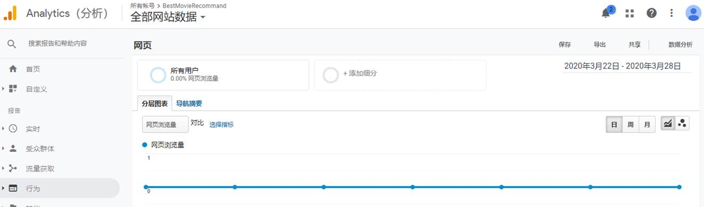
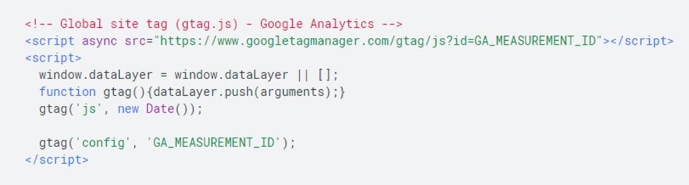
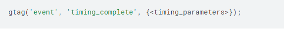
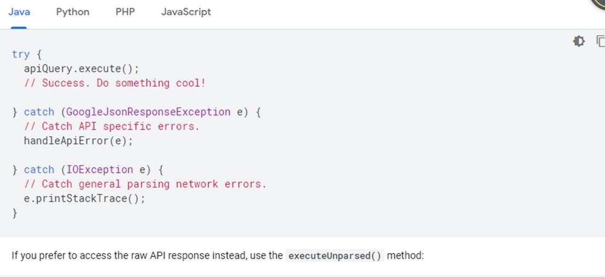

# RS-Movie Ver.3 Report

### Data collecting

We have used [**Movielens**](https://grouplens.org/datasets/movielens/) **[1]** dataset ([ml-latest-small](http://files.grouplens.org/datasets/movielens/ml-latest-small.zip)). This dataset describes **5-star** rating and free-text tagging activity from [MovieLens](http://movielens.org/), a movie recommendation service. It contains **100004 ratings** and **1296 tag applications** across **9125 movies**. These data were created by **671 users** between January 09, 1995 and October 16, 2016.

MovieLens **1M** movie ratings. Stable benchmark dataset. 1 million ratings from 6000 users on 4000 movies. Released 2/2003.

https://grouplens.org/datasets/movielens/

The format and other information of the data are stated below:

```markdown
RATINGS FILE DESCRIPTION
================================================================================

All ratings are contained in the file "ratings.dat" and are in the
following format:

UserID::MovieID::Rating::Timestamp

- UserIDs range between 1 and 6040 
- MovieIDs range between 1 and 3952
- Ratings are made on a 5-star scale (whole-star ratings only)
- Timestamp is represented in seconds since the epoch as returned by time(2)
- Each user has at least 20 ratings

USERS FILE DESCRIPTION
================================================================================

User information is in the file "users.dat" and is in the following
format:

UserID::Gender::Age::Occupation::Zip-code

All demographic information is provided voluntarily by the users and is
not checked for accuracy.  Only users who have provided some demographic
information are included in this data set.

- Gender is denoted by a "M" for male and "F" for female
- Age is chosen from the following ranges:

	*  1:  "Under 18"
	* 18:  "18-24"
	* 25:  "25-34"
	* 35:  "35-44"
	* 45:  "45-49"
	* 50:  "50-55"
	* 56:  "56+"

- Occupation is chosen from the following choices:

	*  0:  "other" or not specified
	*  1:  "academic/educator"
	*  2:  "artist"
	*  3:  "clerical/admin"
	*  4:  "college/grad student"
	*  5:  "customer service"
	*  6:  "doctor/health care"
	*  7:  "executive/managerial"
	*  8:  "farmer"
	*  9:  "homemaker"
	* 10:  "K-12 student"
	* 11:  "lawyer"
	* 12:  "programmer"
	* 13:  "retired"
	* 14:  "sales/marketing"
	* 15:  "scientist"
	* 16:  "self-employed"
	* 17:  "technician/engineer"
	* 18:  "tradesman/craftsman"
	* 19:  "unemployed"
	* 20:  "writer"

MOVIES FILE DESCRIPTION
================================================================================

Movie information is in the file "movies.dat" and is in the following
format:

MovieID::Title::Genres

- Titles are identical to titles provided by the IMDB (including
year of release)
- Genres are pipe-separated and are selected from the following genres:

	* Action
	* Adventure
	* Animation
	* Children's
	* Comedy
	* Crime
	* Documentary
	* Drama
	* Fantasy
	* Film-Noir
	* Horror
	* Musical
	* Mystery
	* Romance
	* Sci-Fi
	* Thriller
	* War
	* Western

- Some MovieIDs do not correspond to a movie due to accidental duplicate
entries and/or test entries
- Movies are mostly en
```

######  description for each file 

| Filename    | ratings.csv                                                  |
| ----------- | ------------------------------------------------------------ |
| Description | User’s ratings on each movie                                 |
| Properties  |                                                              |
| userId      | The id of user                                               |
| movieId     | The id of movie                                              |
| Rating      | Ratings are made on a 5-star scale, with   half-star increments (0.5 stars - 5.0 stars). |
| timestamp   | Timestamps represent seconds since   midnight Coordinated Universal Time (UTC) of January 1, 1970. |

 

| Filename    | movies.csv                                                   |
| ----------- | ------------------------------------------------------------ |
| Description | offers the url for each movie from three   website sources   |
| Properties  |                                                              |
| movieId     | The id of movie                                              |
| title       | Movie titles are entered manually or   imported from <https://www.themoviedb.org/>, and include the year of   release in parentheses. Errors and inconsistencies may exist in these titles. |
| genres      | Genres are a pipe-separated list, and are   selected from the following:   * Action   * Adventure   * Animation   * Children's   * Comedy   * Crime   * Documentary   * Drama   * Fantasy   * Film-Noir   * Horror   * Musical   * Mystery   * Romance   * Sci-Fi   * Thriller   * War   * Western |

 

| Filename    | tags.csv                                                     |
| ----------- | ------------------------------------------------------------ |
| Description | All ratings are contained in the file   `ratings.csv`        |
| Properties  |                                                              |
| userId      | The id of user                                               |
| movieId     | The id of movie                                              |
| tag         | Tags are user-generated metadata about   movies. Each tag is typically a single word or short phrase. The meaning,   value, and purpose of a particular tag is determined by each user. |
| timestamp   | Timestamps represent seconds since   midnight Coordinated Universal Time (UTC) of January 1, 1970. |

 

| Filename    | links.csv                                                    |
| ----------- | ------------------------------------------------------------ |
| Description | offers the url for each movie from three   website sources   |
| Properties  |                                                              |
| movieId     | an identifier for movies used by   <https://movielens.org>.  |
| imdbId      | an identifier for movies used by   <http://www.imdb.com>.    |
| tmdbId      | an identifier for movies used by   <https://www.themoviedb.org>.. |

## Data Storing with Neo4j

### Load Data in Neo4j


##### Ratings Data File Structure (ratings.csv)

All ratings are contained in the file `ratings.csv`. Each line of this file after the header row represents one rating of one movie by one user, and has the following format:

```
userId,movieId,rating,timestamp
```

##### Tags Data File Structure (tags.csv)

All tags are contained in the file `tags.csv`. Each line of this file after the header row represents one tag applied to one movie by one user, and has the following format:

```
userId,movieId,tag,timestamp
```

##### Movies Data File Structure (movies.csv)

Movie information is contained in the file `movies.csv`. Each line of this file after the header row represents one movie, and has the following format:

```
movieId,title,genres
```

##### Links Data File Structure (links.csv)

Identifiers that can be used to link to other sources of movie data are contained in the file `links.csv`. Each line of this file after the header row represents one movie, and has the following format:

```
movieId,imdbId,tmdbId
```

### Graph Structure

The graph structure consists of nodes with 3 distinct labels (Genre, Movie, User), and 3 relationships (RATED, TAGGED, IS_GENRE_OF). Links are added as additional properties to movie nodes.


### Steps

- Create **Genre** nodes

- Load

  movies.csv

  - Create **Movie** nodes
- Create Movie-Genre relationships
  
- Load

  ratings.csv

  - Create **User** nodes
- Create User-Movie **rating** relationships
  
- Load

  tags.csv

  - Create User-Movie **tag** relationships

- Load

  links.csv

  - Update Movie nodes properties with links

### API

#### Description

API documentation is generated using *Swagger* and *Connexion*.

One example:

**/api/movie/ratings/[TITLE]**

Returns the ratings submitted for a given movie.

http://localhost:5000/api/movie/ratings/Braveheart

will return:

```python
[
  {
    "rating": 4.0, 
    "user": "User 1"
  }, 
  {
    "rating": 4.0, 
    "user": "User 5"
  }, 
  {
    "rating": 5.0, 
    "user": "User 6"
  }
]
```


## Model establishing&training with multi-methods

#### Step 1: Data Processing

```python
import pandas as pd
import numpy as np
import tensorflow as tf
ratings_df = pd.read_csv('ratings.csv')
ratings_df.tail()
movies_df = pd.read_csv('movies.csv')
movies_df['movieRow'] = movies_df.index

```

**steps in brief:**

1.filter the features in the movies_df

2.replacing the moviesId in the ratings_df

3.filter the features in the movies_df

4.Create movie rating matrix and rating record matrix


The format of movie rating is: UserID :: MovieID :: Rating :: Timestamp UserID: [1-6040] MovieIDs: [1,3952] Ratings: an integer of 1-5 Timestamp: Timestamp has at least 20 per user  Scoring data preprocessing and network model design In the MovieLens data set, UserID, Gender, Age, Job, and MovieID in the movie feature can be considered as category data. One-Hot coding is usually used.

However, there are many types of MovieID and UserID. If you use One-Hot encoding, each value will be encoded into a sparse vector with a high dimension. As a neural network input, it is computationally intensive.

In addition, with One-Hot coding, the distances of different attribute values are equal, for example, the square of the distance between "less than 18 years old" and "50+" and "45-49" and "50+" are 2.

Therefore, in the data preprocessing phase, we do not use One-Hot encoding, but only encode these data into numbers, and use these data as the index of the embedding matrix.

The first layer of the neural network uses an embedding layer, and the embedding matrix is obtained through learning. Movie themes and movie names are special, they can be regarded as multi-valued attributes, and the length is not acceptable.  For movie themes, because there are not many types, Multi-Hot coding can be used directly. In the neural network, the encoded vectors are multiplied with the embedding matrix to achieve different length inputs.  The processing of movie names is a little more complicated. First, create a mapping dictionary of word-> int, then use a list of numbers to encode, fill them with the same length, go through an LSTM network, and average all outputs of the network to get the movie name features.
    

UserID, Occupation, MovieID unchanged Gender fields: 'F' and 'M' need to be converted into 0 and 1 Age fields: 7 consecutive numbers 0-6 Genres field: Multi-valued attribute, use Multi-Hot  Encoding, dimension is 18 Title field: create a mapping dictionary of word-> int, then use a list of numbers to encode, and fill it with the same length, dimension is 15 

#### Step 2: model establishing 

With the explosive growth of e-commerce and social media platforms, recommendation algorithms have become indispensable tools for many businesses. Two main branches of recommender algorithms are often distinguished: content-based recommender systems and collaborative filtering models. Content-based recommender systems use content information of users and items, such as their respective occupation and genre, to predict the next purchase of a user or rating of an item. Collaborative filtering models solve the matrix completion task by taking into account the collective interaction data to predict future ratings or purchases.

In this work, we view matrix completion as a link prediction problem on graphs: the interaction data in collaborative filtering can be represented by a bipartite graph between user and item nodes, with observed ratings/purchases represented by links. Content information can naturally be included in this framework  in the form of node features. Predicting ratings then reduces to predicting labeled links in the bipartite user-item graph.

#### Goal:

In this work a recommender system for a movie database using neo4j which will be able to:   – suggest top N movies similar to a given movie title to users  – predict user votes for the movies they have not voted for.

#### Innovation:

In this work, we view matrix completion as a link prediction problem on graphs: the interaction data in collaborative filtering can be represented by a bipartite graph between user and item nodes, with observed ratings/purchases represented by links. Content information can naturally be included in this framework  in the form of node features. Predicting ratings then reduces to predicting labeled links in the bipartite user-item graph.

We propose graph convolutional matrix completion (GC-MC): a graph-based auto-encoder framework for matrix completion, which builds on recent progress in deep learning on graphs [2, 6, 19, 5, 15, 30, 14].
The auto-encoder produces latent features of user and item nodes through a form of message passing on the bipartite interaction graph. These latent user and item representations are used to reconstruct the rating links through a bilinear decoder.

The benefit of formulating matrix completion as a link prediction task on a bipartite graph becomes especially apparent when recommender graphs are accompanied with structured external information such as social networks. Combining such external information with interaction data can alleviate performance bottlenecks related to the cold start problem. We demonstrate that our graph auto-encoder model efficiently combines interaction data with side information, without resorting to recurrent frameworks.

Consider a rating matrix M of shape Nu × Nv, where Nu is the number of users and Nv is the number of items. Entries Mij in this matrix encode either an observed rating (user i rated item j) from a set of discrete possible rating values, or the fact that the rating is unobserved (encoded by the value 0). See Figure 1 for an illustration. The task of matrix completion or recommendation can be seen as predicting the value of unobserved entries in M.


##### Constructing a neural network

###### (1) Define the user's embedding matrix

```python
def get_user_embedding(uid, user_gender, user_age, user_job):     
    with tf.name_scope("user_embedding"):
```

###### (2) User's embedded matrix is fully connected together to generate User's features

```python
def get_user_feature_layer(uid_embed_layer, gender_embed_layer, age_embed_layer, job_embed_layer):
    with tf.name_scope("user_fc"):
```

###### (3) Define the embedding matrix for Movie ID

```python
def get_movie_id_embed_layer(movie_id):     
    with tf.name_scope("movie_embedding"):         
        movie_id_embed_matrix = tf.Variable(tf.random_uniform([movie_id_max, embed_dim], -1, 1), name = "movie_id_embed_matrix")         
        movie_id_embed_layer = tf.nn.embedding_lookup(movie_id_embed_matrix, movie_id, name = "movie_id_embed_layer")     		 
     return movie_id_embed_layer
```

###### (4) Sum multiple embedding vectors of movie type

```python
def get_movie_categories_layers(movie_categories):
    with tf.name_scope("movie_categories_layers"):
        movie_categories_embed_matrix = tf.Variable(tf.random_uniform([movie_categories_max, embed_dim], -1, 1), name = "movie_categories_embed_matrix")
        movie_categories_embed_layer = tf.nn.embedding_lookup(movie_categories_embed_matrix, movie_categories, name = "movie_categories_embed_layer")
        if combiner == "sum":
            movie_categories_embed_layer = tf.reduce_sum(movie_categories_embed_layer, axis=1, keep_dims=True)
    #     elif combiner == "mean":
 
    return movie_categories_embed_layer
```

###### (5) Implementation of Movie Title's Convolutional Network

```python
def get_movie_cnn_layer(movie_titles):
    #从嵌入矩阵中得到电影名对应的各个单词的嵌入向量
    with tf.name_scope("movie_embedding"):
        movie_title_embed_matrix = tf.Variable(tf.random_uniform([movie_title_max, embed_dim], -1, 1), name = "movie_title_embed_matrix")
        movie_title_embed_layer = tf.nn.embedding_lookup(movie_title_embed_matrix, movie_titles, name = "movie_title_embed_layer")
        movie_title_embed_layer_expand = tf.expand_dims(movie_title_embed_layer, -1)
 
    #对文本嵌入层使用不同尺寸的卷积核做卷积和最大池化
    pool_layer_lst = []
    for window_size in window_sizes:
        with tf.name_scope("movie_txt_conv_maxpool_{}".format(window_size)):
            filter_weights = tf.Variable(tf.truncated_normal([window_size, embed_dim, 1, filter_num],stddev=0.1),name = "filter_weights")
            filter_bias = tf.Variable(tf.constant(0.1, shape=[filter_num]), name="filter_bias")
 
            conv_layer = tf.nn.conv2d(movie_title_embed_layer_expand, filter_weights, [1,1,1,1], padding="VALID", name="conv_layer")
            relu_layer = tf.nn.relu(tf.nn.bias_add(conv_layer,filter_bias), name ="relu_layer")
 
            maxpool_layer = tf.nn.max_pool(relu_layer, [1,sentences_size - window_size + 1 ,1,1], [1,1,1,1], padding="VALID", name="maxpool_layer")
            pool_layer_lst.append(maxpool_layer)
 
    #Dropout层
    with tf.name_scope("pool_dropout"):
        pool_layer = tf.concat(pool_layer_lst, 3, name ="pool_layer")
        max_num = len(window_sizes) * filter_num
        pool_layer_flat = tf.reshape(pool_layer , [-1, 1, max_num], name = "pool_layer_flat")
 
        dropout_layer = tf.nn.dropout(pool_layer_flat, dropout_keep_prob, name = "dropout_layer")
    return pool_layer_flat, dropout_layer
```

###### (6) Fully connect the various layers of Movie together

```python
def get_movie_feature_layer(movie_id_embed_layer, movie_categories_embed_layer, dropout_layer):
    with tf.name_scope("movie_fc"):
        #第一层全连接
        movie_id_fc_layer = tf.layers.dense(movie_id_embed_layer, embed_dim, name = "movie_id_fc_layer", activation=tf.nn.relu)
        movie_categories_fc_layer = tf.layers.dense(movie_categories_embed_layer, embed_dim, name = "movie_categories_fc_layer", activation=tf.nn.relu)
 
        #第二层全连接
        movie_combine_layer = tf.concat([movie_id_fc_layer, movie_categories_fc_layer, dropout_layer], 2)  #(?, 1, 96)
        movie_combine_layer = tf.contrib.layers.fully_connected(movie_combine_layer, 200, tf.tanh)  #(?, 1, 200)
 
        movie_combine_layer_flat = tf.reshape(movie_combine_layer, [-1, 200])
    return movie_combine_layer, movie_combine_layer_flat
```

###### (7) Building a Computational Graph

```python
tf.reset_default_graph()
train_graph = tf.Graph()
with train_graph.as_default():
    #获取输入占位符
    uid, user_gender, user_age, user_job, movie_id, movie_categories, movie_titles, targets, lr, dropout_keep_prob = get_inputs()
    #获取User的4个嵌入向量
    uid_embed_layer, gender_embed_layer, age_embed_layer, job_embed_layer = get_user_embedding(uid, user_gender, user_age, user_job)
    #得到用户特征
    user_combine_layer, user_combine_layer_flat = get_user_feature_layer(uid_embed_layer, gender_embed_layer, age_embed_layer, job_embed_layer)
    #获取电影ID的嵌入向量
    movie_id_embed_layer = get_movie_id_embed_layer(movie_id)
    #获取电影类型的嵌入向量
    movie_categories_embed_layer = get_movie_categories_layers(movie_categories)
    #获取电影名的特征向量
    pool_layer_flat, dropout_layer = get_movie_cnn_layer(movie_titles)
    #得到电影特征
    movie_combine_layer, movie_combine_layer_flat = get_movie_feature_layer(movie_id_embed_layer, 
                                                                                movie_categories_embed_layer, 
                                                                                dropout_layer)
    #计算出评分，要注意两个不同的方案，inference的名字（name值）是不一样的，后面做推荐时要根据name取得tensor
    with tf.name_scope("inference"):
        #将用户特征和电影特征作为输入，经过全连接，输出一个值的方案
#         inference_layer = tf.concat([user_combine_layer_flat, movie_combine_layer_flat], 1)  #(?, 200)
#         inference = tf.layers.dense(inference_layer, 1,
#                                     kernel_initializer=tf.truncated_normal_initializer(stddev=0.01), 
#                                     kernel_regularizer=tf.nn.l2_loss, name="inference")
        #简单的将用户特征和电影特征做矩阵乘法得到一个预测评分
        inference = tf.matmul(user_combine_layer_flat, tf.transpose(movie_combine_layer_flat))
 
    with tf.name_scope("loss"):
        # MSE损失，将计算值回归到评分
        cost = tf.losses.mean_squared_error(targets, inference )
        loss = tf.reduce_mean(cost)
    # 优化损失 
#     train_op = tf.train.AdamOptimizer(lr).minimize(loss)  #cost
    global_step = tf.Variable(0, name="global_step", trainable=False)
    optimizer = tf.train.AdamOptimizer(lr)
    gradients = optimizer.compute_gradients(loss)  #cost
    train_op = optimizer.apply_gradients(gradients, global_step=global_step)
```


#### Step 3: model training

###### Model-based collaborative filtering

Previously we used truncated SVD as a means to reduce the dimensionality of our matrices. To that end, we imputed the missing rating data with zero to compute SVD of a sparse matrix. However, one could also compute an estimate to SVD in an iterative learning process. For this purpose we only use the known ratings and try to minimize the error of computing the known rates via gradient descent. This algorithm was popularized during the Netflix prize for the best recommender system. Here is a more mathematical description.

###### Mathematical description

SVD factorizes our rating matrix $M_{m*n}$ with a rank of $k$, according to equation (1a) to
3 matrices of $Um×k,Um×k$, $Σk×k$ and $I^T_{n×k}$:

$$M=UΣ_kI^T                      $$	 													$(1a)$
$$M≈UΣ_k′I^T$$														$(1b)$

where U is the matrix of user preferences and I the item preferences and Σ the matrix of singular values. The beauty of SVD is in this simple notion that instead of a full kk vector space, we can approximate M on a much smaller k′ latent space as in (1b). This approximation will not only reduce the dimensions of the rating matrix, but it also takes into account only the most important singular values and leaves behind the smaller singular values which could otherwise result in noise. This concept was used for the dimensionality reduction above as well.
To approximate M, we would like to find U and I matrices in k′ space using all the known rates which would mean we will solve an optimization problem. According to (2), every rate entry in M, $r_{ui}$ can be written as a dot product of $p_u$ and $q_i$:

$$r_{ui}=p_u⋅q_i$$                           								  $(2)$

where $p_u$ makes up the rows of UU and $q_i$ the columns of $I^T$. Here we disregard the diagonal $Σ\Sigma$ matrix for simplicity (as it provides only a scaling factor). graphically it would look something like this:

[](https://blog.codecentric.de/files/2019/06/Screenshot-2019-05-28-at-15.22.31.png)

Finding all $p_u$ and $q_i$s for all users and items will be possible via the following minimisation:

$$min_{pu,qi}=∑_{r_ui∈M}(rui–pu⋅qi)^2 $$           (3)

A gradient descent (GD) algorithm (or a variant of it such as stochastic gradient descent SGD) can be used to solve the minimisation problem and to compute all $p_u$ and $q_i$s. 

###### Implementation

A SVD algorithm similar to the one described above has been implemented in Surprise library, which I will use here. Aside from SVD, deep neural networks have also been repeatedly used to calculate the rating predictions. This blog entry describes one such effort. SVD was chosen because it produces a comparable accuracy to neural nets with a simpler training procedure. In the following you can see the steps to train a SVD model in Surprise. We gain a root-mean-squared error (RMSE) accuracy of 0.77 (the lower the better!) for our rating data, which does not sound bad at all. In fact, with a memory-based prediction from the item-item collaborative filtering described in the previous section, I could not get an RMSE lower that 1.0; that’s 23% improvement in prediction! Next we use this trained model to predict ratings for the movies that a given user u, here e.g. with the id = 7010, has not rated yet. The top 10 highly rated movies can be recommended to user 7010 as you can see below.

```python
from surprise import Dataset, Reader, SVD, accuracy
from surprise.model_selection import train_test_split
 
# instantiate a reader and read in our rating data
reader = Reader(rating_scale=(1, 5))
data = Dataset.load_from_df(ratings_f[['userId','movieId','rating']], reader)
 
# train SVD on 75% of known rates
trainset, testset = train_test_split(data, test_size=.25)
algorithm = SVD()
algorithm.fit(trainset)
predictions = algorithm.test(testset)
 
# check the accuracy using Root Mean Square Error
accuracy.rmse(predictions)
RMSE: 0.7724
 
# check the preferences of a particular user
user_id = 7010
predicted_ratings = pred_user_rating(user_id)
pdf = pd.DataFrame(predicted_ratings, columns = ['movies','ratings'])
pdf.sort_values('ratings', ascending=False, inplace=True)  
pdf.set_index('movies', inplace=True)
pdf.head(10)
```

[](https://blog.codecentric.de/files/2019/06/LastFig.png)


###### Model Training

```python
%matplotlib inline
%config InlineBackend.figure_format = 'retina'
import matplotlib.pyplot as plt
import time
import datetime
 
losses = {'train':[], 'test':[]}
 
with tf.Session(graph=train_graph) as sess:
 
    #搜集数据给tensorBoard用
    # Keep track of gradient values and sparsity
    grad_summaries = []
    for g, v in gradients:
        if g is not None:
            grad_hist_summary = tf.summary.histogram("{}/grad/hist".format(v.name.replace(':', '_')), g)
            sparsity_summary = tf.summary.scalar("{}/grad/sparsity".format(v.name.replace(':', '_')), tf.nn.zero_fraction(g))
            grad_summaries.append(grad_hist_summary)
            grad_summaries.append(sparsity_summary)
    grad_summaries_merged = tf.summary.merge(grad_summaries)
 
    # Output directory for models and summaries
    timestamp = str(int(time.time()))
    out_dir = os.path.abspath(os.path.join(os.path.curdir, "runs", timestamp))
    print("Writing to {}\n".format(out_dir))
 
    # Summaries for loss and accuracy
    loss_summary = tf.summary.scalar("loss", loss)
 
    # Train Summaries
    train_summary_op = tf.summary.merge([loss_summary, grad_summaries_merged])
    train_summary_dir = os.path.join(out_dir, "summaries", "train")
    train_summary_writer = tf.summary.FileWriter(train_summary_dir, sess.graph)
 
    # Inference summaries
    inference_summary_op = tf.summary.merge([loss_summary])
    inference_summary_dir = os.path.join(out_dir, "summaries", "inference")
    inference_summary_writer = tf.summary.FileWriter(inference_summary_dir, sess.graph)
 
    sess.run(tf.global_variables_initializer())
    saver = tf.train.Saver()
    for epoch_i in range(num_epochs):
 
        #将数据集分成训练集和测试集，随机种子不固定
        train_X,test_X, train_y, test_y = train_test_split(features,  
                                                           targets_values,  
                                                           test_size = 0.2,  
                                                           random_state = 0)  
 
        train_batches = get_batches(train_X, train_y, batch_size)
        test_batches = get_batches(test_X, test_y, batch_size)
 
        #训练的迭代，保存训练损失
        for batch_i in range(len(train_X) // batch_size):
            x, y = next(train_batches)
 
            categories = np.zeros([batch_size, 18])
            for i in range(batch_size):
                categories[i] = x.take(6,1)[i]
 
            titles = np.zeros([batch_size, sentences_size])
            for i in range(batch_size):
                titles[i] = x.take(5,1)[i]
 
            feed = {
                uid: np.reshape(x.take(0,1), [batch_size, 1]),
                user_gender: np.reshape(x.take(2,1), [batch_size, 1]),
                user_age: np.reshape(x.take(3,1), [batch_size, 1]),
                user_job: np.reshape(x.take(4,1), [batch_size, 1]),
                movie_id: np.reshape(x.take(1,1), [batch_size, 1]),
                movie_categories: categories,  #x.take(6,1)
                movie_titles: titles,  #x.take(5,1)
                targets: np.reshape(y, [batch_size, 1]),
                dropout_keep_prob: dropout_keep, #dropout_keep
                lr: learning_rate}
 
            step, train_loss, summaries, _ = sess.run([global_step, loss, train_summary_op, train_op], feed)  #cost
            losses['train'].append(train_loss)
            train_summary_writer.add_summary(summaries, step)  #
 
            # Show every <show_every_n_batches> batches
            if (epoch_i * (len(train_X) // batch_size) + batch_i) % show_every_n_batches == 0:
                time_str = datetime.datetime.now().isoformat()
                print('{}: Epoch {:>3} Batch {:>4}/{}   train_loss = {:.3f}'.format(
                    time_str,
                    epoch_i,
                    batch_i,
                    (len(train_X) // batch_size),
                    train_loss))
 
        #使用测试数据的迭代
        for batch_i  in range(len(test_X) // batch_size):
            x, y = next(test_batches)
 
            categories = np.zeros([batch_size, 18])
            for i in range(batch_size):
                categories[i] = x.take(6,1)[i]
 
            titles = np.zeros([batch_size, sentences_size])
            for i in range(batch_size):
                titles[i] = x.take(5,1)[i]
 
            feed = {
                uid: np.reshape(x.take(0,1), [batch_size, 1]),
                user_gender: np.reshape(x.take(2,1), [batch_size, 1]),
                user_age: np.reshape(x.take(3,1), [batch_size, 1]),
                user_job: np.reshape(x.take(4,1), [batch_size, 1]),
                movie_id: np.reshape(x.take(1,1), [batch_size, 1]),
                movie_categories: categories,  #x.take(6,1)
                movie_titles: titles,  #x.take(5,1)
                targets: np.reshape(y, [batch_size, 1]),
                dropout_keep_prob: 1,
                lr: learning_rate}
 
            step, test_loss, summaries = sess.run([global_step, loss, inference_summary_op], feed)  #cost
 
            #保存测试损失
            losses['test'].append(test_loss)
            inference_summary_writer.add_summary(summaries, step)  #
 
            time_str = datetime.datetime.now().isoformat()
            if (epoch_i * (len(test_X) // batch_size) + batch_i) % show_every_n_batches == 0:
                print('{}: Epoch {:>3} Batch {:>4}/{}   test_loss = {:.3f}'.format(
                    time_str,
                    epoch_i,
                    batch_i,
                    (len(test_X) // batch_size),
                    test_loss))
 
    # Save Model
    saver.save(sess, save_dir)  #, global_step=epoch_i
    print('Model Trained and Saved')
```


#### Step 4: Evaluate the model

###### (1) View visualization results in TensorBoard


###### Get Tensors

```python
def get_tensors(loaded_graph):
    uid = loaded_graph.get_tensor_by_name("uid:0")
    user_gender = loaded_graph.get_tensor_by_name("user_gender:0")
    user_age = loaded_graph.get_tensor_by_name("user_age:0")
    user_job = loaded_graph.get_tensor_by_name("user_job:0")
    movie_id = loaded_graph.get_tensor_by_name("movie_id:0")
    movie_categories = loaded_graph.get_tensor_by_name("movie_categories:0")
    movie_titles = loaded_graph.get_tensor_by_name("movie_titles:0")
    targets = loaded_graph.get_tensor_by_name("targets:0")
    dropout_keep_prob = loaded_graph.get_tensor_by_name("dropout_keep_prob:0")
    lr = loaded_graph.get_tensor_by_name("LearningRate:0")
    #两种不同计算预测评分的方案使用不同的name获取tensor inference
#     inference = loaded_graph.get_tensor_by_name("inference/inference/BiasAdd:0")
    inference = loaded_graph.get_tensor_by_name("inference/MatMul:0")#
    movie_combine_layer_flat = loaded_graph.get_tensor_by_name("movie_fc/Reshape:0")
    user_combine_layer_flat = loaded_graph.get_tensor_by_name("user_fc/Reshape:0")
    return uid, user_gender, user_age, user_job, movie_id, movie_categories, movie_titles, targets, lr, dropout_keep_prob, inference, movie_combine_layer_flat, user_combine_layer_flat
```

###### (2) Forward propagate the network and calculate the predicted score

```python
def rating_movie(user_id_val, movie_id_val):
    loaded_graph = tf.Graph()  #
    with tf.Session(graph=loaded_graph) as sess:  #
        # Load saved model
        loader = tf.train.import_meta_graph(load_dir + '.meta')
        loader.restore(sess, load_dir)
 
        # Get Tensors from loaded model
        uid, user_gender, user_age, user_job, movie_id, movie_categories, movie_titles, targets, lr, dropout_keep_prob, inference,_, __ = get_tensors(loaded_graph)  #loaded_graph
 
        categories = np.zeros([1, 18])
        categories[0] = movies.values[movieid2idx[movie_id_val]][2]
 
        titles = np.zeros([1, sentences_size])
        titles[0] = movies.values[movieid2idx[movie_id_val]][1]
 
        feed = {
              uid: np.reshape(users.values[user_id_val-1][0], [1, 1]),
              user_gender: np.reshape(users.values[user_id_val-1][1], [1, 1]),
              user_age: np.reshape(users.values[user_id_val-1][2], [1, 1]),
              user_job: np.reshape(users.values[user_id_val-1][3], [1, 1]),
              movie_id: np.reshape(movies.values[movieid2idx[movie_id_val]][0], [1, 1]),
              movie_categories: categories,  #x.take(6,1)
              movie_titles: titles,  #x.take(5,1)
              dropout_keep_prob: 1}
 
        # Get Prediction
        inference_val = sess.run([inference], feed)  
 
        return (inference_val)
```

###### (3) Generate Movie Feature Matrix

Combine the trained movie features into a movie feature matrix and save it locally

###### (4) Generate User Feature Matrix

Combine the trained user features into a user feature matrix and save it locally

###### (5) Use the produced user feature matrix and movie feature matrix to make movie recommendations

**(a)** The idea is to calculate the cosine similarity between the feature vector of the movie currently being watched and the feature matrix of the entire movie, and take the top_k with the highest similarity. Here, some random selections are added here to ensure that each recommendation is slightly different.

```python
def Recommendation_same_type_movie（movie_id_val，top_k = 20）：loaded_graph = tf.Graph（）
```

**(b) **The idea is to use the user feature vector and the movie feature matrix to calculate the ratings of all movies, take the top_k with the highest score, and also add some random selection parts.

**(c)** Those who have watched this movie also watched (liked) which movies first select the top_k people who like a certain movie and get the user feature vector of these people.
   Then calculate these people's ratings for all movies, select the movie with the highest rating for each person as a recommendation, and also add a random selection

The above is the commonly used recommendation function implemented. The network model is trained as a regression problem, and the trained user feature matrix and movie feature matrix are recommended for recommendation.

#### Step 5: Build a recommendation system

the movie website development environment: IntelliJ IDEA + maven + git + linux + powerdesigner software architecture: neo4j + mybatis + spring + springmvc


Recommended system Development environment: IntelliJ IDEA + maven + git + linux 

Software architecture: hadoop + zookeeper + flume + kafka + nginx + spark + hive + neo4j  

Events (such as which movie the user likes or scores for a certain movie) and pass the information to the recommendation system, the recommendation system will make corresponding processing according to the information, store the recommendation result in the mysql database, and the web front end will query the database  Show recommended movies to users.  The recommended process is as follows:


### 1.1.2 storing with noe4j 

1.2.1 introduction

Neo4j is a high-performance,NOSQL graph database that stores structured data on a network rather than in tables.It is an embedded, disk-based, fully transactional Java persistence engine, but it stores structured data on a network (mathematically called a graph) rather than in tables.Neo4j can also be thought of as a high-performance graph engine with all the features of a mature database.Programmers work in an object-oriented, flexible network structure rather than strict, static tables

1.2.2 Transform csv data to Neo4j 

Using Neo4j-Importer to load csv data into Neo4j

…

 

#### 2.Using Google Analytics to collect data

##### 2.1 Introduction

Google Analytics:

A website analysis tool launched by Google can be used to analyze the user-centered browsing data of websites. The tool can help website builders to better manage websites, track user behaviors and monitor website traffic in real time, so as to optimize websites. It includes a series of data analysis tools and visualization tools.

We can use Google Analytics to collect data on user behavior and use it as input to the recommendation algorithm model, making the recommendation algorithm more intelligent. 

The following are some of the information that we may use Google Analytitcs to extract useful for recommendation algorithms: 

Tracking the overall user behavior of the website: 

A. All Movies Viewed in Recent Seven Days 

B. Keywords frequently searched by users in the past seven days 

C. Number of views of the entire website in the past seven days 

Tracking of individual user behavior: 

A. Movie pages that the user has recently visited frequently 

B. The user's most recent search content 

C. The user stayed on a web page for more than three minutes

##### 2.2 Implementing：

2.1 register An Account 

​       To use google analytics ,the first thing is to register.Then Sign in to get the dashboard as below pictrues shows.



#### 2.2.configuration on the website

We use two ways to configure, the first is overall configuration which track the entire website and the second is local configuration which we can customize the actions of customers we want to track

For the implementation , there are also two api provided by google analytics .They are gtag.js and analytics.js we ‘d like to use gtag.js here for its convienience.

#### 2.1Global configuration

The global site tag (gtag.js) is a JavaScript tagging framework and API that allows you to send event data to Google Analytics, Google Ads, and Google Marketing Platform.

To configure it on the website we add below code(global snippet) on the page which you want to track



 

#### 2.2 Track info Configuration

u  Send Event data to Analytics 

​       For example to track the click event.We can use this to track the user click and search info.


u  Use gtag.js to measure user timing

 

Use the event command to send a timing_complete event and add the below code to send timing info. We could use this to track the stick time of user.




#### 2.3Track the PageView

The Google Analytics tag automatically sends a pageview hit, unless you disable pageview 

We could use this to track the popular movie site

#### 2.3 Extract the information from google analytics to Java 

We use core reporting API:

The Core Reporting API provides access to the tabular data in Google Analytics standard and custom reports. To access data, you create a query that specifies: the view (profile), the start and end dates, and the dimensions and metrics that make up the column headers in the table. This query is sent to the Core Reporting API and The Core Reporting API returns all the data in the form of a table.

##### 2.3.1 Build a Core Reporting API query

The analytics service object contains a method to build a Core Reporting API query.

​       Below is an example to get the data we want.


 

 

##### 2.3.2 Execute the query



```
HttpResponse response = apiQuery.executeUnparsed();
```

 

##### 2.3.3 Working with the API results

If the Core Reporting API query was successful, the API returns with the Analytics reporting data as well as other related information about the data. We could then use our data as an input of recommendation system